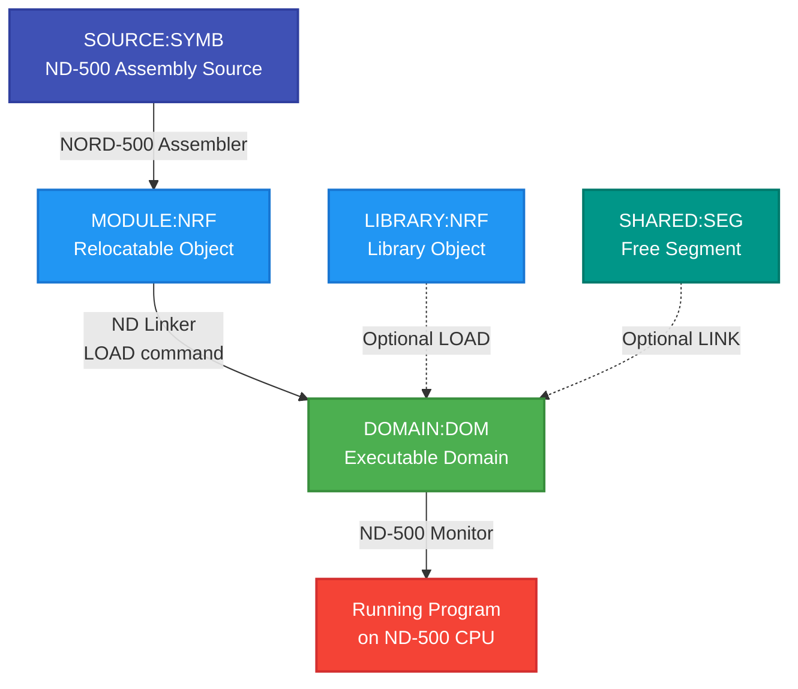
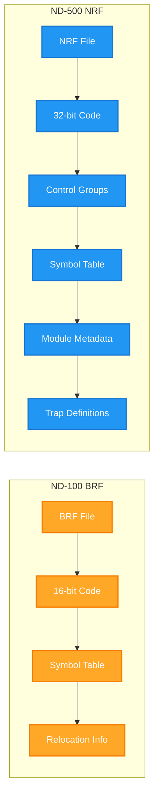
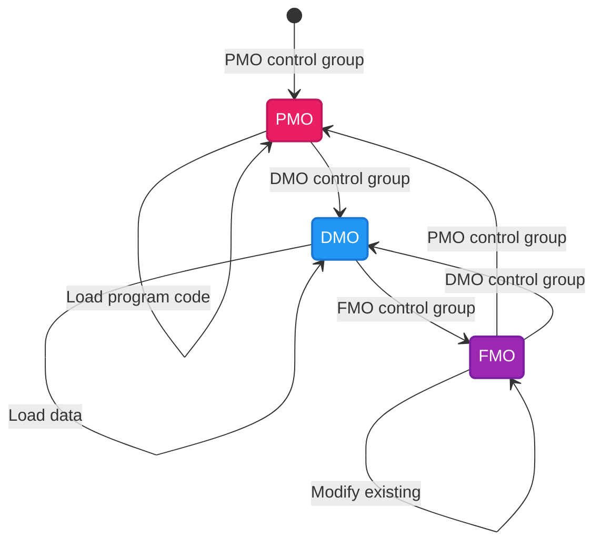
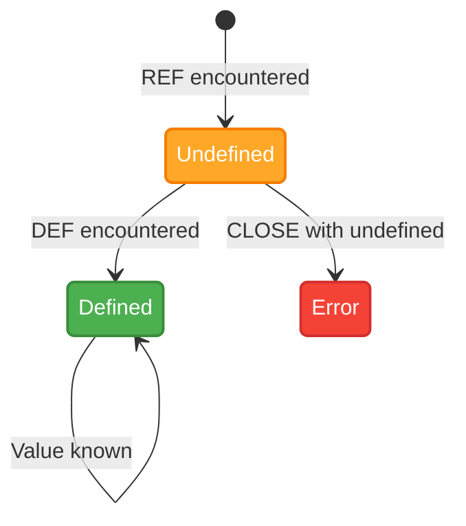
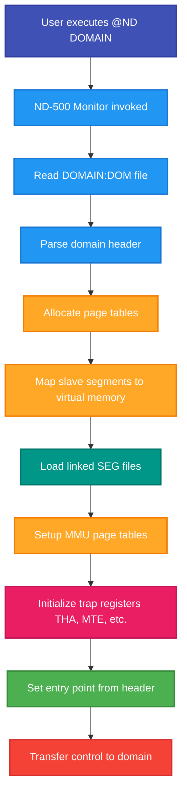

# ND-500 Linking and File Formats - Deep Dive

**Comprehensive guide to ND-500 program linking, NRF format, and domain creation**

**Version:** 1.1
**Date:** October 20, 2025 (checked and corrected 5 October 2026)
**Status:** Complete; checked against measurements

---

> **Checked 5 October 2026 against a real system.** This guide was written in October 2025 from the
> [ND Linker User Guide and Reference Manual (ND-860289-2)](../../Reference-Manuals/ND-860289-2-EN%20ND%20Linker%20User%20Guide%20and%20Reference%20Manual.md)
> before anything had been run. On 5 October 2026 the linker (`ND LINKER, Version B01`), the NC C compiler
> (A06) and PLANC-500 (G) were run under real SINTRAN III VSX/500 L with the ND-500/5000 MONITOR J04, and
> this guide was corrected against those measurements and against the manual. The measured sessions, with
> evidence tags, are in the practical chapters:
>
> - [../ND500/ND-LINKER-PRACTICAL-GUIDE.md](../ND500/ND-LINKER-PRACTICAL-GUIDE.md) - the session that works, the auto jobs, `LIST-ENTRIES UNDEFINED`, `LIST-STATUS`, the domain file layout and sizes, `COMPRESS`
> - [../ND500/NC-C-COMPILER-GUIDE.md](../ND500/NC-C-COMPILER-GUIDE.md) - C with the NC compiler (this is the C compiler that runs today; the older CC-500 is a different product)
> - [../ND500/PLANC-500-COMPILER-GUIDE.md](../ND500/PLANC-500-COMPILER-GUIDE.md) - PLANC with PLANC-500
> - [../ND500/README.md](../ND500/README.md) - what must be on the pack, and the meaning of the tags
>
> How to read the markers in this guide: **[measured]** = seen on the real system on 5 October 2026;
> **[manual]** = taken from the Linker manual, not run; **[not verified]** = in neither source, kept only as
> an illustration. Where the text below gives a section or appendix number without naming a document, it
> means the Linker manual. The older Linkage-Loader is described in
> [ND-60.136.04A ND-500 Loader Monitor](../../Reference-Manuals/ND-60.136.04A%20ND-500%20Loader%20Monitor.md).
> The local description [../../SINTRAN/File-Formats/DOM-FILE-FORMAT.md](../../SINTRAN/File-Formats/DOM-FILE-FORMAT.md)
> is partly unverified and is being corrected separately; it is not used as a source here.

---

## Table of Contents

1. [Introduction](#1-introduction)
2. [ND-500 Linking Workflow](#2-nd-500-linking-workflow)
3. [File Formats Deep Dive](#3-file-formats-deep-dive)
4. [ND Linker User Interface](#4-nd-linker-user-interface)
5. [Practical Linking Examples](#5-practical-linking-examples)
6. [Symbol Resolution and Libraries](#6-symbol-resolution-and-libraries)
7. [Advanced Topics](#7-advanced-topics)
8. [File Format Binary Specifications](#8-file-format-binary-specifications)
9. [Conversion and Migration](#9-conversion-and-migration)
10. [Reference Tables](#10-reference-tables)
11. [Troubleshooting](#11-troubleshooting)
12. [See Also](#12-see-also)

---

## 1. Introduction

### 1.1 Purpose and Scope

This guide provides a comprehensive deep-dive into **ND-500 program linking** and **file format specifications**. While the companion guide [LINKING-GUIDE.md](LINKING-GUIDE.md) covers general linking concepts for both ND-100 and ND-500, this document focuses exclusively on:

- **ND-500 specific linking** using the ND Linker
- **NRF (NORD Relocatable Format)** binary specification
- **DOM (Domain files)** structure and management
- **SEG (Free segment files)** creation and linking
- **Binary-level format details** for emulator developers

**Target audience:**
- ND-500 assembly language programmers
- Emulator developers implementing ND-500 support
- System programmers needing format-level understanding
- Developers troubleshooting complex linking issues

### 1.2 ND-500 vs ND-100 Linking

**Key differences:**

| Aspect | ND-100 | ND-500 |
|--------|--------|--------|
| **Object Format** | BRF (Binary Relocatable Format) | NRF (NORD Relocatable Format) |
| **Linker Tool** | NRL (NORD Relocating Loader) | ND Linker |
| **Executable Format** | PROG, BPUN | DOM (Domain), SEG (Segment) |
| **Architecture** | 16-bit, 64KB address space | 32-bit, 4GB address space |
| **Segments** | RT segments, max 128KB | ND-500 segments, max 128MB each |
| **CPU** | ND-100 | ND-500 coprocessor |
| **Execution** | `@PROGRAM` | `@ND DOMAIN` [manual, measured] or the domain name typed at the ND-500 monitor prompt [measured] |

The ND-500/ND-5000 compilers that were run on 5 October 2026 and produce NRF are the NC C compiler and
PLANC-500; see [../ND500/NC-C-COMPILER-GUIDE.md](../ND500/NC-C-COMPILER-GUIDE.md) and
[../ND500/PLANC-500-COMPILER-GUIDE.md](../ND500/PLANC-500-COMPILER-GUIDE.md). The manual's own examples use
FORTRAN-500 and COBOL-500. (The ND-100/ND-500 segment sizes in the table are from manual section 3.1.3.)

**Why separate linking systems?**

The ND-500 is a **32-bit coprocessor** with fundamentally different architecture from the 16-bit ND-100. The NRF format supports:
- 32-bit addressing and larger address spaces
- Separate program and data segments per segment number
- Advanced memory management (paging, virtual memory)
- Sophisticated trap handling
- Multiple segments per domain (up to 32)

### 1.3 Prerequisites

**Before using this guide, you should understand:**

1. **NORD-500 Assembly Language** - See [NORD-500-ASSEMBLER-DEVELOPER-GUIDE.md](../Languages/System/NORD-500-ASSEMBLER-DEVELOPER-GUIDE.md)
2. **SINTRAN III basics** - File management, user areas, MODE files
3. **General linking concepts** - See [LINKING-GUIDE.md](LINKING-GUIDE.md)
4. **ND-500 architecture** - Processor features, memory model

**Optional for full understanding:**
- SINTRAN III kernel internals (see `../../SINTRAN/OS/` documentation)
- ND-500 emulator implementation (see `../../SINTRAN/Emulator/` documentation)

### 1.4 Quick Reference: What File Format Do I Need?

**"I want to create..."**

| Goal | File Format | Tool | Output |
|------|-------------|------|--------|
| **Executable ND-500 program** | DOM | ND Linker | `PROGRAM:DOM` |
| **Shared library segment** | SEG | ND Linker (advanced mode) | `LIBRARY:SEG` |
| **Object code for linking** | NRF | NC, PLANC-500 [measured]; FORTRAN-500, COBOL-500 [manual]; the ND-500 assembler | `MODULE:NRF` |
| **Legacy domain (old format)** | PSEG/DSEG/LINK + DESC | Old Linkage-Loader (NLL) | Multiple files |
| **Convert old to new** | DOM | CONVERT-DOMAIN | `PROGRAM:DOM` |

**"I have a file and don't know what it is..."**

| Extension | Type | Use |
|-----------|------|-----|
| `:NRF` | Object code | Load with ND Linker LOAD command |
| `:DOM` | Domain (executable) | Run with `@ND DOMAIN-NAME`, or type `DOMAIN-NAME` (or `DOMAIN-NAME:DOM`) at the ND-500 monitor prompt [measured] |
| `:SEG` | Free segment | Link to domain with LINK command |
| `:PSEG` | Old format program | Legacy, use CONVERT-DOMAIN |
| `:DSEG` | Old format data | Legacy, use CONVERT-DOMAIN |
| `:LINK` | Old format link info | Legacy, use CONVERT-DOMAIN |

### 1.5 Document Organization

This guide is organized for **progressive learning**:

- **Sections 1-2:** Overview and workflow (read first)
- **Section 3:** File format concepts (essential)
- **Section 4-5:** Practical usage (hands-on)
- **Section 6-7:** Advanced features (when needed)
- **Section 8:** Binary specifications (reference, for emulator developers)
- **Section 9-12:** Reference material (as needed)

**Tip:** Read sections 1-5 sequentially, then use 6-12 as reference.

---

## 2. ND-500 Linking Workflow

### 2.1 Complete Build Pipeline



### 2.2 Detailed Workflow Steps

#### Step 1: Write Source Code

**File:** `PROGRAM:SYMB`

```asm
MODULE HELLO, 50

% Main entry point
ROUTINE MAIN
    MAIN START

    % Print message
    W DATA 'Hello from ND-500!'
    % ... (simplified)

ENDROUTINE

ENDMODULE
```

**Tool:** Text editor (QED, PED, LED, NOTIS-WP)

#### Step 2: Assemble or compile to NRF

**Command** (assembler form as given in the assembler guide; not run in the 5 October 2026 measurements):
```bash
@NORD-500-ASSEMBLER PROGRAM:SYMB
```

The measured compilers [measured]:

```
ND-5000: NC-A06
NC: COMPILE HELLO,"HELLO","HELLO"            (C: HELLO:C -> HELLO:LIST, HELLO:NRF)

ND-5000: PLANC-500-G00
*COMPILE PHELLO:PLNC,PHELLO:LIST,PHELLO:NRF  (PLANC; the output files must exist or be given in quotes)
```

NC needs `DEFINE-STANDARD-DOMAIN CAT-CAT5-B,CAT-CAT5-B06` and `DEFINE-STANDARD-DOMAIN NC-A,NC-A06` once per
cold start, and NC's `EXIT` returns to the SINTRAN prompt, not to the monitor [measured]. Details in the two
compiler chapters linked at the top.

**Output:** `PROGRAM:NRF` (NORD Relocatable Format)

**What happens:**
- Source parsed and validated
- Machine code generated (relocatable)
- Symbol table created (exports/imports)
- NRF control groups emitted
- Listing file created (optional)

#### Step 3: Link to Domain

**Command** [manual, section 3.2]:
```bash
@LINKER
NDL: OPEN-DOMAIN "PROGRAM"
NDL: LOAD PROGRAM:NRF
NDL: EXIT
```

The same session as it was run on 5 October 2026 [measured] (`@SET-TERMINAL-TYPE,,93` must be given before
`@ND-500`, or the linker prints its table of terminal types and waits; the pack must hold a `DDBTABLES-G`
terminal table):

```
@SET-TERMINAL-TYPE,,93
@ND-500
ND-5000: LINKER-B01
- ND LINKER, Version B01            10. January   1989  Time:  0:00 -
NDL: SET-ADVANCED-MODE
NDL(ADV): OPEN-DOMAIN "HELLO"
NDL(ADV): LOAD HELLO
Program:........155B P01   Data:...........214B D01   Debug:.........262B Bytes
NDL(ADV): CLOSE
NDL(ADV): LINKER-AUTO-FORT:JOB
C Auto Job  -  Link/load part.
NDL(ADV): LOAD              (SYSTEM)NC-LIB
...
NDL(ADV): LINKER-AUTO:JOB
NDL(ADV): EXIT
```

`SET-ADVANCED-MODE` is not required for a plain link; it was typed in the measured sessions. Everything
between `CLOSE` and `EXIT` is printed by the linker while it runs the auto jobs (section 4.5).

**Output:** `PROGRAM:DOM` (executable domain)

**What happens:**
- Domain file created
- NRF modules loaded into segments
- Symbol table resolved (external references)
- Relocation performed (addresses assigned)
- Auto-jobs executed (trap setup, library linking)
- Domain closed and ready to run

#### Step 4: Execute

**Command** [manual, section 3.3; measured]:
```bash
@ND PROGRAM
```
or
```bash
@ND-500-MONITOR
N5000: PROGRAM
```

The manual prints the monitor prompt as `N5000:`; the measured system (MONITOR J04) printed `ND-5000:`,
and `@ND-500` was used to enter it [measured]. Other measured ways to start a domain: `PROGRAM:DOM` at
the monitor prompt (needed when the name is one letter, because `A` alone is an ambiguous monitor
command), `RECOVER-DOMAIN PROGRAM`, and `PLACE-DOMAIN PROGRAM` followed by `RUN`. After `PLACE-DOMAIN` +
`RUN` a C program prints nothing until one carriage return is typed, because its runtime reads an argument
line first [measured]. A C program ends with `program PROGRAM terminated` and two time lines [measured].

**What happens:**
- ND-500 Monitor loads domain
- Segments mapped to virtual memory
- Entry point determined
- Program executes on ND-500 CPU
- I/O handled via monitor calls

### 2.3 ND Linker vs NRL Comparison

| Feature | NRL (ND-100) | ND Linker (ND-500) |
|---------|--------------|---------------------|
| **Target CPU** | ND-100 | ND-500 |
| **Input Format** | BRF | NRF |
| **Output Format** | PROG, BPUN | DOM, SEG |
| **Command Syntax** | `*COMMAND` | `NDL: COMMAND` |
| **User Interface** | Simple line editor | ND-SHELL (advanced editing) |
| **Segment Support** | Single program | Multiple segments (0-31) |
| **Free Segments** | No | Yes (SEG files) |
| **Advanced Mode** | No | Yes (SET-ADVANCED-MODE) |
| **JOB Files** | Limited | Full JOB control language |
| **Libraries** | Simple | NRF Library Handler (NLH) |
| **Trap Handling** | No | Extensive trap definition |
| **Help System** | Minimal | Context-sensitive HELP |

### 2.4 File Format Comparison: BRF vs NRF



**Key NRF advantages:**
1. **Control groups** provide structured metadata
2. **32-bit addressing** for larger programs
3. **Module system** for better organization
4. **Library support** with fast load vectors
5. **Trap handling** integration
6. **Debug information** embedded

### 2.5 Execution Models

#### ND-100 Execution

```
Source → NPL → MAC → BRF → NRL → PROG → @PROG
                                          (runs on ND-100)
```

**Simple, direct execution:**
- Program loaded into ND-100 memory
- Single address space
- Direct SINTRAN monitor calls

#### ND-500 Execution

```
Source → NORD-500-ASM → NRF → ND Linker → DOM → @ND DOM
                                                  (runs on ND-500)
```

**Complex, coprocessor execution:**
- Domain loaded into ND-500 virtual memory
- Multiple segments (0-31)
- Separate program/data spaces
- Virtual memory paging
- ND-500 Monitor mediates execution

---

## 3. File Formats Deep Dive

### 3.1 NRF - NORD Relocatable Format

#### 3.1.1 Overview

**Purpose:** Intermediate relocatable object format output by ND-500 language processors (assemblers, compilers)

**Characteristics:**
- **Binary format** with structured control groups
- **Relocatable code** (no fixed addresses)
- **Symbol table** for imports/exports
- **Module-based** (multiple modules per file)
- **Linkable** with other NRF files and libraries

**File extension:** `:NRF` (default for NORD-500 tools)

#### 3.1.2 NRF Structure

```
┌─────────────────────────────────┐
│ NRF FILE                        │
├─────────────────────────────────┤
│ Module 1                        │
│  ├─ BEG (Start module)          │
│  ├─ MSA (Main start address)    │
│  ├─ DEF/DDF (Symbol definitions)│
│  ├─ REF/LRF/DRF (References)    │
│  ├─ PMO/DMO (Code/data)         │
│  ├─ ... (more control groups)   │
│  └─ END (End module, checksum)  │
├─────────────────────────────────┤
│ Module 2                        │
│  ├─ BEG                         │
│  ├─ ...                         │
│  └─ END                         │
├─────────────────────────────────┤
│ ... (more modules)              │
└─────────────────────────────────┘
```

**Each module is independent** and can be loaded separately by the linker.

#### 3.1.3 Control Groups

**Control groups** are the fundamental building blocks of NRF files. Each control group is a **binary data structure** that directs the linker during loading.

**Control group structure** [manual, appendix D]:

```
┌─────────────────┬──────────────────────┬────────────────────────────┐
│ Control Field   │ Numeric Field        │ Symbolic Field             │
│ (1 byte,        │ (NL bytes, 0 to 7,   │ (SL byte + up to 255 ASCII │
│  mandatory)     │  two's complement)   │  characters; only for the  │
│                 │                      │  groups marked (S))        │
└─────────────────┴──────────────────────┴────────────────────────────┘
```

**Control field format** [manual, appendix D]: a 5-bit NRF control number and a 3-bit numeric length
(NL). The manual lists the control numbers in octal (0-37B).

**Example control groups** (control numbers in octal, as the manual prints them):

| Code (octal) | Mnemonic | Purpose |
|------|----------|---------|
| 0 | NUL | Group ignored |
| 1 | BEG | Begin module (priority, language code, target machine, OS id) |
| 2 | END | End of module (with checksum) |
| 3 | MSA | Main start address |
| 4 | LIB | Library symbol (S) |
| 5 | DEF | Program symbol definition (S) |
| 6 | REF | Program symbol reference (S) |
| 7 | LRF | Library reference (S) |
| 10 | DDF | Data symbol definition (S) |
| 11 | DRF | Data symbol reference (S) |
| 15 | PMO | Set program mode |
| 16 | DMO | Set data mode |
| 17 | FMO | Set free mode (S) |

(Full control group reference in Section 8.1. The numbering used in the October 2025 version of this
guide - BEG=0, END=1, LIB=7, REF=8, PMO=11, and so on - did not match the manual and has been replaced.)

#### 3.1.4 Load Pointers

The linker maintains **three load pointers** during NRF processing [manual, appendix D; the four names
PP, DP, XP and BP and the pseudo-symbols #PCLC, #DCLC and #CCLC are the manual's]:

**PP - Program Byte Pointer:**
- Points to current load address in **program memory**
- Active when linker is in **Program Mode (PMO)**
- Symbol: `#PCLC` (Program Current Location Counter)

**DP - Data Byte Pointer:**
- Points to current load address in **data memory**
- Active when linker is in **Data Mode (DMO)**
- Symbol: `#DCLC` (Data Current Location Counter)
- Special: `#CCLC` (Common Current Location Counter) for FORTRAN COMMON blocks

**XP - Free Pointer:**
- Points to address in **Free Mode (FMO)**
- Used to modify previously loaded data
- Active when linker is in **Free Mode (FMO)**

**BP - Current Base Pointer:**
- Always points to PP, DP, or XP depending on current mode

**Mode transitions:**



#### 3.1.5 Symbol Table Mechanics

**Symbol table entries:**

```
┌────────────┬──────────────┬──────────┐
│ Symbol Name│ Symbol Value │ Status   │
├────────────┼──────────────┼──────────┤
│ "MAIN"     │ 0x00001234   │ Defined  │
│ "SQRT"     │ (unknown)    │ Undefined│
│ "BUFFER"   │ 0x00AB5678   │ Defined  │
└────────────┴──────────────┴──────────┘
```

**How symbols are resolved:**

1. **DEF/DDF control group** encountered:
   - Symbol name read from trailing field
   - Symbol value = current PP or DP
   - Entry added to symbol table (or updated if undefined)

2. **REF/LRF/DRF control group** encountered:
   - Symbol name read from trailing field
   - If defined: Value inserted at BP
   - If undefined: Entry created, reference recorded for later

3. **Module END** reached:
   - If undefined symbols remain: Error or library search

4. **CLOSE command** executed:
   - All symbols must be defined
   - Auto-jobs run if needed (library loading)
   - Domain closed

The symbol-table terms (defined entry, undefined entry, resolving, program symbol, data symbol) are the
manual's, section 6.1. The manual adds: "If there are two conflicting definitions of one symbol, a
warning is given and the first definition the Linker encounters is the one which applies."

**Example** (assembler source in the notation of the assembler guide; not run here):

```asm
% Module 1: MAIN.SYMB
MODULE MAIN
    IMPORT-P SQRT        % Will generate REF control group

    ROUTINE MAIN
        MAIN START       % Will generate DEF control group
        % Call SQRT
    ENDROUTINE
ENDMODULE
```

```asm
% Module 2: MATH.SYMB
MODULE MATH
    EXPORT SQRT          % Will generate DEF control group

    ROUTINE SQRT
        % Square root implementation
    ENDROUTINE
ENDMODULE
```

**Linking:**
```bash
NDL: LOAD MAIN        % REF to SQRT creates undefined entry
NDL: LOAD MATH        % DEF for SQRT resolves the reference
```

#### 3.1.6 Library Symbols (LIB Control Group)

**Library symbols** are special: they are only loaded if referenced.

**Standard symbol (DEF):**
- Always loaded when module is loaded
- Used for main program symbols

**Library symbol (LIB):**
- Only loaded if symbol is in undefined entry list
- Used for library routines

The manual, appendix D (LIB 4): "All LIBs in a module must appear immediately after the BEG. ... If one
or more of these symbols are referenced but not defined in the symbol table, the entire module is loaded.
Otherwise it is skipped." So the unit of conditional loading is the module, not the single symbol.

**Example library NRF** (sketch; one module per routine, as the manual's examples are built):

```
Module: SQRT          Module: SIN
  BEG                   BEG
  LIB SQRT              LIB SIN       % module loaded only if SIN is undefined
  DEF SQRT              DEF SIN
  ... code ...          ... code ...
  END                   END
```

**When loading:**
```bash
NDL: LOAD MATHLIB
```

There is no `LIBRARY` command in the ND Linker (the October 2025 version of this guide used one; it is not
in the manual's command list, appendix A). A library file is loaded with the ordinary `LOAD` command, and
"the Linker automatically selects the modules that define symbols referred to in the other modules you have
loaded" [manual, section 4.2]. A file that was not compiled in library mode can be loaded the same way with
`SPECIAL-LOAD <file> LIBRARY` (advanced mode) [manual, section 4.2 and command SPECIAL-LOAD]. The measured
C auto job uses plain `LOAD (SYSTEM)NC-LIB`; the PLANC auto job uses
`SPECIAL-LOAD (SYSTEM)PLANC-LIB LIBRARY` [measured].

#### 3.1.7 Fast vs Slow Library Format

**Slow library (sequential search):**
```
┌──────────────────────────────┐
│ Module 1 (BEG...END)         │
├──────────────────────────────┤
│ Module 2 (BEG...END)         │
├──────────────────────────────┤
│ Module 3 (BEG...END)         │
└──────────────────────────────┘
```
Must scan from beginning to find symbol.

**Fast library (indexed):**
```
┌──────────────────────────────┐
│ Fast Load Vector (LBB groups)│
│  SQRT → offset 0x1234        │
│  SIN  → offset 0x5678        │
│  COS  → offset 0xABCD        │
├──────────────────────────────┤
│ Module 1 at 0x1234           │
├──────────────────────────────┤
│ Module 2 at 0x5678           │
├──────────────────────────────┤
│ Module 3 at 0xABCD           │
└──────────────────────────────┘
```
Direct access via symbol name lookup. (The offsets above are only an illustration. The manual, appendix
D, LBB 30: the fast load vector is a run of LBB groups at the start of the file; each holds the byte
position in the NRF file of the module that defines the symbol; `N=0` with a null symbol starts the
vector and `N=-1` with a null symbol ends it; the vector is processed in passes until all referenced
symbols in it are satisfied.)

**Creating fast libraries:**

Use the **NRF Library Handler (NLH)** (covered in Section 6.2): `PREPARE-LIBRARY` (default YES) makes
`SAVE-LIBRARY` write a fast load vector; `FORCE-LIBRARY` lets modules not compiled in library mode put
their DEF/DDF symbols into the vector [manual, commands PREPARE-LIBRARY and FORCE-LIBRARY].

---

### 3.2 DOM - Domain Files (New Format)

#### 3.2.1 Overview

**Purpose:** Executable program format for ND-500, self-contained with all segments

**Key features:**
- **File type:** `:DOM`
- **Maximum size:** 128 MB per file
- **Contains:** Domain header + debug info + link info + slave segments
- **Segments:** Up to 32 program/data segment pairs (0-31)
- **Execution:** `@ND DOMAIN-NAME`, or `DOMAIN-NAME` at the monitor prompt [measured]

**Advantages over old format (PSEG/DSEG/LINK + DESC)** [manual, appendix E]:
- Self-contained (single file)
- Portable (no DESC dependency)
- Easier to copy and manage
- Future-proof

#### 3.2.2 File Structure

```
╔═══════════════════════════════════════╗
║ DOMAIN:DOM (128 MB max)               ║
╠═══════════════════════════════════════╣
║ Pages 0-3: Domain Header (4 pages)    ║
║   - Pages 0-1: Actual header          ║
║   - Pages 2-3: Reserved (not allocated║
╠═══════════════════════════════════════╣
║ Debug Info Area (default 2 MB)        ║
║   - Symbolic debug information        ║
║   - Only allocated pages used         ║
╠═══════════════════════════════════════╣
║ Link Info Area (default 2 MB)         ║
║   - Symbol table (defined entries)    ║
║   - Only allocated pages used         ║
╠═══════════════════════════════════════╣
║ Slave Segment 1 (default 34 MB)       ║
║   ├─ Program segment 1 (2 MB default) ║
║   └─ Data segment 1 (32 MB default)   ║
╠═══════════════════════════════════════╣
║ Slave Segment 2 (default 34 MB)       ║
║   ├─ Program segment 2                ║
║   └─ Data segment 2                   ║
╠═══════════════════════════════════════╣
║ Slave Segment 3 (default 34 MB)       ║
║   ├─ Program segment 3                ║
║   └─ Data segment 3                   ║
╠═══════════════════════════════════════╣
║ ... (more segments as configured)     ║
╚═══════════════════════════════════════╝

Total space: 4 pages + 2MB + 2MB + (3 × 34MB) = ~106 MB (3 default segments)
```

(Sizes from manual section 3.1.1. References to free segments are kept inside the domain header, not at
the end of the file - manual, appendix E, "64 segment defs - slave or linked segments" and "32 indirect
segment defs".)

**Where the parts actually start** [measured on `HELLO:DOM`, a freshly linked C program; the same positions
are printed by `LIST-STATUS`]:

| Part | Byte position in the file | In `HELLO:DOM` |
|---|---|---|
| domain header | 0 | 692 bytes |
| debug information | 0x002000 (`20000B`) | 179 bytes |
| link information | 0x202000 (`10020000B`) | 2547 bytes, 96 entries |
| program segment 1 | 0x402000 (`20020000B`) | 21067 bytes |
| data segment 1 | 0x602000 (`30020000B`) | 13788 bytes |

The file is an indexed file with holes: `@FILE-STATISTICS HELLO:DOM,,` reported `23 PAGES , 6313436 BYTES
IN FILE` [measured]. The byte count is the start of the data segment plus its size (0x602000 + 0x35DC =
6313436), and only the 23 written pages are on disk. The manual's appendix E prints these positions as
`00002000`, `01002000`, `02002000`, `03002000`; those match the measured values only as octal numbers with
the last digit missing (`010020000B` = 0x202000), so the printed table is probably mis-transcribed. A
compressed domain has its debug information at 0x1000 and each following area on the next page boundary
[measured on the preserved vendor domains, twelve of thirteen of which have this layout; that they were
made with `COMPRESS` is inferred from the layout].

#### 3.2.3 Domain Header

**Location:** First 2 pages of domain file (pages 2-3 reserved, not allocated on disk) [manual, section 3.1.1]

**Contents** [manual, appendix E, "Summary of Domain and Segment Headers"]:
- Identification (link lock, linker version/revision, flags, machine, OS id)
- Privileges
- Mother domain and 16 child domains (name pool indexes and link keys)
- Free byte pointer in name pool
- Debug info boundaries; link info boundaries
- Start address (restart address)
- Trap block - THA, MTE, OTE, CTE, TEMM
- (Process priority - reserved)
- 32 indirect segment definitions
- Source code language mask and MSA language
- Id message
- 64 segment definitions - slave or linked segments
- Name pool, fills the page (SINTRAN file names of linked segment files and other strings)

There is no "working set size" field and no "creation date" field in the manual's list (both were in the
October 2025 version of this guide). Working-set limits are per segment (`MINP`/`MAXP` in each segment
definition, set with `SET-SEGMENT-LIMITS`).

**Important:** Binary format details in Section 8.2

#### 3.2.4 Segment Numbering

**ND-500 supports 32 segments** numbered 0-31, with both program and data space:

```
Program Segments:        Data Segments:
  P00 P01 P02 ... P31      D00 D01 D02 ... D31

Segment pair notation: S01 means P01 + D01
```

**Conventions** [manual, sections 3.1.1 and 5.5]:

| Segment Range | Use |
|---------------|-----|
| **0** | Avoid: can cause ADDRESS-ZERO-ACCESS traps, and pointer errors into an unused segment 0 are caught as PROTECT-VIOLATION |
| **1-19** | User programs and data |
| **20-30** | "by convention segments 20 to 30 are usually used for ND libraries" - the per-number table is in section 10.3 |
| **31** | Monitor calls (reserved, always) |

**Default loading:**

When you don't specify a segment number, the linker uses the first unused segment, starting from 1
[manual, section 3.1.1]:

```bash
NDL: OPEN-DOMAIN "TEST"
NDL: LOAD PROG1         % Loads to segment 1
NDL: LOAD PROG2         % Still segment 1 (same load)
NDL: SET-SEGMENT-NUMBER 2
NDL: LOAD PROG3         % Loads to segment 2
```

#### 3.2.5 Segment Size Allocation

**Default sizes:**
- **Program segment:** 2 MB
- **Data segment:** 32 MB
- **Total per segment pair:** 34 MB

**Domain capacity with defaults:**
- 4 pages header + 2 MB debug + 2 MB link = ~4 MB overhead
- 128 MB - 4 MB = 124 MB available
- 124 MB ÷ 34 MB = **3 segments maximum** (with defaults)

**Customizing segment sizes:**

Use `SET-SEGMENT-SIZE` in LINKER-SERVICE-PROGRAM. Its parameters are `<Segment number>` (or `ALL`),
`<Program size (in pages)>` and `<Data size (in pages)>`; the defaults for a domain are 1024 and 16384
pages, a page being 2 KB (1024 pages = `10 000 000B` bytes = 2 MB) [manual, command SET-SEGMENT-SIZE].
The command must come before the segment is first used (before `SET-SEGMENT-NUMBER`/`LOAD` for it); with
no domain open only `ALL` is accepted and the setting then applies to every file opened later in the
session. The service program's prompt is `NDL(SRV):` [manual; measured].

```bash
NDL: SET-ADVANCED-MODE
NDL(ADV): OPEN-DOMAIN "CUSTOM"
NDL(ADV): LINKER-SERVICE-PROGRAM
- ND LINKER's  SERVICE-PROGRAM -
NDL(SRV): SET-SEGMENT-SIZE 1,4096,8192   % Segment 1: 8 MB program, 16 MB data (pages of 2 KB)
NDL(SRV): EXIT
NDL(ADV): LOAD MYPROGRAM
```

(The October 2025 version gave the sizes in MB with a `PD` parameter and a prompt `LSP:`; none of that
is in the manual.)

**Fitting more segments:**

To fit more than 3 segments, reduce sizes:

```
Example: 6 segments of 20 MB each
  Program: 1 MB, Data: 19 MB per segment
  Total: 6 × 20 MB = 120 MB < 124 MB ✓
```

**Maximum segment sizes:**

The sum of all segment sizes cannot exceed **124 MB** (128 MB - overhead).

#### 3.2.6 Linking to Free Segments

Domains can **link** to free segments (SEG files) without embedding them.

**Advantages:**
- Share code/data across multiple domains
- Save disk space
- Update library without recompiling all programs
- Reduce memory usage (shared segments in RAM)

**Example:**

```bash
% Create shared library as free segment
@LINKER
NDL: SET-ADVANCED-MODE
NDL(ADV): OPEN-SEGMENT "MATHLIB", 20, PD
NDL(ADV): LOAD SQRT:NRF, SIN:NRF, COS:NRF
NDL(ADV): CLOSE
NDL(ADV): EXIT

% Link domain to free segment
@LINKER
NDL: OPEN-DOMAIN "MYAPP"
NDL: LOAD MYAPP:NRF
NDL: SET-ADVANCED-MODE
NDL(ADV): LINK MATHLIB:SEG
NDL(ADV): EXIT

% Now MYAPP:DOM references MATHLIB:SEG at segment 20
```

**How it works:**

```
┌─────────────────┐       references       ┌─────────────────┐
│ MYAPP:DOM       │─────────────────────────>│ MATHLIB:SEG     │
│  - Segment 1    │                         │  - Segment 20   │
│  - Segment 2    │                         │    (shared)     │
│  - Link to 20   │                         └─────────────────┘
└─────────────────┘

At execution time, ND-500 Monitor loads both files and maps segment 20.
```

**Important considerations** [manual, command LINK and section 3.7]:

1. **Segment number must be unused** in the domain - separately for program and data: "if the specified
   segment file contains program segment number 7, then program segment number 7 must be free in the
   current domain or segment, while data segment number 7 need not be free"
2. **SEG file must exist** at execution time under the file name (with user area) stored in the domain
   header; `LIST-STATUS` shows the stored references and the service-program command
   `CHANGE-FILE-REFERENCES` changes them
3. **Symbol resolution** happens during LINK command
4. **Included segments** (SEG linking to SEG) are referenced from the domain too, but their link
   information is not read; to resolve symbols defined in an included segment, `LINK` that segment as
   well
5. **Link lock:** reopening the SEG with `OPEN-SEGMENT` gives it a new link lock and the domain can no
   longer be placed until the lock is restored with `CHANGE-LINK-LOCK` or the domain is relinked

---

### 3.3 SEG - Free Segment Files

#### 3.3.1 Overview

**Purpose:** Single segment that can be shared across multiple domains

**Key features:**
- **File type:** `:SEG`
- **Maximum size:** 128 MB
- **Contains:** Segment header + debug info + link info + one segment
- **Segment number:** 0-31 (assigned at creation)
- **Linking:** Multiple domains can link to same SEG

**Use cases:**
- Shared system libraries
- Common utility routines
- Large data tables
- Debugged code modules

#### 3.3.2 File Structure

```
╔═══════════════════════════════════════╗
║ SEGMENT:SEG (128 MB max)              ║
╠═══════════════════════════════════════╣
║ Pages 0-3: Segment Header (4 pages)   ║
║   - Pages 0-1: Actual header          ║
║   - Pages 2-3: Reserved (not allocated║
╠═══════════════════════════════════════╣
║ Debug Info Area (default 4 MB)        ║
║   - Symbolic debug information        ║
╠═══════════════════════════════════════╣
║ Link Info Area (default 4 MB)         ║
║   - Symbol table (defined entries)    ║
╠═══════════════════════════════════════╣
║ Program Segment (default 4 MB)        ║
║   - Executable code                   ║
╠═══════════════════════════════════════╣
║ Data Segment (remaining space)        ║
║   - ~116 MB with defaults             ║
║   - Data storage                      ║
╠═══════════════════════════════════════╣
║ Included Segment References (if any)  ║
║   - Other SEG files this links to     ║
╚═══════════════════════════════════════╝
```

**Note:** SEG files have **larger default sizes** for debug/link areas than DOM files (4 MB vs 2 MB).

#### 3.3.3 Segment Header

**Location:** First 2 pages of segment file (2 more reserved) [manual, section 3.1.2]

**Contents** [manual, appendix E, "Segment Header"]:
- Identification (link lock, linker version, flags, machine, OS id)
- Program and data segment definitions, and their logical segment numbers
- Number of matched ND-100 segments and 10 shared ND-100 segment definitions
- Free byte pointer in name pool
- Debug info boundaries; link info boundaries
- Start address (restart address)
- Trap block - THA, MTE, OTE, CTE, TEMM
- 32 indirect segment definitions
- Source code language mask
- Id message
- 64 linked segments
- Name pool

The symbol table itself is in the link information area, not in the header.

#### 3.3.4 Creating Free Segments

**Must be in advanced mode:**

```bash
@LINKER
NDL: SET-ADVANCED-MODE
NDL(ADV): OPEN-SEGMENT "<Segment-name>", <Segment-number>, <Segment-type>, <Attributes>
```

**Parameters:**

| Parameter | Description | Example |
|-----------|-------------|---------|
| **Segment-name** | File name (quotes if new); default type `:SEG` | `"MYLIB"` or `MYLIB` |
| **Segment-number** | 0-31; default is the lowest available number starting with 1 | `20` |
| **Segment-type** | P, D, or PD; default PD | `PD` (both) |
| **Attributes** | Optional; the manual lists WRITE-PERMIT/READ-ONLY, SHARED-DATA-SEGMENT, SWAP-ON-ORIGINAL-FILE, EMPTY-DATA-SEGMENT, FILE-AS-SEGMENT, CACHE/NOT-CACHE, COPY-CAPABILITY-ALLOWED, CLEAR-CAPABILITY-ALLOWED, FORTRAN-COMMON-SEGMENT and their NOT- forms | (usually omit) |

(Parameters and defaults from the manual's OPEN-SEGMENT page and appendix A.)

**Example:**

```bash
NDL: SET-ADVANCED-MODE
NDL(ADV): OPEN-SEGMENT "MATHLIB", 20, PD
NDL(ADV): LOAD SQRT:NRF
NDL(ADV): LOAD SIN:NRF
NDL(ADV): LOAD COS:NRF
NDL(ADV): CLOSE
NDL(ADV): EXIT
```

**Result:** `MATHLIB:SEG` containing SQRT, SIN, COS at segment 20

#### 3.3.5 Included Segments (SEG → SEG Linking)

Free segments can link to other free segments:

```bash
% Create base library
NDL(ADV): OPEN-SEGMENT "BASE", 20, PD
NDL(ADV): LOAD BASE-ROUTINES:NRF
NDL(ADV): CLOSE

% Create extended library that links to base
NDL(ADV): OPEN-SEGMENT "EXTENDED", 21, PD
NDL(ADV): LOAD EXTENDED-ROUTINES:NRF
NDL(ADV): LINK BASE:SEG          % Link to other SEG
NDL(ADV): CLOSE

% Create domain that links to extended
NDL: OPEN-DOMAIN "APP"
NDL: LOAD APP:NRF
NDL(ADV): LINK EXTENDED:SEG       % Indirectly links to BASE too
NDL: EXIT
```

**Chain:**
```
APP:DOM → EXTENDED:SEG → BASE:SEG
```

**At execution:** ND-500 Monitor loads all three files and maps segments 20 and 21.

#### 3.3.6 Modifying Existing Segments

**APPEND-SEGMENT** opens an existing segment without erasing it [manual, command APPEND-SEGMENT]:

```bash
NDL(ADV): APPEND-SEGMENT MATHLIB
NDL(ADV): LOAD NEWFUNCTION:NRF    % Add new function
NDL(ADV): CLOSE
```

Its parameters are `<Segment name>` and an optional `<Segment attribute>` list; there is no segment-number
parameter (the October 2025 version of this guide gave one). Only the attributes named are changed; the
FORTRAN-COMMON-SEGMENT attribute cannot be changed.

**Use cases:**
- Adding functions to library
- Updating implementations
- Incremental development

**Notes from the manual:** `APPEND-DOMAIN` is the matching command for domains and "the link lock of the
domain is not altered by this command". A free segment reopened with `OPEN-SEGMENT` (not APPEND) gets a new
link lock, which invalidates every domain linked to it.

---

### 3.4 PSEG/DSEG/LINK - Old Format (Legacy)

#### 3.4.1 Overview

**Purpose:** Legacy domain format from Linkage-Loader (before ND Linker)

**Structure:** Three separate files + DESC entry

```
User Directory:
├── PROGRAM:PSEG      % Program segment
├── PROGRAM:DSEG      % Data segment
├── PROGRAM:LINK      % Link information
└── DESCRIPTION-FILE:DESC   % Shared domain metadata
    └── Entry for PROGRAM
```

**Disadvantages:**
- Not self-contained (DESC dependency)
- Multiple files to manage
- Difficult to copy/move
- Not future-proof

#### 3.4.2 File Contents

**PSEG (Program Segment):**
- Executable ND-500 machine code
- One or more program segments

**DSEG (Data Segment):**
- Initialized data
- One or more data segments

**LINK (Link Information):**
- Symbol table
- Segment mapping
- Entry points

**DESC (Description File):**
- One per user: "Every user of NLL has his own description file, which is created and initialized the
  first time the user starts NLL" ([ND-60.136.04A ND-500 Loader Monitor](../../Reference-Manuals/ND-60.136.04A%20ND-500%20Loader%20Monitor.md), section 1.5)
- Holds the names of all segments and domains of that user and which :PSEG/:DSEG/:LINK files make up
  each segment
- Written by the old Linkage-Loader (NLL), not by the ND-500 Monitor

#### 3.4.3 When to Use Old Format

[not verified - the list below is the October 2025 author's reasoning; neither manual says when the old
format should still be used]

**Use old format only if:**
- Working with legacy RT programs that don't recognize DOM files
- Compatibility with old SIBAS or NOTIS versions required
- Existing build system uses old Linkage-Loader

**For all new development:** Use DOM format.

#### 3.4.4 Migration to DOM Format

**CONVERT-DOMAIN program** converts old to new [manual, appendix F]:

```bash
@ND CONVERT-DOMAIN <Destination domain> <Source domain> <Include linked segment(s) (Y,N)>
                   <Display progress information (Yes,No)> <Force free segment number(s)>
```

The first parameter is the new domain, the second the old one (same order as in the October 2025 version);
the destination defaults to the source name, and `$` in the destination stands for the source name
(`new-$` gives `NEW-ACCOUNTS-DOMAIN` from `ACCOUNTS-DOMAIN`). Do not give a file type for the source
domain. Started without parameters, the program enters its own command mode with the prompt `CONV:`.

**Example** [manual, appendix F; the domain name is as printed in the scan, which has OCR damage]:

```bash
@ND CONVERT-DOMAIN "(\)WP-500-N08" (DOMAINS)WP-500-N08 Y Y 1:3
>> Converting free segment number 3 <<
>> Converting free segment number 1 <<
>> Finished <<
```

**What happens** [manual, appendix F, "Segment handling"]:
1. Segments that belong to the source domain become slave segments of the destination domain
2. Segments the source domain was linked to become free segments (`SEGFILE:PSEG/:DSEG/:LINK` ->
   `SEGFILE:SEG`); an existing `:SEG` of that name on the destination user is reused without checking
   its contents
3. Segment numbers listed in parameter 5 are written to separate segment files even if they were slave
   segments

**After conversion:**
- NEW-PROG:DOM is fully functional
- Can delete old PSEG/DSEG/LINK files
- No DESC dependency

**Note:** Conversion is one-way (no DOM-to-old converter is described in either manual).

**See also:** [CONVERT-DOMAIN-PSEG-DSEG-TO-DOM.md](CONVERT-DOMAIN-PSEG-DSEG-TO-DOM.md) - detailed step-by-step conversion procedure with full parameter reference.

---

## 4. ND Linker User Interface

### 4.1 Starting the Linker

**Command** [manual; both forms appear in its examples]:
```bash
@LINKER
```
or
```bash
@ND LINKER
```

On the measured system the linker is the domain file `LINKER-B01:DOM` under user SYSTEM and was started
from the ND-500 monitor [measured]:

```
@SET-TERMINAL-TYPE,,93
@ND-500
ND-5000: LINKER-B01
```

Without `@SET-TERMINAL-TYPE` the linker prints its table of terminal types and waits for an answer; it
also needs the `DDBTABLES-G` terminal table on the pack [measured]. Whether `@LINKER` works on that pack
depends on how the domain is named there; it was not tried.

**Output** - the manual's example banner (version B0C of August 1988):
```
- ND LINKER, version B0C Alfa test, 23. August 1988 Time: 13:31 -
- NDL entered:                 Date: 28. August 1988 Time: 17:21 -
NDL:
```

and the measured banner (version B01 of January 1989) [measured]:
```
- ND LINKER, Version B01            10. January   1989  Time:  0:00 -
NDL:
```

At start-up the measured linker also printed `LINKER:INIT` followed by a "No such file name" warning: it
looks for the optional start-up job of that name (section 4.5), and the warning is harmless [measured].

**Prompt** `NDL:` indicates standard mode [manual, measured]
**Prompt** `NDL(ADV):` indicates advanced mode [manual, measured]
**Prompt** `NDL(NLH):` indicates NRF Library Handler mode [manual]
**Prompt** `NDL(SRV):` indicates Linker Service Program mode [manual, measured] (the October 2025 version
of this guide wrote `LSP:`; that prompt does not exist)

A script that waits for the prompt should wait for the text `NDL`, because `NDL(ADV):` does not contain
`NDL:` [measured].

### 4.2 ND-SHELL User Interface

The ND Linker uses **ND-SHELL**, providing advanced editing features [manual, "Standard Notation" and
chapter 2]:

**Key Features:**
- **NOTIS-WP line editing** (full editing on command line)
- **Command history** (scroll up/down through previous commands)
- **Context-sensitive HELP** (HELP key shows detailed information; the text comes from a `:HELP` file, `LINKER-B01:HELP` on the measured pack)
- **Command completion** (SHIFT+HELP lists matching commands)
- **File browsing** (F3 lists matching files)
- **Parameter prompts** (DOWN ARROW prompts for next parameter)
- **JOB file support** (batch command execution)
- **Variables and control flow** (`DO...WHILE...ENDDO`, `FOR...ENDFOR`, `IF...ELSIF...ELSE...ENDIF` in JOBs)

**Essential keys** [manual, "Standard Notation"]:

| Key | Function |
|-----|----------|
| **RETURN** | Execute command / choose default parameter |
| **DOWN ARROW** | Prompt for optional parameters |
| **HELP** | Show detailed help for current command |
| **SHIFT+HELP** | List matching commands / show default value |
| **F3** | List matching file names |
| **F4** | Show status information |
| **FAT LEFT ARROW** | Copy previous command for editing |
| **EXIT** | Leave current mode / exit linker |
| **SHIFT+EXIT** | Exit linker, return to SINTRAN |
| **HOME** | Abort current command |

### 4.3 Command Modes

**Standard Mode** (default):
- Basic linking commands
- OPEN-DOMAIN, LOAD, CLOSE, EXIT
- No segment manipulation
- Suitable for simple programs

**Advanced Mode** (SET-ADVANCED-MODE):
- All standard commands plus:
- OPEN-SEGMENT, APPEND-SEGMENT, LINK
- SET-SEGMENT-NUMBER, SET-SEGMENT-SIZE
- Advanced control over loading
- Required for free segments

**NRF Library Handler Mode** (NRF-LIBRARY-HANDLER, entered from advanced mode; prompt `NDL(NLH):`):
- Library file manipulation
- GET-MODULES, REPLACE-MODULES, DELETE-MODULES, SAVE-LIBRARY
- LIST-MODULES, LIST-NRF, LIST-STATUS
- PREPARE-LIBRARY, FORCE-LIBRARY (fast load vector)
- Module transfer between libraries

**Linker Service Program Mode** (LINKER-SERVICE-PROGRAM, entered from advanced mode; prompt `NDL(SRV):`):
- Advanced configuration
- SET-AREA-SIZE, SET-SEGMENT-SIZE, SET-HEAP-SIZE
- COMPRESS, CHANGE-FILE-REFERENCES, CHANGE-LINK-LOCK, INSERT-MESSAGE
- SET-FORMAT (number system)

(Command lists from manual chapter 7 and appendix A.)

### 4.4 Essential Commands

#### OPEN-DOMAIN

**Purpose:** Create or open a domain file

**Syntax:**
```bash
NDL: OPEN-DOMAIN "<Domain-name>"     % Create new (quotes required)
NDL: OPEN-DOMAIN <Domain-name>       % Open existing (no quotes)
```

**Parameters** [manual, appendix A]:
- **Domain name**: File name (default type :DOM); user area and directory go inside the name,
  `(Directory:User)Name`
- **Domain privileges**: optional, `ENABLE-ESCAPE` (default) or `DISABLE-ESCAPE`

**Example:**
```bash
NDL: OPEN-DOMAIN "MYAPP"             % Creates MYAPP:DOM
NDL: OPEN-DOMAIN MYAPP               % Opens existing MYAPP:DOM; its contents are overwritten
```

**What happens:**
- Closes any previously open domain (and runs the auto jobs for it, section 4.5)
- Creates new domain file (with quotes) or opens existing; "If no double quotation marks are used, the
  domain ... must already exist, and its contents will be overwritten" [manual, section 3.2]
- Sets current segment to 1 (default)
- Ready to LOAD modules

Every measured relink deleted the old file first (`@DELETE-FILE HELLO:DOM`) and used the quoted form
[measured]. To open a domain without erasing it, use `APPEND-DOMAIN` (advanced mode).

#### LOAD

**Purpose:** Load NRF files into current domain/segment

**Syntax:**
```bash
NDL: LOAD <file1>, <file2>, <file3>, ...
```

**Parameters:**
- **File names**: One or more NRF files (default type :NRF)

**Example:**
```bash
NDL: LOAD MAIN                       % Load MAIN:NRF
NDL: LOAD MODULE1, MODULE2, MODULE3  % Load three files
NDL: LOAD UTILS:NRF, MATHLIB         % Explicit + default type
```

**What happens:**
- NRF modules processed sequentially
- Symbol definitions added to symbol table
- Symbol references recorded (resolved if possible)
- Code and data loaded to current segment
- PP and DP pointers advanced

**After LOAD:**
```
Program:.......150B P01    Data:...........224B D01
```
[manual]. The measured linker (B01) adds a third field:
```
Program:........155B P01   Data:...........214B D01   Debug:.........262B Bytes
```
[measured]. The numbers are octal (suffix `B`) load addresses in the current program and data segment;
`P01`/`D01` is segment 1. The segment number in that field is printed in octal too: the manual's examples
show segment 10 as `P12`/`D12` and segment 31 as `P37`.

#### Loading a library

There is no separate `LIBRARY` command (the October 2025 version of this guide had one). A library is
loaded with `LOAD`:

```bash
NDL: LOAD FORTRAN-LIB                % Load FORTRAN runtime library
NDL: LOAD MATHLIB                    % Load math library
```

"When you give the LOAD command for a library file, the Linker checks in the symbol table of the current
domain which symbols are undefined, and whether any of these become defined if the library file is
loaded" [manual, section 5.3.2]. Only those modules are loaded. A file that is not marked as a library can
be loaded the same way with the advanced-mode command `SPECIAL-LOAD <file> LIBRARY`; `SPECIAL-LOAD` also
has the load types `TOTAL` (everything), `SELECT` and `OMIT` [manual, command SPECIAL-LOAD].

#### LINK

**Purpose:** Link domain to free segment (advanced mode)

**Syntax:**
```bash
NDL(ADV): LINK <segment-name>
```

**Example:**
```bash
NDL: SET-ADVANCED-MODE
NDL(ADV): LINK MATHLIB:SEG           % Link to MATHLIB at its segment number
```

**What happens:**
- Segment file opened and symbol table read
- Undefined symbols resolved from segment
- Segment number registered in domain
- Reference to SEG file stored (not embedded)

**At execution:** ND-500 Monitor loads both DOM and SEG files.

#### CLOSE

**Purpose:** Close current domain/segment

**Syntax:**
```bash
NDL: CLOSE
NDL: CLOSE N,N                       % No load map, no auto job
NDL: CLOSE ,NO                       % Auto job off, load map default
```

**Parameters** [manual, command CLOSE and appendix A]:
- **Load map** (No/Yes): list all references and entries with their values (default No)
- **Perform Auto Job/Linker Job** (Yes/No): run the auto jobs (default Yes); Yes also lists undefined
  entries if any exist
- **Output file** (default terminal)

(The October 2025 version of this guide named the parameters "Automatic actions" and "Final-message";
those are not the manual's.)

**What happens:**
1. Check for undefined symbols and for a missing trap block
2. If undefined or no trap handler: Execute auto-jobs (e.g., LINKER-AUTO-FORT:JOB)
3. All symbols must be defined
4. Trap block must be set (if no SET-TRAP-CONDITION was given, CLOSE copies the first valid trap block
   found on any linked segment; the same strategy applies to the main start address)
5. Domain/segment written to disk
6. Symbol table committed to link info area
7. File closed

"In interactive mode, the domain or segment will not be closed the first time if undefined references
exist. This, however, does not apply if parameter 2 is NO." [manual]

**Auto-jobs** [manual, chapter 4; measured]:
- `LINKER-AUTO-FORT:JOB` for FORTRAN
- `LINKER-AUTO-PLNC:JOB` for PLANC
- `LINKER-AUTO:JOB` generic fallback, run after the language job if entries are still undefined or no
  language job was found
- For an NC (C) object the linker ran `LINKER-AUTO-FORT:JOB`, not a C job, and `LIST-STATUS` shows
  `Source code language: Fortran*, Planc` [measured]; so the file named `LINKER-AUTO-FORT:JOB` on the
  measured pack holds the C job (section 4.5)

#### EXIT

**Purpose:** Exit linker (auto-closes if needed)

**Syntax:**
```bash
NDL: EXIT
```

**What happens:**
- If domain/segment open: CLOSE command executed
- "returns you to SINTRAN, the ND-5000 Monitor, or User Environment, depending on which of these you
  entered the Linker from" [manual]; started from the monitor it returned to `ND-5000:` [measured]

**Note:** EXIT = CLOSE + exit. "If your load operation failed to define all the symbols used in your
program, you will receive the error message "The file is not closed", and the EXIT command is not
executed. If you want to close the file and/or exit from the linker, you must give the command two times
in succession." [manual, section 3.2]

#### SET-SEGMENT-NUMBER

**Purpose:** Change current segment (advanced mode)

**Syntax:**
```bash
NDL(ADV): SET-SEGMENT-NUMBER <segment-number>
NDL(ADV): SET-SEGMENT-NUMBER <segment-number>, <segment-type>
```

**Parameters** [manual]:
- **segment-number**: 0-31; default is the lowest unused number, starting with 1
- **segment-type**: PD (both), P (program only), D (data only); default PD
- **segment attributes**: optional, as for OPEN-SEGMENT (FORTRAN-COMMON-SEGMENT is not valid for slave
  segments)

**Example:**
```bash
NDL(ADV): SET-SEGMENT-NUMBER 5       % Switch to segment 5 (PD)
NDL(ADV): SET-SEGMENT-NUMBER 10, P   % Switch to segment 10 (program only)
```

**Output** [manual example for segment 10]:
```
Program:.........4B P12    Data:............4B D12
```

The segment number after `P`/`D` is octal: segment 10 is shown as `P12`. Loading starts at address 4B,
not 0: "The Linker normally avoids loading to the first word of each segment, to prevent
ADDRESS-ZERO-ACCESS traps" [manual, section 5.5].

Setting a segment number reserves file space of the current segment size (default 34 MB) in the domain
file, so a fourth default-sized segment gives an error unless `SET-SEGMENT-SIZE` was used first [manual].

**Use case:** Load different modules to different segments.

#### LIST-ENTRIES

**Purpose:** View symbol table

**Syntax:**
```bash
NDL: LIST-ENTRIES <selection>
```

**Parameters** [manual, appendix A]:
- **Entry selection**: UNDEFINED (default), DEFINED or ALL
- **Order**: NUMERICAL (default) or ALPHABETICAL
- **Entry type**: ALL (default), USER or ENTRY
- **Entry name**
- **Output file** (default terminal)

**Example** (format as in the manual's section 3.5 example):
```bash
NDL: LIST-ENTRIES UNDEFINED
Undefined entries:
  PRTIME............./FTN........76B P01

NDL: LIST-ENTRIES DEFINED
Defined entries:
  MAIN.............../FTN........4B P01
Current load addresses:
  Program:......150B P01 Data:............224B D01
```

Each line is the entry name, the language of the module that referenced or defined it (`/FTN`; a C object
from NC shows `/ffff`), the octal address and the segment. A measured example, a C main program before its
runtime library was loaded [measured]:

```
NDL(ADV): LIST-ENTRIES UNDEFINED
Undefined entries: 10
NUN!GEHT!S!LOS!..../ffff........5B P01  C!INIT............./ffff.......37B P01
C!EXIT............./ffff......100B P01  RERAISE!EXC!......./ffff......106B P01
C!EXIT............./ffff......114B P01  DAS!WAR!S!........./ffff......122B P01
ADD2.............../ffff......142B P01  PRINTF............./ffff......162B P01
V!ARGV............./ffff.......63B P01  V!ENV............../ffff.......70B P01
```

Entries whose name begins with `#` are hidden from the listing [manual, appendix D].

**Use case:** Debug linking issues, verify symbol resolution.

#### LIST-STATUS

**Purpose:** Show detailed domain/segment information

**Syntax:**
```bash
NDL: LIST-STATUS <domain-or-segment>
```

**Example** [measured, shortened; the full output also lists privileges and segment attributes]:
```bash
NDL(ADV): LIST-STATUS HELLO
Domain: (PACK-ONE:SYSTEM)HELLO:DOM;1
Main Start Address:   4B           Segment no:   1B
Start of debug info:  20000B       Size:         263B
Start of link info:   10020000B    Size:        4763B
Linker version used:  B01
Trap handler vector:  30734B       Segment no:   1B
Source code language: Fortran*, Planc
Program segment:   1  Address in file:    20020000B      Size:           51113B
Data segment:      1  Address in file:    30020000B      Size:           32734B
```

For a domain linked to a free segment the manual's `LIST-DOMAINS` example prints the linked segment as
`Program segment: 10  Linked to: PRTIME:SEG  Link key: 34244` [manual, section 3.6].

**Shows:**
- Segment numbers used
- Segment sizes
- File offsets
- Linked segments and their link keys
- Trap handler vector address
- Main start address and the languages of the loaded modules

#### DEFINE-ENTRY

**Purpose:** Manually define symbol (advanced mode)

**Syntax** [manual, command DEFINE-ENTRY]:
```bash
NDL(ADV): DEFINE-ENTRY <Entry name>, <Value>, <Entry type (P,D)>
```

**Parameters:**
- **Entry name**: Symbol to define
- **Value**: a number, or an already defined symbol, or one of the pseudo-symbols `#PCLC`, `#DCLC`,
  `#CCLC` (current program, data and common load addresses) and `#THA` (trap handler vector address);
  default 0
- **Entry type**: P (program, default) or D (data)

There is no fourth "segment" parameter (the October 2025 version of this guide had one). The segment is
part of the value: the manual defines monitor calls on segment 31 as
`DEFINE-ENTRY GETCLOCK 370000000113B P` (segment 37B = 31, address 113B), and warns "Be sure to use the
correct number of zeros. The Linker does not accept the abbreviation 37'113B."

**Example** [measured, from the C auto job]:
```bash
NDL(ADV): DEFINE-ENTRY       stack-space,400000,d
NDL(ADV): DEFINE-ENTRY       heap-space,400000,d
NDL(ADV): REFER              stack-space,rts_stack_size,d,d
NDL(ADV): REFER              heap-space,rts_heap_size,d,d
```

`400000` is octal (131072). The two `REFER` lines are the command `REFER-ENTRY`, abbreviated; its
parameters are `<Referred entry name>`, `<Address of reference>`, `<Entry type of referred entry (P,D)>`
and `<Reference in program or data segment (P,D)>` [manual, appendix A]. Together the four lines store the
value of `stack-space` into the data word `rts_stack_size` that the C runtime reads.

**Use case:** Define constants, override addresses, set sizes, name monitor calls.

### 4.5 JOB Files and Automation

**JOB files** contain batch commands for the linker.

**Creating a JOB:**
```bash
% LINKTEST:JOB - Automated linking example
OPEN-DOMAIN "TESTPROG"
LOAD MAIN
LOAD UTILS
LOAD MATHLIB
EXIT
```

**Executing:**
```bash
NDL: LINKTEST                        % Runs LINKTEST:JOB
```

A JOB is started by typing its name; "If ambiguity arises between commands and JOBs, the commands take
precedence. This can be avoided by specifying the file type JOB." Output of a JOB is not shown unless the
job contains `LIST` (and `ENDLIST` turns it off again) [manual, section 2.6].

**JOB Control Language** [manual, section 2.6.1 - the statements are the manual's; this short job was not
run]:

```bash
% Variables: created with quotes, used without
"PROGNAME:VAR" = 'MYAPP'
"DEBUG:VAR" = TRUE

% Conditional
IF DEBUG:VAR = TRUE
  MESSAGE 'Debug mode enabled'
ENDIF

% Loop: FOR <var> <from> <to> ... ENDFOR
FOR I:VAR 1 5
  SHOW 'Loading module', I:VAR
ENDFOR

% Error handling: ERROR-CODE:VAR holds the code of the last error
IF ERROR-CODE:VAR > 0
  ERROR 'Link failed', ERROR-CODE:VAR
ENDIF
```

The manual's full list of statements: `ASK`, `DESTINATION`, `DO...WHILE...ENDDO`, `LIST...ENDLIST`,
`ERROR`, `FIELD`, `FOR...WHILE...ENDFOR`, `IF...ELSIF...ELSE...ENDIF`, `MESSAGE`, `PARAMETER`, `RETURN`,
`SHOW`, `TERMINATION`. Operators: `+ - / * ** MOD SHIFT ( ) SQRT`, the relational operators, `AND OR XOR
NOT`, `TRUE FALSE`. "No abbreviation is possible. The JOB control statements are only available in JOBs."

**Auto-execution JOBs** [manual, sections 2.6.3 and chapter 4]:

- **LINKER:INIT** - Executed when linker starts (if exists); the measured linker printed `LINKER:INIT`
  and a "No such file name" warning when it was absent [measured]
- **LINKER:EXIT** - Executed when linker exits (if exists)
- **LINKER-AUTO-<lang>:JOB** - run by CLOSE when entries are undefined or the trap block is missing;
  `<lang>` is an abbreviation of the language of the Main Start Address (`FORT`, `PLNC`, ...); searched
  first under the current user, then under SYSTEM
- **LINKER-AUTO:JOB** - run after that if entries are still undefined or no language job was found

**Example LINKER-AUTO-FORT:JOB** [manual, section 4.3, shortened]:
```bash
SET-ADVANCED-MODE
MESSAGE 'FORTRAN Auto Job - Trap definition part.'
SET-TRAP-CONDITION OWN, ENAB, #INVALOP, INVALID-OPERATION
SET-TRAP-CONDITION OWN, ENAB, #INVALDI, DIVIDE-BY-ZERO
SET-TRAP-CONDITION OWN, ENAB, #FLOFLW, FLOATING-OVERFLOW
...                                         % 15 traps in all
REFER-ENTRY #MAINGRA, #THA, D, D
MESSAGE 'FORTRAN Auto Job - Link/load part.'
LIST
SPECIAL-LOAD (SYSTEM)FORTRAN-LIB-K LIBRARY
SPECIAL-LOAD (SYSTEM)EXCEPT-LIB LIBRARY
SET-IO-BUFFERS
```

**The two auto jobs that were run on 5 October 2026** [measured]. The C job (on the measured pack it is
the file named `LINKER-AUTO-FORT:JOB`: the linker chose the FORT job for the NC object and `LIST-STATUS`
reports its language as `Fortran*`, so by the manual's rule the MSA language in the NC object is
FORTRAN's - inferred, the NRF bytes were not inspected):

```bash
MESSAGE 'C Auto Job  -  Link/load part.'
LIST
SET-ADVANCED-MODE
LOAD              (SYSTEM)NC-LIB
LOAD              (SYSTEM)CAT-LIB
DEFINE-ENTRY       stack-space,400000,d
DEFINE-ENTRY       heap-space,400000,d
REFER              stack-space,rts_stack_size,d,d
REFER              heap-space,rts_heap_size,d,d
```

and `LINKER-AUTO-PLNC:JOB`:

```bash
MESSAGE 'PLANC Auto Job  -  Link/load part.'
SET-ADVANCED-MODE
LIST
SPECIAL-LOAD            (SYSTEM)PLANC-LIB    LIBRARY
```

Neither of the measured jobs has a trap definition part; the linker allocates a trap handler vector and
trap stack itself when a domain is closed without any `SET-TRAP-CONDITION` [manual, command
SET-TRAP-CONDITION], and `LIST-STATUS` on the C domain shows `Trap handler vector: 30734B` [measured].
A copy of the job files is in
[../../SINTRAN/ND500-APPS/_shared/files/](../../SINTRAN/ND500-APPS/_shared/files/).

---

## 5. Practical Linking Examples

### 5.1 Simple Single-Module Domain

**Scenario:** Create executable from one NORD-500 assembly source.

**Source:** `HELLO:SYMB`
```asm
MODULE HELLO, 50

ROUTINE MAIN
    MAIN START

    % Print "Hello, ND-500!"
    % (simplified, actual I/O via monitor calls)

ENDROUTINE

ENDMODULE
```

**Build steps** [the assembler step is from the assembler guide and the link step from the manual; this
assembler example was not run]:

```bash
% 1. Assemble
@NORD-500-ASSEMBLER HELLO:SYMB

% Output: HELLO:NRF created

% 2. Link
@LINKER
NDL: OPEN-DOMAIN "HELLO"
NDL: LOAD HELLO
NDL: EXIT

% Auto-job may run here (trap setup)

% 3. Execute
@ND HELLO
Hello, ND-500!
```

**The same thing, measured, with a C source** [measured; full transcript in
[../ND500/ND-LINKER-PRACTICAL-GUIDE.md](../ND500/ND-LINKER-PRACTICAL-GUIDE.md)]:

```
ND-5000: NC-A06
NC: COMPILE HELLO,"HELLO","HELLO"
NC: EXIT
@ND-500
ND-5000: LINKER-B01
NDL: SET-ADVANCED-MODE
NDL(ADV): OPEN-DOMAIN "HELLO"
NDL(ADV): LOAD HELLO
Program:........155B P01   Data:...........214B D01   Debug:.........262B Bytes
NDL(ADV): CLOSE
NDL(ADV): LINKER-AUTO-FORT:JOB
C Auto Job  -  Link/load part.
NDL(ADV): LOAD              (SYSTEM)NC-LIB
Program:......36716B P01   Data:.........23634B D01   Debug:.........262B Bytes
NDL(ADV): LOAD              (SYSTEM)CAT-LIB
Program:......51113B P01   Data:.........30734B D01   Debug:.........262B Bytes
NDL(ADV): DEFINE-ENTRY       stack-space,400000,d
NDL(ADV): DEFINE-ENTRY       heap-space,400000,d
NDL(ADV): REFER              stack-space,rts_stack_size,d,d
NDL(ADV): REFER              heap-space,rts_heap_size,d,d
NDL(ADV): LINKER-AUTO:JOB
NDL(ADV): EXIT
ND-5000: HELLO
HELLO FROM C!
program HELLO terminated
```

**Files created** [measured]:
- `HELLO:NRF` - Object code; the C hello program loaded as 155B bytes of program and 214B of data, and a
  PLANC hello program's `:NRF` was 270 bytes
- `HELLO:DOM` - Executable domain; SINTRAN reports 6313436 bytes because the data segment starts at
  byte 0x602000 of the file, but only 23 pages (47104 bytes) are on disk (section 3.2.2); `COMPRESS`
  in the service program packed it to 47104 bytes and the program still ran

**Simple!** For basic programs, this is all you need.

### 5.2 Multi-Module Domain with Libraries

**Scenario:** Main program calls utilities and math library.

**Files:**
- `MAIN:SYMB` - Main program
- `UTILS:SYMB` - Utility routines
- `MATHLIB:NRF` - Pre-built math library

**MAIN:SYMB:**
```asm
MODULE MAIN
    IMPORT-P INIT_UTILS, SQRT

    ROUTINE MAIN
        MAIN START
        % Call utility initialization
        % Call SQRT
    ENDROUTINE
ENDMODULE
```

**UTILS:SYMB:**
```asm
MODULE UTILS
    EXPORT INIT_UTILS

    ROUTINE INIT_UTILS
        % Initialization code
    ENDROUTINE
ENDMODULE
```

**Build:**

```bash
% Assemble modules
@NORD-500-ASSEMBLER MAIN:SYMB
@NORD-500-ASSEMBLER UTILS:SYMB

% Link all together
@LINKER
NDL: OPEN-DOMAIN "MYAPP"
NDL: LOAD MAIN, UTILS           % Load main modules
NDL: LOAD MATHLIB               % Load math library (only the module defining SQRT is loaded)
NDL: LIST-ENTRIES DEFINED       % Verify symbols
NDL: EXIT

% Execute
@ND MYAPP
```

(Sketch, not run. `LOAD` of a library file loads only the modules that define undefined entries [manual,
section 5.3.2]; if MATHLIB was not compiled in library mode, use `SPECIAL-LOAD MATHLIB LIBRARY` in
advanced mode. The measured two-file C program, `MAIN2` calling `add2()` in `ADD2`, was linked with
`LOAD MAIN2`, `LOAD ADD2`, `CLOSE` and printed `2 + 3 = 5` [measured].)

**Symbol resolution:**
1. MAIN loaded → INIT_UTILS, SQRT undefined
2. UTILS loaded → INIT_UTILS defined
3. MATHLIB loaded → Only module containing SQRT is loaded

**Result:** MYAPP:DOM with all code integrated.

### 5.3 Domain with Free Segment

**Scenario:** Share common library across multiple programs.

**Step 1: Create shared library as SEG**

```bash
@LINKER
NDL: SET-ADVANCED-MODE
NDL(ADV): OPEN-SEGMENT "MATHLIB", 20, PD
NDL(ADV): LOAD SQRT:NRF, SIN:NRF, COS:NRF, TAN:NRF
NDL(ADV): CLOSE
NDL(ADV): EXIT
```

**Result:** `MATHLIB:SEG` at segment 20

**Step 2: Create multiple domains that link to it**

**Program A:**
```bash
@LINKER
NDL: OPEN-DOMAIN "PROGA"
NDL: LOAD PROGA:NRF              % Uses SQRT
NDL: SET-ADVANCED-MODE
NDL(ADV): LINK MATHLIB:SEG       % Link to shared library
NDL: EXIT
```

**Program B:**
```bash
@LINKER
NDL: OPEN-DOMAIN "PROGB"
NDL: LOAD PROGB:NRF              % Uses SIN, COS
NDL: SET-ADVANCED-MODE
NDL(ADV): LINK MATHLIB:SEG       % Link to same library
NDL: EXIT
```

**Execution:**
```bash
@ND PROGA                        % Loads PROGA:DOM + MATHLIB:SEG
@ND PROGB                        % Loads PROGB:DOM + MATHLIB:SEG (shared)
```

**Benefits:**
- MATHLIB code only stored once on disk
- If both run simultaneously, MATHLIB shared in RAM
- Update MATHLIB once, affects all programs

**Segment layout:**

```
PROGA:DOM                   PROGB:DOM
  Segment 1 (PROGA code)      Segment 1 (PROGB code)
  Link to segment 20          Link to segment 20
           ↓                           ↓
         MATHLIB:SEG (segment 20)
```

### 5.4 Multiple Segments in One Domain

**Scenario:** Large application with modules in different segments.

**Why multiple segments?**
- Organize code logically (core, utilities, I/O)
- Exceed single segment size limits
- Separate frequently/infrequently used code

**Example:**

```bash
@LINKER
NDL: SET-ADVANCED-MODE
NDL(ADV): OPEN-DOMAIN "BIGAPP"

% Load core functionality to segment 1
NDL(ADV): SET-SEGMENT-NUMBER 1
NDL(ADV): LOAD CORE:NRF

% Load utilities to segment 5
NDL(ADV): SET-SEGMENT-NUMBER 5
NDL(ADV): LOAD UTILS:NRF

% Load I/O handlers to segment 7
NDL(ADV): SET-SEGMENT-NUMBER 7
NDL(ADV): LOAD IO_HANDLERS:NRF

% Link to shared graphics library at segment 20
NDL(ADV): LINK GRAPHICS:SEG

NDL(ADV): EXIT
```

**Result:** `BIGAPP:DOM` with segments 1, 5, 7 + link to 20

**Cross-segment calls:** Linker resolves references automatically via symbol table.

**Memory layout:**

```
BIGAPP:DOM virtual address space:

Segment 0:  (unused)
Segment 1:  CORE code/data
Segments 2-4: (unused)
Segment 5:  UTILS code/data
Segment 6:  (unused)
Segment 7:  IO_HANDLERS code/data
Segments 8-19: (unused)
Segment 20: GRAPHICS:SEG (linked)
Segments 21-30: (unused)
Segment 31: Monitor calls (system reserved)
```

### 5.5 Segment Size Customization

**Scenario:** Need large data segment, small program segment.

**Problem:** Defaults are 2 MB program, 32 MB data per segment. Need 1 MB program, 100 MB data.

**Solution:**

```bash
@LINKER
NDL: SET-ADVANCED-MODE
NDL(ADV): OPEN-DOMAIN "DATAAPP"
NDL(ADV): LINKER-SERVICE-PROGRAM
- ND LINKER's  SERVICE-PROGRAM -

% Customize segment 1 size: sizes are in pages of 2 KB
NDL(SRV): SET-SEGMENT-SIZE 1, 512, 51200
%                          |   |    └─ 51200 pages = 100 MB data
%                          |   └─ 512 pages = 1 MB program
%                          └─ Segment number 1

NDL(SRV): EXIT

% The segment is now reserved at the new size; load as usual
NDL(ADV): LOAD DATAAPP:NRF
NDL(ADV): EXIT
```

[manual, command SET-SEGMENT-SIZE: parameters `<Segment number>`, `<Program size (in pages)>`, `<Data
size (in pages)>`; the command must precede the first use of that segment; with no domain open only `ALL`
is accepted. The manual's own example doubles the program segment with `SET-SEGMENT-SIZE 1 2048`. The
October 2025 version gave MB values and a `PD` parameter, which the command does not have.]

**Verification:** `LIST-STATUS DATAAPP` lists each segment with its address in the file and its loaded
size (section 4.4); the reserved size shows as the distance between the start addresses of consecutive
areas. [The verification output printed in the October 2025 version of this guide was invented and has
been removed.]

**Limitations** [manual, section 3.1.1]:
- Total all segments ≤ 124 MB
- 1 MB program + 100 MB data = 101 MB → OK
- Could add one more ~20 MB segment

---

## 6. Symbol Resolution and Libraries

### 6.1 Symbol Table Mechanics

**Symbol table** is the linker's database for tracking all symbols (names) in the program.

**Entry types:**

| Type | Description | Source |
|------|-------------|--------|
| **Defined** | Symbol with known value | DEF, DDF control groups |
| **Undefined** | Symbol referenced but not defined yet | REF, LRF, DRF control groups |

**Symbol table lifecycle:**



**Resolution process:**

**Step 1: LOAD MAIN**
```
Symbol Table:
  MAIN        →  0x00001000  (Defined - entry point)
  SQRT        →  (Undefined - called but not provided)
  BUFFER      →  0x00AB2000  (Defined - data area)
```

**Step 2: LOAD MATHLIB**
```
Linker scans MATHLIB:NRF for SQRT definition...
  Found: Module containing SQRT

Symbol Table:
  MAIN        →  0x00001000  (Defined)
  SQRT        →  0x00005678  (Defined - now resolved!)
  BUFFER      →  0x00AB2000  (Defined)
```

**Step 3: CLOSE**
```
Check symbol table:
  All symbols defined? YES
  Trap handler set? (check by auto-job)
  → SUCCESS: Domain closed
```

**If undefined at CLOSE** [manual, chapter 4 and command CLOSE]:
```
CLOSE finds undefined entries (or no trap block)
  → runs LINKER-AUTO-<lang>:JOB (own user first, then SYSTEM)
  → still undefined, or no such file? runs LINKER-AUTO:JOB
  → still undefined? the undefined entries are listed and the message is
    "The file is not closed"; a second CLOSE (or EXIT) closes anyway
```

Use `LIST-ENTRIES UNDEFINED` to see exactly what is missing and where it is referenced [measured].

### 6.2 Creating NRF Libraries

**NRF Library** = Collection of modules where each module is loaded only if needed.

**Requirements:**
1. Modules compiled in **LIBRARY-MODE**
2. LIB control groups (not DEF) for exported symbols
3. Fast load vector (optional, for performance)

**Step 1: Compile in library mode** [manual, section 5.3.1; the manual compiles from files, one
`LIBRARY-MODE` before each `COMPILE`; FORTRAN and PLANC can put many routines in one NRF file, the 1985
COBOL and PASCAL compilers only one]

**FORTRAN example** (sketch in the manual's form, not run):
```bash
@ND FORTRAN-500
LIBRARY-MODE
COMPILE SQRT,TERMINAL,SQRT
LIBRARY-MODE
COMPILE SIN,TERMINAL,SIN
EXIT
```

**Result:** `SQRT:NRF` and `SIN:NRF` with LIB control groups.

**Step 2: Combine into library file using NRF Library Handler** [manual, section 5.3.3 and the
commands PREPARE-LIBRARY and SAVE-LIBRARY; the manual creates the library file with `@CREATE-FILE`
first]

```bash
@CREATE-FILE MATHLIB:NRF
@LINKER
NDL: SET-ADVANCED-MODE
NDL(ADV): NRF-LIBRARY-HANDLER MATHLIB

% Add modules
NDL(NLH): GET-MODULES SQRT          % Copy SQRT:NRF → MATHLIB:NRF
NDL(NLH): GET-MODULES SIN           % Copy SIN:NRF → MATHLIB:NRF
NDL(NLH): GET-MODULES COS
NDL(NLH): GET-MODULES TAN

% Verify contents (column headings as the manual prints them; sizes illustrative)
NDL(NLH): LIST-MODULES

Module       Nrf-entry  P/D  Language  Program_size  Data_size  Debug_size
1. SQRT      P.X        Fortran   150B          50B        0B
2. SIN       P.X        Fortran   180B          50B        0B
...

% A fast load vector is written by SAVE-LIBRARY when PREPARE-LIBRARY is YES (the initial value)
NDL(NLH): PREPARE-LIBRARY
SAVE will generate a FAST library file

% Save library
NDL(NLH): SAVE-LIBRARY
NDL(NLH): EXIT
```

The `X` in the `P/D` column marks a LIB-marked entry; only those go into the fast load vector unless
`FORCE-LIBRARY` is used [manual, command PREPARE-LIBRARY]. There is no `FAST-VECTOR` command (the
October 2025 version of this guide used one).

**Result:** `MATHLIB:NRF` with fast load vector.

**Step 3: Use library**

```bash
NDL: OPEN-DOMAIN "MYAPP"
NDL: LOAD MYAPP:NRF               % Calls SQRT and COS
NDL: LOAD MATHLIB                 % Loads only the SQRT and COS modules
NDL: EXIT
```

**Efficiency** [not verified - illustrative numbers]:
- **Without library:** Load all 4 modules (660B program, 200B data)
- **With library:** Load only 2 modules (320B program, 100B data)

### 6.3 NRF Library Handler (NLH) Commands

**Entering NLH:**
```bash
NDL(ADV): NRF-LIBRARY-HANDLER <library-file>
```

**The commands** [manual, appendix A, "Commands Available in the NRF-Library-Handler Mode"]:

| Command | Purpose |
|---------|---------|
| **GET-MODULES** | Copy modules from an NRF file into the current library (source file, first/last module, after module, entry type) |
| **REPLACE-MODULES** | Replace modules in the library with the modules of the same name in a source file |
| **DELETE-MODULES** | Remove modules from library (first/last module) |
| **DELETE-DEBUG-INFORMATION** | Strip debug information from modules |
| **LIST-MODULES** | Show the modules in a library with program, data and debug sizes |
| **LIST-NRF** | List the NRF control groups of modules (symbolic, group by group) |
| **LIST-STATUS** | Files referred to in the session, module and entry counts, heap usage |
| **INSERT-MESSAGE** | Put a message (no blanks) in the file; it is printed each time the library is loaded |
| **PREPARE-LIBRARY** | YES (initial value): SAVE-LIBRARY writes a fast load vector |
| **FORCE-LIBRARY** | Also put DEF/DDF symbols of modules not compiled in library mode into the fast load vector |
| **SET-LIBRARY** | Change current library file |
| **SET-CASE-SIGNIFICANCE** | Whether upper and lower case are distinct in entry names |
| **SAVE-LIBRARY** | Write library to disk (required!) |
| **EXIT** | Exit NLH (does not auto-save!) |

**Important:** NLH does not auto-save: "Writes the new contents of the current NRF file to disk. EXIT does
not save the file automatically." [manual, section 5.3.3]. Always use SAVE-LIBRARY before EXIT.

### 6.4 System Libraries

**Reserved segment numbers:**

| Segment | Use |
|---------|-----|
| **20-30** | System libraries (convention) |
| **31** | Monitor calls (reserved, always) |

**Segment numbers used by ND products** [manual, section 5.5]:

| Segment | Used by | OK to use? |
|---------|---------|-----------|
| 0 | - (ADDRESS-ZERO-ACCESS traps; debugging implications) | avoid |
| 20 | SIBAS message segment | maybe |
| 21 | COBOL multiuser file access | maybe |
| 22 | the Linker | maybe |
| 23 | FOCUS and VTM | maybe |
| 24 | the SIBAS library | maybe |
| 25 | a SIBAS message segment | maybe |
| 26 | the Symbolic Debugger | maybe |
| 27 | the PASCAL library | maybe |
| 28 | the COBOL library | maybe |
| 29 | the PLANC library | maybe |
| 30 | the FORTRAN library and other language libraries | maybe |
| 31 | monitor calls | no |

(The October 2025 version placed COBOL-LIB on 25, PLANC-LIB on 26 and EXCEPT-LIB on 27; that did not
match the manual.) "Maybe" means the number is free as long as that product is not used.

**Runtime libraries as loaded on 5 October 2026** [measured]: the C runtime `NC-LIB:NRF` and
`CAT-LIB:NRF` and the PLANC runtime `PLANC-LIB:NRF` (which names itself `PLANC-LIB-F00`) are NRF files
under user SYSTEM and are *loaded* into the program's own segment 1 by the auto jobs, not linked as free
segments. PLANC runtime entries begin with `#` (`#UTBY`, `#INBY`, `#OPFI`, ...).

**Auto-linking** [manual]:

The manual's sample `LINKER-AUTO-FORT:JOB` (section 4.3) *loads* the runtime from NRF files:

```bash
SPECIAL-LOAD (SYSTEM)FORTRAN-LIB-K LIBRARY
SPECIAL-LOAD (SYSTEM)EXCEPT-LIB LIBRARY
```

A FORTRAN library kept as a free segment is linked to segment 30 only "if it has been defined as an
autolink file by your system supervisor" [manual, section 3.5]; `SPECIAL-LINK <segment> LIBRARY` links a
free segment only if it resolves some undefined entry [manual, section 4.2]. (The October 2025 version's
statement that the auto job runs `SPECIAL-LINK (SYSTEM)FORTRAN-LIB LIBRARY` is not what the manual's sample
job contains.)

---

## 7. Advanced Topics

### 7.1 Domain Loading and MMU Setup

**Critical question:** How does loading a DOM file set up the ND-500 MMU and domain?

**Answer:** The ND-500 Monitor handles all setup during domain placement.

> **Source note.** What the Linker manual says about placement is limited to this: the domain header
> holds "various information that the monitor needs when it places the domain" (section 3.1.1); the trap
> registers THA, MTE, OTE, CTE and TEMM are initialised from the trap block in the header (section 4.1);
> the address space is 4 GB split into 32 segments of 128 MB by the top five address bits, with separate
> program and data spaces (section 3.1); a page is 2 KB (1024 pages = 2 MB, command SET-AREA-SIZE);
> and fixed pages (FIX-SEGMENT) are brought in before the program starts (section 6.4). The step-by-step
> placement procedure below is a description from general principles and was **not verified** against
> the monitor's code or the Loader Monitor manual; the measured fact is only that `PLACE-DOMAIN` followed
> by `RUN`, `RECOVER-DOMAIN`, and typing the domain name all start a linked program [measured].

**Domain placement process:**



**Detailed steps:**

**1. Domain header parsing:**

The monitor reads the domain header (first 2 pages of DOM file) containing:
- Segment descriptor table (which segments 0-31 are used)
- Segment sizes and file offsets
- Entry point address (where execution starts)
- Trap handler addresses (THA, MTE, OTE, CTE, TEMM)
- Working set size
- Memory attributes (fixed/paged, etc.)
- Free segment references (which SEG files to load)

**2. Page table allocation:**

For each segment in the domain:
- Allocate page table (maps virtual → physical pages)
- ND-500 uses **paging**; the page size the linker counts in is 2 KB [manual, SET-AREA-SIZE: 1024 pages
  = `10 000 000B` bytes]
- Each segment gets separate program and data page tables

**3. Segment mapping:**

**Slave segments** (embedded in DOM):
- Read segment content from DOM file
- Allocate physical pages
- Load content into physical memory
- Update page tables to map virtual addresses

**Free segments** (linked SEG files):
- Open SEG file referenced in domain header
- Repeat mapping process for SEG content
- Verify link key matches (version check)
- If SEG has included segments, recursively load those too

**4. MMU setup:**

The monitor configures ND-500 MMU registers:

| Register | Purpose | Set From |
|----------|---------|----------|
| **Page table base registers** | Point to page tables for each segment | Allocated page tables |
| **Segment bounds** | Segment sizes (program/data) | Domain header segment descriptors |
| **Segment attributes** | Read/write/execute permissions | Domain header attributes |

**5. Trap handler initialization:**

From domain header trap block:

| Register | Purpose | Value |
|----------|---------|-------|
| **THA** | Trap Handler Address | Points to trap vector |
| **MTE** | Memory Trapping Enable | Which traps enabled |
| **OTE** | Overflow Trapping Enable | Overflow trap configuration |
| **CTE** | Condition Trapping Enable | Condition trap settings |
| **TEMM** | Trap Enable Mask Mode | Trap mode controls |

**6. Entry point and execution:**

- Program counter (PC) set to entry point from domain header
- Stack pointer initialized
- Control transferred to domain code
- **Domain is now running on ND-500 CPU**

**Virtual memory model:**

```
ND-500 Virtual Address Space (32-bit):

Segment 0:  0x00000000 - 0x07FFFFFF  (128 MB)
Segment 1:  0x08000000 - 0x0FFFFFFF  (128 MB)
...
Segment 31: 0xF8000000 - 0xFFFFFFFF  (128 MB)

Each segment has:
  Program space (instructions)
  Data space (variables, heap, stack)

MMU translates:
  Virtual address → Physical page → Physical address
  via page tables loaded by monitor
```

**Key insight:** The DOM file is a **complete specification** for the monitor to set up the ND-500 MMU and execute the program. The domain header contains all metadata needed.

**For emulator developers:**

To load a DOM file in an emulator:
1. Read domain header (see Section 8.2 for binary format)
2. Parse segment descriptor table
3. Allocate emulated page tables
4. Load slave segment content from file offsets
5. Load linked SEG files (if any)
6. Initialize trap registers from header
7. Set PC to entry point
8. Begin execution

**Cross-reference:** See `../../SINTRAN/OS/04-MMU-CONTEXT-SWITCHING.md` for MMU details and `../../SINTRAN/OS/09-ND500-CODE-LOADING.md` for domain loading internals.

### 7.2 Trap Handling

**Traps** are hardware exceptions that interrupt program execution.

**ND-500 trap names as the linker knows them** [manual, command SET-TRAP-CONDITION; bit number =
position in the status/OTE/MTE/TEMM registers; the EXCEPT-LIB entry names are from section 6.7]:

| Bit | Trap name | EXCEPT-LIB entry | Kind |
|-----|-----------|------------------|------|
| 9 | OVERFLOW | #OVERFLW | ignorable |
| 11 | INVALID-OPERATION | #INVALOP | ignorable, enabled by default |
| 12 | DIVIDE-BY-ZERO | #INVALDI | ignorable, enabled by default |
| 13 | FLOATING-UNDERFLOW | #FLTUFLOW | ignorable |
| 14 | FLOATING-OVERFLOW | #FLTOFLW | ignorable, enabled by default |
| 15 | BCD-OVERFLOW | #BCDOFLW | ignorable |
| 16 | ILLEGAL-OPERAND-VALUE | #ILLOPER | ignorable, enabled by default |
| 17-20 | SINGLE-INSTRUCTION-TRAP, BRANCH-TRAP, CALL-TRAP, BREAKPOINT-INSTRUCTION-TRAP | #SINGINS, #BRANCTR, #CALLTRA, #BRKPNTR | ignorable |
| 21-23 | ADDRESS-TRAP-FETCH / -READ / -WRITE | #ADDRFTC, #ADDREAD, #ADDWRTE | ignorable |
| 24 | ADDRESS-ZERO-ACCESS | #ADDZERO | ignorable |
| 25 | DESCRIPTOR-RANGE | #DESCRIR | ignorable |
| 26 | ILLEGAL-INDEX | #ILLINDX | ignorable, enabled by default |
| 27 | STACK-OVERFLOW | #STKOFLW | ignorable, enabled by default |
| 28 | STACK-UNDERFLOW | #STKUFLOW | ignorable, enabled by default |
| 29 | PROGRAMMED-TRAP | #PROGTRA | ignorable, enabled by default |
| 30 | DISABLE-PROCESS-SWITCH-TIMEOUT | #DISPSWT | non-ignorable, enabled by default |
| 31 | DISABLE-PROCESS-SWITCH-ERROR | #DISPSWE | non-ignorable, enabled by default |
| 32 | INDEX-SCALING-ERROR | #INXSCAL | non-ignorable, enabled by default |
| 33 | ILLEGAL-INSTRUCTION-CODE | #ILINCOD | non-ignorable, enabled by default |
| 34 | ILLEGAL-OPERAND-SPECIFIER | #ILOPSPE | non-ignorable, enabled by default |
| 35 | INSTRUCTION-SEQUENCE-ERROR | #INSEQUE | non-ignorable, enabled by default |
| 36 | PROTECT-VIOLATION | #PVIOLAT | non-ignorable, enabled by default |
| 37-41 | TRAP-HANDLER-MISSING, PAGE-FAULT, POWER-FAIL, PROCESSOR-FAULT, HARDWARE-FAULT | - | fatal: always reported to the monitor |

An ignorable trap that is locally enabled calls the handler; locally disabled, it is reported to the
monitor only if the MTE bit is set, otherwise ignored. A non-ignorable trap not handled locally is
reported to the monitor regardless of MTE [manual, section 6.7]. (The manual's section 6.7 table spells
some entry names slightly differently from its sample job, e.g. `#FLTOFLW` against `#FLOFLW`; both are
reproduced as printed.)

**Trap vector:** Table of trap handler addresses. The first `SET-TRAP-CONDITION` allocates 2000B bytes at
the current data load address for the vector and a trap stack; THA points there when the domain is
placed. If no `SET-TRAP-CONDITION` is given at all, the linker allocates the area anyway when a *domain*
is closed (not for a free segment) [manual, command SET-TRAP-CONDITION].

**Defining traps in linker** [manual, command SET-TRAP-CONDITION]:

```bash
NDL(ADV): SET-TRAP-CONDITION OWN, ENABLE, #FLOFLW, FLOATING-OVERFLOW
%                            |    |       |        └─ Trap name(s), or ALL
%                            |    |       └─ Entry name of the handler routine (your own, or the
%                            |    |          EXCEPT-LIB routine; default is the EXCEPT-LIB one;
%                            |    |          omitted when disabling or when destination is MOTHER)
%                            |    └─ ENABLE (default) or DISABLE; ENAB is an abbreviation
%                            └─ OWN (default), MOTHER or CHILD: which register pair (OTE, MTE, CTE)
```

The October 2025 version of this guide read the third parameter as the trap type and the first as
"OWN or MONITOR"; neither is what the manual says. Giving `SET-TRAP-CONDITION` yourself makes the linker
skip the trap definition part of the auto job, so either repeat the whole set or call the auto job
explicitly first and then change the one condition [manual].

**Example (the manual's sample LINKER-AUTO-FORT:JOB, section 4.3, in the four-parameter form the
SET-TRAP-CONDITION command page prints; the sample job defines 15 traps, these are nine of them):**

```bash
SET-TRAP-CONDITION OWN, ENAB, #INVALOP, INVALID-OPERATION
SET-TRAP-CONDITION OWN, ENAB, #INVALDI, DIVIDE-BY-ZERO
SET-TRAP-CONDITION OWN, ENAB, #FLOFLW, FLOATING-OVERFLOW
SET-TRAP-CONDITION OWN, ENAB, #ILLOPER, ILLEGAL-OPERAND-VALUE
SET-TRAP-CONDITION OWN, ENAB, #ILLINDX, ILLEGAL-INDEX
SET-TRAP-CONDITION OWN, ENAB, #STKOFLW, STACK-OVERFLOW
SET-TRAP-CONDITION OWN, ENAB, #STKUFLW, STACK-UNDERFLOW
SET-TRAP-CONDITION OWN, ENAB, #PROGTRA, PROGRAMMED-TRAP
SET-TRAP-CONDITION OWN, ENAB, #PVIOLAT, PROTECT-VIOLATION
```

To disable a trap, the entry name is left out: `SET-TRAP-CONDITION OWN,DISABLE,DIVIDE-BY-ZERO` [manual,
section 6.8]. To use the EXCEPT-LIB handler without naming it: `SET-TRAP-CONDITION OWN, ENABLE, ,
DIVIDE-BY-ZERO` creates an undefined reference to `#INVALDI` that the auto job's load of EXCEPT-LIB
defines [manual, section 6.11].

**Trap handler address:**

```bash
REFER-ENTRY #MAINGRA, #THA, D, D
%           |         └─ THA register (Trap Handler Address)
%           └─ Symbol containing trap vector address
```

**Trap block priority** [manual, section 4.1 and command CLOSE]:

1. **SET-TRAP-CONDITION in the linker** sets up a valid trap block unless the domain already has one
2. **Trap block from a linked SEG file** is copied to the domain if the domain has none (copied after the
   auto job has run; SET-TRAP-CONDITION commands in the auto job are then skipped)
3. **Auto-job trap setup** (LINKER-AUTO-FORT:JOB) runs at CLOSE when there is still no valid trap block
4. The program can change THA and the enable registers at run time

**User-defined trap handlers** [manual, section 6.9]:

The manual's example is a PLANC module with two `ROUTINE SPECIAL` handlers written in inline ND-5000
assembler: each starts with `ENTT`, puts a trap code in the `W1` register, calls a PLANC routine that
prints which trap happened, and returns with `RETT`. The rules the manual gives: a trap handler must
start with the `ENTT` instruction and return through `RETT`, and if one routine handles several traps it
must be told which trap occurred, since it cannot find out by itself. The handler entry names are then
given as parameter 3 of `SET-TRAP-CONDITION`. (The assembler sketch that stood here in the October 2025
version of this guide was not from the manual and has been removed.)

Link trap handler [manual, section 6.9 mode file]:
```bash
NDL(ADV): LOAD PLANC-VERS-1
NDL(ADV): LOAD PLANC-LIB
NDL(ADV): SET-TRAP-CONDITION OWN ENABLE TRAPDIVZERO DIVIDE-BY-ZERO
NDL(ADV): SET-TRAP-CONDITION OWN ENABLE TRAPPROTVIOL PROTECT-VIOLATION
NDL(ADV): EXIT
```

`REFER-ENTRY <entry>, #THA, D, D` (as in the sample FORTRAN job, `REFER-ENTRY #MAINGRA, #THA, D, D`)
stores the trap vector address into a data word of the program; `#THA` is "the address where the
TrapHandler Address vector is allocated" [manual, command DEFINE-ENTRY].

### 7.3 FORTRAN COMMON Blocks

**COMMON blocks** are shared data areas in FORTRAN.

**Problem:** FORTRAN COMMON blocks can be defined in multiple modules with different sizes.

**Solution:** Linker uses special **#CCLC** pointer (Common Current Location Counter) separate from **#DCLC** (Data Current Location Counter).

A program that uses COMMON does not need any special treatment; a separate COMMON segment is for very
large COMMON areas or for two ND-500 processes that share one COMMON area [manual, section 6.5].

**FORTRAN-COMMON-SEGMENT attribute** [manual, section 6.5 example]:

```bash
NDL: SET-ADVANCED-MODE
NDL(ADV): OPEN-DOMAIN "TEMP"
NDL(ADV): OPEN-SEGMENT "COMMON5" 5 D FORTRAN-COMMON-SEGMENT WRITE-PERMIT
Fortran common segment COMMON5:SEG linked as data segment 5 in current domain.
NDL(ADV): DEFINE-FORTRAN-COMMON CSEG5
NDL(ADV): OPEN-SEGMENT "COMMON7" 7 D FORTRAN-COMMON-SEGMENT WRITE-PERMIT
Fortran common segment COMMON7:SEG linked as data segment 7 in current domain.
NDL(ADV): DEFINE-FORTRAN-COMMON CSEG7
NDL(ADV): LOAD TEMP
Program:.......314B P01  Data:..........274B D01
COMMON5:SEG    Data:........14404B D05
COMMON7:SEG    Data:........14404B D07
NDL(ADV): EXIT
```

**What happens** [manual, section 6.5 notes and appendix D]:

1. The FORTRAN compiler generates a size specification for each COMMON block (a data LIB or DDF group
   with a numeric field)
2. `OPEN-SEGMENT ... FORTRAN-COMMON-SEGMENT` does **not** close the open domain: the new segment is
   linked to it, and from then on common blocks are loaded there through `#CCLC` while everything else
   still goes to the domain
3. `DEFINE-FORTRAN-COMMON <name>` puts the block on the open common segment; its size is fixed when the
   first NRF module that defines the block is loaded
4. **The first definition applies.** "If several such groups are loaded, the first applies. If this is
   not the largest, you will get an error message." (The October 2025 version said the largest wins;
   that is the opposite of the manual.)
5. A COMMON segment must be a data segment; `P` is an error and `PD` is silently reduced to `D`
6. Do not use segments 0 and 26 for COMMON segments if the Symbolic Debugger will be used, and not 30 if
   the FORTRAN runtime library is linked as a free segment

**Loading some COMMON areas to a common segment and others to a normal segment** [manual, section 6.5,
the two mode-file forms]:

```bash
% Form 1: build the common segment first
open-segment "common", 5, d, write-permit
load common-seg-modul
close
open-domain "links-to-common"
link common
load data-seg-module

% Form 2: open the common segment while the domain is open; after that, common
% areas can no longer be loaded to a normal segment
open-domain "links-to-common"
load data-seg-module1
open-segment "common", 5, d, write-permit
load common-seg-modul
close
append-domain links-to-common
link common
load data-seg-module2
```

**Result:** a domain with its ordinary data on segment 1 and COMMON on segment 5.

### 7.4 Memory Allocation Control

[manual, section 6.4 and the commands SET-SEGMENT-LIMITS and FIX-SEGMENT. The commands
`SET-WORKING-SET-SIZE` and `SET-SEGMENT-ATTRIBUTE` given in the October 2025 version of this guide do not
exist.]

**Working set limits:** per segment, the minimum number of pages that stay in physical memory and the
maximum that may be there at one time.

**Default:** minimum 0, maximum 1.

**Override:**

```bash
NDL(ADV): SET-SEGMENT-LIMITS <Domain or segment name>, <Segment number>, <Segment type (D,P)>,
                             <Minimum number of pages>, <Maximum number of pages>
```

**Example:**
```bash
NDL(ADV): SET-SEGMENT-LIMITS ,1,D,100,200   % data segment 1 of the current domain: 100 to 200 pages
```

"This command is most useful to prevent thrashing ... abuse of this command can easily result in
trashing for the other programs instead." [manual]

**Fixed segments:** Prevent paging for critical code or for I/O buffers.

```bash
NDL(ADV): FIX-SEGMENT <Fix type (Contiguous,Scattered,Absolute,Unfix)>, <Domain or segment name>,
                      <Segment number>, <Segment type (D,P)>, <Low address>, <High address>,
                      <Physical address>
```

**Example:**
```bash
NDL(ADV): FIX-SEGMENT CONTIGUOUS,,1,D      % data segment 1 of the current domain, whole loaded range
```

"Only user SYSTEM can execute domains with fixed segments." [manual, command FIX-SEGMENT]

**Use case:** Real-time systems where page faults unacceptable; device buffers that must stay in
contiguous physical memory.

### 7.5 ND-100 to ND-500 Communication

**Shared memory:** "On the ND-500(0), the shared memory is part (or all) of a segment. On the ND-100, the
shared memory is an ND-100 segment, or it is the RTCOMMON area." [manual, section 6.6]

**Linker role** [manual, section 6.6 and chapter 7, "Commands for ND-100/ND-500(0) Communication"]:
- `MATCH-RT-SEGMENT <segment name or number>` - declares that part of the current free segment uses the
  same physical pages as an ND-100 segment (or RTCOMMON). The linker reads the ND-100 symbol table in
  `(SYSTEM)RTFIL:DATA`, copies the "defined common symbols" of that ND-100 segment into its own symbol
  table, and reserves an area of the matching size on the current data or common segment from the next
  page boundary. Nothing can be loaded into that area, but the program can refer to the symbols.
- `LINK-RT-PROGRAMS` - the second command in this group; its details are on the manual's command page.

The manual's worked example: an RT program `RTBRF` on the ND-100 increments a variable in RTCOMMON every
second; the ND-500 side is a free segment `RT-SEG` opened with `OPEN-SEGMENT "RT-SEG" 10` and
`MATCH-RT-SEGMENT RTCOMMON`, which the domain `RT-TEST` links to. The programs must agree on their own
synchronisation (reservation flags or semaphores; the ND-500 side would use the test-and-set instruction
`BY TSET`).

(The October 2025 version said "Linker role: None directly" and mentioned 5MPM and XMSG; the linker does
have the two commands above, and 5MPM and XMSG are not mentioned in the Linker manual - the
cross-references below cover them.)

**Cross-reference:** See `../../SINTRAN/OS/08-MESSAGE-PASSING-DETAILED.md` for message passing protocol and `../../SINTRAN/OS/06-MULTIPORT-MEMORY-AND-ND500-COMMUNICATION.md` for 5MPM architecture.

### 7.6 Debugging Information

**Debug area** in DOM/SEG files stores symbolic debugging information.

**Contents:**
- Symbol names and addresses
- Source line numbers
- Variable types
- Module names

**Size** [manual, sections 3.1.1 and 3.1.2]:
- DOM files: Default 2 MB (1024 pages) each for debug and link information
- SEG files: Default 4 MB (2048 pages) each

In the measured C hello domain the debug area starts at byte 0x2000 and holds 179 bytes, the link
information starts at 0x202000 and holds 2547 bytes (96 entries) [measured].

**Customizing** [manual, command SET-AREA-SIZE: two parameters, both in pages; only valid when no domain
or segment is open; applies to every file opened afterwards in the session; range 0 to 170000B pages]:

```bash
NDL(ADV): LINKER-SERVICE-PROGRAM
NDL(SRV): SET-AREA-SIZE <Debug area size (in pages)>, <Link area size (in pages)>
NDL(SRV): EXIT
```

**Example:**
```bash
NDL(SRV): SET-AREA-SIZE 5120,1024           % 10 MB debug area, link area left at 2 MB
```

If the area is too small the load stops with `*** ERROR - Debug information area of size 24000B full.`
and the manual's recovery is `RESET-LINKER`, a larger `SET-AREA-SIZE`, and `OPEN-DOMAIN` again. To leave
the debug information out altogether, give `IGNORE-DEBUG-INFORMATION` (advanced mode) before loading;
`DELETE-DEBUG-INFORMATION` in the NRF Library Handler strips it from library modules [manual].

**Using debug info:**

With ND-500 Symbolic Debugger:
- Set breakpoints by symbol name
- Display variable values
- Step through source code
- Examine stack traces

**Compiling with DEBUG-MODE:**

```bash
@ND FORTRAN-500
FTN: DEBUG-MODE ON
FTN: COMPILE PROGRAM
FTN: EXIT
```

Generates extended debug information in NRF file, copied to domain.

---

## 8. File Format Binary Specifications

### 8.1 NRF Control Groups - Complete Reference

**NRF files consist of binary control groups.** Each control group directs the linker.

> **This section was rewritten on 5 October 2026.** The control-group table in the October 2025 version
> (BEG=0, END=1, ERR=2, ... up to EXT=35, with groups named ORG, BSS, BYT, HWD, WRD, TXT, TRP, COM) did
> not come from the manual and was wrong throughout. What follows is the manual's appendix D, "The ND
> Relocatable Format". Control numbers are **octal**, as the manual prints them. Nothing here was
> checked against NRF bytes on 5 October 2026; the NRF files were only loaded.

**Control group format** [manual, appendix D]:

```
Control Field (1 byte, mandatory):
  5-bit NRF control number + 3-bit numeric length NL (0 to 7)

Numeric Field (NL bytes, optional):
  numeric value, two's complement, up to 7 bytes

Symbolic Field (optional, only for the groups marked (S)):
  SL (1 byte, symbol length 0 to 255) followed by SL ASCII characters.
  "If the control field implies a symbolic field, but none is present, its length is 0."
```

A symbol whose name begins with `#` is hidden from `LIST-ENTRIES`.

**Complete control group table** [manual, appendix D, "Summary of NRF-control numbers" and the group
descriptions]:

| Code (octal) | Mnemonic | Fields | Description |
|------|----------|--------|-------------|
| **0** | **NUL** | N | **Group ignored.** NL must be zero. |
| **1** | **BEG** | N | **Begin module.** Numeric bytes: 1st realtime priority; 2nd language code (0 Assembly, 1 Fortran, 2 Planc, 3 Cobol, 4 Pascal, 5 Simula, 6 Ada, 7 Coral, 8 C, 9 Basic); 3rd address length (4); 4th target machine and type (0/1 = Norsk Data ND-500(0)); 5th OS id (0-9 SINTRAN III, 10-19 UNIX, 20-29 MS-DOS). After BEG the mode is program mode. BEG-END pairs may not nest; only LBB and MSG may appear outside them. |
| **2** | **END** | N | **End module.** NL is the size of the checksum (0 = no test, 2 = default); the checksum is the sum of the byte values from BEG to END, trailing fields included, overflow ignored. |
| **3** | **MSA** | N | **Main start address.** The current BP is the main start address. A second MSA gives a warning; the first applies. |
| **4** | **LIB** | N, S | **Library.** All LIBs come right after BEG. If any LIB symbol of a module is referenced but undefined, the whole module is loaded, otherwise it is skipped (SPECIAL-LOAD overrides). In data mode with NL>0 it defines a common block of size N. |
| **5** | **DEF** | N, S | **Program symbol definition.** NL=0: value = PP. NL≠0: value = the numeric value. |
| **6** | **REF** | N, S | **Program symbol reference.** The symbol value (plus the numeric value) is inserted at BP in 4 bytes (NL=0) or N bytes; BP advances by that. |
| **7** | **LRF** | N, S | **Library reference.** Like REF if the symbol is defined; if undefined, a zero is written and no undefined entry is made. "Norsk Data plans to remove this group". |
| **10** | **DDF** | N, S | **Data symbol definition.** As DEF for DP. In C, Cobol, Fortran and Pascal the numeric field is a common block size; an already defined symbol allocates no new block. |
| **11** | **DRF** | N, S | **Data symbol reference.** As REF for data symbols. |
| **12** | **RMV** | N, S | **Remove symbol** from the symbol table (keeps the table small; avoids local-name conflicts). |
| **13** | **SLA** | N, S | **Set load address.** BP = N (+ symbol value if a symbol is given). Bypassed pages are not allocated on disk. |
| **14** | **AJS** | N | **Adjust.** BP = BP + N. |
| **15** | **PMO** | N | **Set program mode.** BP = PP = PP + N. |
| **16** | **DMO** | N | **Set data mode.** BP = DP = DP + N. |
| **17** | **FMO** | N, S | **Set free mode.** BP = XP = N + symbol value (or BP + N without a symbol); later data overwrites what was loaded there; PP and DP are unchanged. |
| **20** | **REP** | N | **Repeat** the next group N times. |
| **21** | **LDI** | N | **Load immediately.** The NL trailing bytes are loaded at BP; BP += NL. |
| **22** | **ADI** | N | **Add immediately.** N is added into the next NL bytes at BP; BP += NL. |
| **23** | **APA** | N | **Add program address.** PP + N stored in the next 4 bytes; BP += 4. |
| **24** | **ADA** | N | **Add data address.** DP + N stored in the next 4 bytes; BP += 4. |
| **25** | **IHB** | N | **Execution inhibit.** The NRF is incomplete because of compiler errors. |
| **26** | **EOF** | N | **End of file.** |
| **27** | **DBG** | N | **Debug.** Start or end of debug information, which goes to the debug and link area. |
| **30** | **LBB** | N, S | **Library module byte pointer.** Fast load vector entry: N is the byte position in the NRF file of the module defining the symbol. N=0 with a null symbol opens the vector, N=-1 with a null symbol closes it; an entry with N≠0 and no symbol is loaded unconditionally in the first pass. |
| **31** | **MSG** | N, S | **Message.** The string is printed while loading; `$` becomes CR LF. |
| **32** | **MIS** | N | **Miscellaneous**; N is a sub-number: 0 CGR0 start of compound group, 1 CGR1 end of compound group (used with REP, may nest), 2 ADD, 3 SUB, 4 MUL, 5 DIV - combine the next referenced symbol's value with the value at BP. |
| **33** | **LDN** | N | **Load N bytes immediately** (the N bytes follow the numeric field; no symbolic field). |
| **34-37** | **IL1-IL4** | - | Illegal control numbers. |

Version B changed the format (manual, appendix I, "Changes in NRF format"): the DDF, LIB, REP and BEG
groups; the details are in that appendix.

**Example - the first LBB of a fast load vector** [manual, appendix D]:

```
Byte:   0     1  2  3  4    5    6
        304B  0  0  0  0    1    0
        |     |           |  |    |
        |     N (4 bytes) |  SL   S (one null byte)
        control field: LBB (30B) with NL = 4  ->  (30B << 3) | 4 = 304B
```

(The byte-level dump of a whole module that stood here in the October 2025 version was invented and has
been removed.)

**Reading NRF files:** Use the NRF-LIBRARY-HANDLER command LIST-NRF; it prints one group per line in the
form `(BEG,2 0B 2B)`, `(LBB,4 CASE_TO_case 1268B)` and so on, with the fast load vector first if there is
one [manual, command PREPARE-LIBRARY example].

### 8.2 DOM File Binary Layout

> **This section was rewritten on 5 October 2026.** The word-by-word header layout in the October 2025
> version (magic number `0x4E44`, "number of segments" at word 4, a 2-word segment descriptor table at
> words 5-36, a working-set field, 3-word free-segment references) was invented; none of it is in the
> manual. What follows is the manual's appendix E, "The New Domain Format", as transcribed in this
> repository, plus the positions measured on 5 October 2026. The appendix is a scan and several of its
> offset tables are garbled; the offsets below are given as the transcription prints them and have **not**
> been checked against DOM bytes. The local file
> [../../SINTRAN/File-Formats/DOM-FILE-FORMAT.md](../../SINTRAN/File-Formats/DOM-FILE-FORMAT.md) is
> being corrected separately and is not a source here.

**File layout with default sizes** [manual, appendix E; byte addresses as printed there, which match the
measured positions only as octal with a trailing digit missing - see section 3.2.2]:

```
Domain file                                   Segment file
00000000  DOMAIN HEADER (2 pages)             00000000  SEGMENT HEADER (2 pages)
00002000  DEBUG INFO (2 MB)                   00002000  DEBUG INFO (4 MB)
01002000  LINK INFO (2 MB)                    02002000  LINK INFO (4 MB)
02002000  PROGRAM, 1st slave segment (2 MB)   04002000  PROGRAM (4 MB)
03002000  DATA, 1st slave segment (32 MB)     06002000  DATA (rest of the file)
23002000  PROGRAM, 2nd slave segment (2 MB)
24002000  DATA, 2nd slave segment (32 MB)
44002000  PROGRAM, 3rd slave segment (2 MB)
45002000  DATA, 3rd slave segment
EOF
```

"Only those pages actually being used, are allocated on disk. (For contiguous files, all pages are
allocated on disk.)" Measured positions for a freshly linked domain: header at 0, debug information at
0x002000, link information at 0x202000, program segment 1 at 0x402000, data segment 1 at 0x602000
[measured]. In the vendor's shipped domains, which have no holes, the debug information starts at
0x1000 and every following area starts on the next page boundary [measured; that `COMPRESS` produced
that layout is inferred].

**Domain header, byte offsets in octal** [manual, appendix E, "Domain Header Layout" and the following
pages, as transcribed]:

| Octal byte | Field | Meaning |
|---|---|---|
| 0000 | LINKLOCK | "Magic number. Link keys in other domains should match this lock." A random number; 4 bytes, then "future use" |
| 0004 | VERSION, REVISION | Version/revision of the ND Linker used to generate this domain |
| 0010 | FLAGS, MACHINE | Target machine (bits 5-7: 0 Norsk Data, 1 Motorola, 2 Intel) and type (bits 0-3: 1 = ND-500(0)); flag bits 11 trap block valid, 12 TRUE if :DOM file, 13 root domain, 14 SIN-III domain, 15 TRUE if ND-500/5000 domain |
| 0012 | OSID | 0-9 ND-OS (SINTRAN III), 10-19 UNIX, 20-29 MS-DOS; then 6 bytes "subsystem key" |
| 0020 | PRIVILEGES | Enable escape; privileged instruction allowed ("ND use only, cannot place domain"); the rest future use |
| 0046 | mother + 16 child domains | 8 bytes each: MIN and MAX index into the name pool, LINKKEY that "should match the LINK LOCK in the corresponding domain" |
| 0266 | not used | 30 bytes, "to align common part for domain/segment header" |
| 0304/0310 | FREIND | Free pointer in name pool |
| 0314, 0320 | DEBUG LB, SZ | Lower bound and size of the debug info area within the :DOM file |
| 0320, 0324 | LINK LB, SZ | Lower bound and size of the link info area (the transcription repeats 0320; one of the two is wrong) |
| 0330 | STADR | Start address |
| 0334 | RESTADR | Restart address |
| 0340 | THA | Trap handler vector address |
| 0344-0400 | MTE2, MTE1, OTE2, OTE1, CTE2, CTE1, TEMM2, TEMM1 | Mother, own and child traps enabled and the trap enable modification mask, each as a most/least significant pair |
| 0404 | PRIORITY | (reserved) process priority |
| 0410 | 32 indirect segments | 10 bytes each: MIN/MAX index to a domain name in the name pool, LINKKEY, SLOG logical segment number within that domain |
| 1110 | LANGUAGE, MSAL | Source language mask (bit 31 Assembler, 30 Fortran, 29 Planc, 28 Cobol, 27 Pascal, 26 Simula, 25 Ada, 24 Coral, 23 C, 22 Basic) and the MSA language code (0 ASM, 1 FORT, 2 PLNC, 3 COB, 4 PASC, 5 SIMU, 6 ADA, 7 COR, 8 C, 9 BASC) |
| 1114 | MIN, MAX | Indexes to a free text (the id message) in the name pool |
| 1124 ... 4520 | 32 x (program, data) segment descriptors | see below; the start of each is in the manual's SEGTABDISP table (segment 0 program at 1124B, data at 1160B; segment 1 at 1214B / 1250B; ... segment 31 at 4434B / 4470B; 70B apart) |
| 4524 - 10000 | NAME POOL | "Buffer for SINTRAN III file name references and other text strings" |

**Segment descriptor** (34B bytes for the program half and 34B for the data half) [manual, appendix E]:

| Displacement (octal) | Field | Meaning |
|---|---|---|
| 00 | LB | Lower bound of the segment in the file; if ATT.LINKED, instead MIN/MAX indexes to the segment file name in the name pool |
| 04 | SZ | Size of the segment; if ATT.LINKED, instead the LINKKEY of the linked segment file |
| 10 | ATT | Attributes (bits: 10 fixed absolute, 11 fixed contiguous, 12 fixed scattered, 13 segment used, 14 linked segment, 15 routine vector, 16 insufficiently loaded, 17 Fortran common segment, 18 other machine segment, 19 start vector on segment, 20 indirect segment, 21 shared/matched with ND-100, 22 copy capability allowed, 23 clear capability allowed, 24 cache, 25 file as segment, 26 empty data segment, 27 shared data segment, 28 program segment, 29 swap on swap file, 30 parameter access, 31 write permit) |
| 14 | FLA | Fixed lower address |
| 20 | FUA | Fixed upper address |
| 24 | AFA | Absolute fix address |
| 30 | MINP, MAXP | Minimum and maximum number of pages in memory (SET-SEGMENT-LIMITS) |

So a free segment the domain is linked to occupies a descriptor whose LB/SZ hold the file name and link
key instead of a file position; there is no separate "free segment reference" table.

**Link information entries** [manual, appendix G]: each symbol entry holds a pointer to the next entry,
the symbol length SL, the numeric length, an operation code, flag bits (save, omit, select, included in
start vector, common label, data symbol, data reference, undefined), a language byte, the 4-byte value,
a 4-byte size (block size for a common label, or index in the start vector), and the symbol text. The
manual prints the layout as a PLANC `RECORD PACKED` declaration.

**For emulator developers:** read the header with the offsets above, treat them as unverified until
compared with real DOM bytes, and read segment data from the LB/SZ of each used descriptor. The C sketch
that stood here in the October 2025 version used the invented layout and has been removed.

### 8.3 SEG File Binary Layout

**SEG file structure** [manual, appendix E, "Segment Header Layout", as transcribed; the word layout in
the October 2025 version, with a magic number `0x5345`, was invented]:

```
╔══════════════════════════════════════════════╗
║ SEGMENT:SEG File                             ║
╠══════════════════════════════════════════════╣
║ Pages 0-1: Segment Header (octal byte offsets)║
║   0000 LINKLOCK (random number; link keys     ║
║        in domains must match it)             ║
║   0004 VERSION, REVISION of the linker        ║
║   0010 FLAGS, MACHINE   0014 OSID             ║
║   0020 (subsystem key, 6 bytes)               ║
║   0024 PROGRAM segment: LB, SZ, ATT, FLA,     ║
║        FUA, AFA, MINP/MAXP                    ║
║   0060 DATA segment: LB, SZ, ATT, FLA, FUA,   ║
║        AFA, MINP/MAXP                         ║
║   0110 PR, DA: logical segment numbers of the ║
║        program and data segment; NOOFN100:    ║
║        number of matched ND-100 RT segments   ║
║   0114 10 x matched ND-100 segment: name,     ║
║        ND-100 segment number, map address in  ║
║        ND-500 logical memory, size (pages)    ║
║   0304 alignment                              ║
║   0310 FREIND free pointer in name pool       ║
║   0314/0320 DEBUG LB, SZ   0324/0330 LINK LB, SZ ║
║   0330 STADR  0334 RESTADR  0340 THA           ║
║   0344-0400 MTE2/1, OTE2/1, CTE2/1, TEMM2/1    ║
║   0404 PRIORITY                               ║
║   0410 32 x indirect segment (MIN/MAX, LINKKEY,║
║        SLOG)                                  ║
║   1110 LANGUAGE mask, MSAL                    ║
║   1114 MIN/MAX of the id message              ║
║   1124 32 x linked program segment and        ║
║        32 x linked data segment: MIN/MAX of   ║
║        the file name, LINKKEY                 ║
║   2124 NAME POOL (to 10000)                   ║
╠══════════════════════════════════════════════╣
║ Pages 2-3: Reserved                          ║
╠══════════════════════════════════════════════╣
║ Debug Info Area (default 4 MB)               ║
╠══════════════════════════════════════════════╣
║ Link Info Area (default 4 MB)                ║
╠══════════════════════════════════════════════╣
║ Program Segment (default 4 MB)               ║
║   Machine code                               ║
╠══════════════════════════════════════════════╣
║ Data Segment (remaining ~116 MB)             ║
║   Initialized data                           ║
╚══════════════════════════════════════════════╝
```

**Link lock** [manual, appendix E "LINKLOCK: Random number", section 3.7, commands OPEN-SEGMENT and
CHANGE-LINK-LOCK]:
- A random number written when the segment file is created (not a checksum of the content)
- Every domain linked to the segment stores it as the link key for that segment
- A new `OPEN-SEGMENT` on the file gives it a new link lock, so the old domains can no longer be placed
  until the lock is restored with the service program's `CHANGE-LINK-LOCK` or the domains are relinked;
  `APPEND-SEGMENT` keeps the lock
- "the link locks of the segment files [must] equal the link keys in the domain file. If they do not, it
  means the segment file at hand is a different version than the one the domain was linked to, and,
  almost certainly, it cannot be used."

**Included segment references:** the "32 x linked program/data segment" entries above - name pool
indexes of the file name and the LINKKEY [manual, appendix E].

---

## 9. Conversion and Migration

### 9.1 CONVERT-DOMAIN: Old to New Format

**Purpose:** Convert legacy PSEG/DSEG/LINK + DESC to modern DOM format.

**Syntax** [manual, appendix F: "two mandatory and one optional parameter" in the text, five in the
listing]:
```bash
@ND CONVERT-DOMAIN <Destination domain> <Source domain> <Include linked segment(s) (Y,N)>
                   <Display progress information (Yes,No)> <Force free segment number(s)>
```

**Example:**
```bash
@ND CONVERT-DOMAIN NEWPROG OLDPROG
```

**What happens:**

**Input files (old format)** [manual, appendix E and Loader Monitor manual, section 1.5]:
```
User directory:
  OLDPROG:PSEG       % Program segment(s)
  OLDPROG:DSEG       % Data segment(s)
  OLDPROG:LINK       % Link information
  DESCRIPTION-FILE:DESC  % Contains OLDPROG entry
```

**Conversion process** [manual, appendix F, "Segment handling"; the eight-step list in the October 2025
version was the author's reconstruction, not the manual's]:

1. Segments that belong to the source domain are converted to slave segments in the destination domain
2. Segments linked to are converted to free segments (`SEGFILE:PSEG/:DSEG/:LINK` -> `SEGFILE:SEG`); if
   a `:SEG` of that name already exists on the destination user it is used as it is, judged by name
   only
3. A linked segment on another user area is converted there if possible, else on the destination user,
   else on the current user; with parameter 3 = YES a copy is made on the destination user instead
4. Segment numbers given in parameter 5 (`3-6`, `3..6` or `3:6` for a range) are written to separate
   segment files, "useful if you plan to link another domain to these segments"

**Output:**
```
User directory:
  NEWPROG:DOM        % Self-contained domain
  (Old files still exist)
```

**Verification:** `LIST-STATUS NEWPROG` in the linker shows the main start address, the trap handler
vector, each segment's address in the file and size, and the linked segment files (format in section
4.4). [The output printed here in the October 2025 version was invented.]

**After verification:**
```bash
% Delete old files
@DELETE-FILE OLDPROG:PSEG
@DELETE-FILE OLDPROG:DSEG
@DELETE-FILE OLDPROG:LINK
% (DESC entry can be removed manually or left)
```

**Important notes:**

- **One-way conversion:** no DOM-to-old converter is described in either manual
- **No recompilation needed:** NRF files not involved
- **Old files untouched** [manual: the old files are read, a new `:DOM` is written]
- "Preserves all functionality" and "safe to delete after verification" are the October 2025 author's
  expectations [not verified]

**See also:** [CONVERT-DOMAIN-PSEG-DSEG-TO-DOM.md](CONVERT-DOMAIN-PSEG-DSEG-TO-DOM.md) - detailed procedure, all 5 parameters, segment handling rules, and what to do when the :LINK file is missing.

**When to convert:**

- **Recommended:** All new development uses DOM format
- **Required:** If old files need to be portable
- **Optional:** Legacy systems still support old format

**When NOT to convert** [not verified - not in either manual]:

- Legacy RT programs that don't recognize DOM files
- Build scripts hardcoded for old format
- Compatibility with very old SIBAS/NOTIS versions

### 9.2 BRF vs NRF: Cross-Platform Considerations

**Problem:** Can I link ND-100 BRF files with ND-500 NRF files?

**Answer:** **NO.** BRF and NRF are incompatible.

| Aspect | BRF (ND-100) | NRF (ND-500) |
|--------|--------------|--------------|
| **CPU** | ND-100 (16-bit) | ND-500 (32-bit) |
| **Instruction set** | ND-100 opcodes | ND-500 opcodes |
| **Address size** | 16-bit | 32-bit |
| **Linker** | NRL | ND Linker |
| **Executable** | PROG, BPUN | DOM, SEG |
| **File format** | BRF control codes | NRF control groups |

**Workarounds:**

1. **Recompile for target CPU:**
   - Source → ND-100 compiler → BRF → NRL → PROG (ND-100)
   - Source → ND-500 compiler → NRF → ND Linker → DOM (ND-500)

2. **Emulation:**
   - ND-100 code cannot natively run on ND-500
   - Would require ND-100 emulator on ND-500 (rare)

3. **Communication:**
   - ND-100 program (PROG) runs on ND-100
   - ND-500 program (DOM) runs on ND-500
   - Communicate via shared memory (5MPM) and message passing

**Recommendation:** Develop for target CPU from start. If porting ND-100 → ND-500, recompile source code.

---

## 10. Reference Tables

### 10.1 ND Linker Commands - Quick Reference

[manual, appendix A - complete lists. The October 2025 tables had `LIBRARY`, `FAST-VECTOR` and
`COPY-CAPABILITY-ALLOWED` as commands and `LSP:` as a prompt; none of those exist.]

**Standard Mode Commands (NDL:):**

| Command | Purpose |
|---------|---------|
| **CLOSE** | Close current domain/segment (load map, auto job yes/no, output file) |
| **EXIT** | Exit linker |
| **LIST-DOMAINS** | List domain files of a user area |
| **LIST-ENTRIES** | Show symbol table (undefined/defined/all) |
| **LIST-STATUS** | Detailed domain/segment info |
| **LOAD** | Load NRF file(s), libraries included |
| **OPEN-DOMAIN** | Create/open domain file (name, privileges) |
| **SET-ADVANCED-MODE** | Enter advanced mode |
| **@** | Execute a SINTRAN command |
| **%** | Comment |
| HELP key / SHIFT+HELP | Context-sensitive help; list of matching commands |

**Advanced Mode Commands (NDL(ADV):)** - all standard commands plus:

| Command | Purpose |
|---------|---------|
| **ABORT-BATCH-ON-ERROR** | Abort a mode/batch job at the first error |
| **APPEND-DOMAIN** | Open domain without erasing |
| **APPEND-SEGMENT** | Open segment without erasing |
| **CREATE-ROUTINE-VECTOR** | Make a routine vector on the segment |
| **DEFINE-ENTRY** | Manually define symbol |
| **DEFINE-FORTRAN-COMMON** | Define a COMMON block on a common segment |
| **DELETE-ENTRIES** | Remove entries from the symbol table |
| **FIX-SEGMENT** | Fix a segment (or part) in physical memory |
| **IGNORE-DEBUG-INFORMATION** | Do not store debug information |
| **INCLUDE-IN-ROUTINE-VECTOR** | Put an entry into the routine vector |
| **LINK** | Link to free segment(s) |
| **LINK-RT-PROGRAMS** | ND-100/ND-500 communication |
| **LINKER-SERVICE-PROGRAM** | Enter service program mode |
| **LIST-SEGMENTS** | List segment files |
| **MATCH-RT-SEGMENT** | Share memory with an ND-100 segment / RTCOMMON |
| **NRF-LIBRARY-HANDLER** | Enter library handler mode |
| **OPEN-SEGMENT** | Create/open free segment |
| **REFER-ENTRY** | Store an entry's value at an address |
| **RELOAD** | Reload a module |
| **RESET-LINKER** | Reset the linker's state |
| **SAVE-ENTRIES** | Keep entries in the link information |
| **SET-COMPUTER** | ND-500 or MC68000 |
| **SET-HIGH-ADDRESS** | Upper load limit |
| **SET-IO-BUFFERS** | FORTRAN I/O buffers (2 KB each, default 16) |
| **SET-LIST-MODE** | Listing / disassembly while loading |
| **SET-LOAD-ADDRESS** | Set the current load address |
| **SET-SEGMENT-LIMITS** | Min/max pages in memory per segment |
| **SET-SEGMENT-NUMBER** | Change current segment |
| **SET-START-ADDRESS** | Set the main start address |
| **SET-TRAP-CONDITION** | Define trap handling |
| **SPECIAL-DEFINE** | Define entries from a free segment without linking |
| **SPECIAL-LINK** | Link with options (LIBRARY, TOTAL, SELECT, OMIT) |
| **SPECIAL-LOAD** | Load with options (LIBRARY, TOTAL, SELECT, OMIT) |

**NRF Library Handler Mode (NDL(NLH):):**

| Command | Purpose |
|---------|---------|
| **DELETE-DEBUG-INFORMATION** | Strip debug information from modules |
| **DELETE-MODULES** | Remove modules |
| **EXIT** | Exit NLH (no save) |
| **FORCE-LIBRARY** | Choose which symbol kinds enter the fast load vector |
| **GET-MODULES** | Copy modules into the library |
| **INSERT-MESSAGE** | Add load message |
| **LIST-MODULES** | Show library modules |
| **LIST-NRF** | List NRF control groups |
| **LIST-STATUS** | Files, module/entry counts, heap usage |
| **PREPARE-LIBRARY** | Fast load vector on SAVE (default yes) |
| **REPLACE-MODULES** | Replace modules from a source file |
| **SAVE-LIBRARY** | Write library to disk |
| **SET-CASE-SIGNIFICANCE** | Case-sensitive entry names yes/no |
| **SET-LIBRARY** | Change current library |

**Linker Service Program Mode (NDL(SRV):):**

| Command | Purpose |
|---------|---------|
| **CHANGE-FILE-REFERENCES** | Change the segment file names stored in a domain |
| **CHANGE-LINK-LOCK** | Set a domain's or segment's link lock |
| **COMPRESS** | Pack a domain or segment file (removes holes) |
| **EXIT** | Exit service program |
| **INSERT-MESSAGE** | Put a message into a domain or segment |
| **SET-AREA-SIZE** | Debug/link area size in pages |
| **SET-FORMAT** | Number system (octal/decimal/hex/default) |
| **SET-HEAP-SIZE** | Symbol table and NRF handler heap sizes |
| **SET-SEGMENT-SIZE** | Program/data reservation per segment in pages |

Copy protection is a *segment attribute* (`COPY-CAPABILITY-ALLOWED` / `NOT-COPY-CAPABILITY-ALLOWED`,
default NOT) given to OPEN-SEGMENT, APPEND-SEGMENT or SET-SEGMENT-NUMBER, not a service-program command.

### 10.2 File Type Summary

| Extension | Type | Created By | Used By | Description |
|-----------|------|------------|---------|-------------|
| `:SYMB` | Source | Editor | assembler, FORTRAN-500 [manual] | Assembly or FORTRAN source; NC uses `:C` and `:H`, PLANC-500 `:PLNC` (or `:SYMB`) [measured] |
| `:NRF` | Object | Assembler, NC, PLANC-500, FORTRAN-500, ... | ND Linker | Relocatable object code |
| `:DOM` | Executable | ND Linker | ND-500 Monitor | Executable domain (new format) |
| `:SEG` | Executable | ND Linker | ND-500 Monitor | Free segment (shared library) |
| `:PSEG` | Executable | Old Linkage-Loader | ND-500 Monitor | Program segment (old format) |
| `:DSEG` | Executable | Old Linkage-Loader | ND-500 Monitor | Data segment (old format) |
| `:LINK` | Metadata | Old Linkage-Loader | ND-500 Monitor | Link information (old format) |
| `:DESC` | Metadata | Old Linkage-Loader (NLL) | NLL | `DESCRIPTION-FILE:DESC`, one per user (old format) [Loader Monitor manual, section 1.5] |
| `:LIST` | Listing | NC, PLANC-500 [measured] | Human | Compiler listing (the October 2025 version said `:LST`; not seen) |
| `:CAT` | Intermediate | NC | CAT-CAT5-B06 code generator | NC's intermediate file [measured] |
| `:JOB` | Script | Editor | ND Linker | Batch commands for linker |
| `:HELP`, `:INIT` | Text | - | ND Linker | Help text (`LINKER-B01:HELP`) and optional start-up job |

### 10.3 Segment Number Conventions

[manual, section 5.5; the October 2025 table ("20 math libraries", "26-29 utility libraries") did not
match it]

| Segment | Use | OK to use? |
|---------|-----|-----------|
| **0** | ADDRESS-ZERO-ACCESS traps; pointer errors into an unused segment 0 give PROTECT-VIOLATION, which helps debugging | avoid |
| **1-19** | User programs and data | yes |
| **20** | SIBAS message segment | maybe |
| **21** | COBOL multiuser file access | maybe |
| **22** | The Linker | maybe |
| **23** | FOCUS and VTM | maybe |
| **24** | SIBAS library | maybe |
| **25** | SIBAS message | maybe |
| **26** | Symbolic Debugger | maybe |
| **27** | PASCAL library | maybe |
| **28** | COBOL library | maybe |
| **29** | PLANC library | maybe |
| **30** | FORTRAN library and other language libraries | maybe |
| **31** | Monitor calls | **no** |

"Maybe" means usable as long as that product is not in use. Several versions of one standard library can
each be a separate segment file with the same segment number [manual].

### 10.4 NRF Control Group Summary (Essentials)

[manual, appendix D; control numbers in octal]

| Code (octal) | Mnemonic | Purpose | Example |
|------|----------|---------|---------|
| 1 | BEG | Begin module | priority, language code, target machine, OS id |
| 2 | END | End module | checksum (NL bytes) |
| 3 | MSA | Main start address | the current BP |
| 4 | LIB | Library symbol | module loaded only if "SQRT" is referenced and undefined |
| 5 | DEF | Define program symbol | "MAIN" = PP |
| 6 | REF | Reference program symbol | insert "FUNC" value at BP |
| 10 | DDF | Define data symbol | "BUFFER" = DP, or a common block of size N |
| 11 | DRF | Reference data symbol | insert "DATA" value at BP |
| 13 | SLA | Set load address | BP = N (+ symbol) |
| 14 | AJS | Adjust | BP += N (reserve space) |
| 15 | PMO | Program mode | BP = PP += N |
| 16 | DMO | Data mode | BP = DP += N |
| 20 | REP | Repeat | repeat next group N times |
| 21 | LDI | Load immediately | NL bytes of code or data at BP |
| 23 / 24 | APA / ADA | Add program / data address | PP + N or DP + N stored in 4 bytes |
| 30 | LBB | Fast load vector entry | "SQRT" -> byte position N in the file |
| 31 | MSG | Message | printed while loading |
| 33 | LDN | Load N bytes immediately | longer code or data runs |

(See Section 8.1 for the complete table.)

### 10.5 Common Error Messages

Messages that are quoted in the manual or were seen on 5 October 2026:

| Message | Cause | Solution | Source |
|-------|-------|----------|--------|
| `The file is not closed` | Undefined entries at CLOSE/EXIT | `LIST-ENTRIES UNDEFINED`, load what is missing, or give CLOSE a second time to close anyway | manual, section 3.2 |
| `Undefined entries: N` followed by the list | printed by `LIST-ENTRIES UNDEFINED`, and by CLOSE when entries are undefined | load the missing modules or library (`LOAD`, `SPECIAL-LOAD ... LIBRARY`) | manual; measured |
| `*** ERROR - Debug information area of size 24000B full. (0054:23)` | SET-AREA-SIZE too small | `RESET-LINKER`, larger `SET-AREA-SIZE`, open again | manual, command SET-AREA-SIZE |
| `Redefinition ignored` (warning) | a symbol defined twice; the first definition applies | use `SPECIAL-LINK ... LIBRARY` / `SPECIAL-LOAD` to avoid loading the duplicate | manual, section 6.1 and SPECIAL-LINK |
| an error message when setting the fourth segment number | three default-sized segments fill the 128 MB file | `SET-SEGMENT-SIZE` first | manual, command SET-SEGMENT-SIZE |
| `No such file name` after `LINKER:INIT` at start-up | the optional start-up job is absent | harmless | measured |
| `NO SUCH PAGE` during a link, or a register dump and `ND LINKER abortion` | **an emulator defect**, not the linker's: the linker reads pages of its output file it has not written yet and relies on the swapper's Programmed Trap to be taken as soon as the process is active | fixed in the emulator (nd100x `70f4854` with nd500x `2d85a44`) | measured |

Error messages are shown in inverse video with the SSI code and error code at the right; F4 shows the
latest status code [manual, section 2.3]. The NRF Library Handler's messages are listed in the manual's
appendix C. The texts "Segment size exceeded", "Segment number already used", "Link key mismatch",
"Domain file too large", "Cannot open file" and "Invalid NRF format" in the October 2025 version of this
table were not taken from the manual and were not seen; the conditions exist but the wording is
[not verified].

---

## 11. Troubleshooting

### 11.1 Undefined Symbols

**Problem:** CLOSE or EXIT answers `The file is not closed` [manual, section 3.2].

**Diagnosis:**
```bash
NDL: LIST-ENTRIES UNDEFINED

Undefined entries:
  SQRT............../FTN........12B P01
  INIT_IO............/ASM........50B P01
```

(Format as in the manual; a measured listing for a C program is in section 4.4. Each line names the
entry, the language of the referencing module, and the address of the reference.)

**Solutions:**

**1. Missing module:**
```bash
NDL: LOAD MATHLIB                % If SQRT is in MATHLIB:NRF
```

**2. Missing library:**
```bash
NDL: LOAD STDLIB                          % a library file: only the needed modules are loaded
NDL(ADV): SPECIAL-LOAD STDLIB LIBRARY     % a plain NRF file treated as a library
```

**3. Typo in symbol name:**
- Check source code for correct spelling
- Whether upper and lower case are distinct in entry names is a setting of the NRF Library Handler
  (`SET-CASE-SIGNIFICANCE`) [manual]; the C runtime entries were listed in upper case (`PRINTF`, `C!INIT`)
  although the source calls `printf` [measured]

**4. Symbol in different segment:**
- Verify symbol exported with EXPORT directive
- Check MODULE declarations
- A symbol defined in a segment *included* by a linked segment is not resolved until that segment is
  linked explicitly too [manual, command LINK]

**5. Auto-job not running:**
```bash
% Manually execute auto-job
NDL: LINKER-AUTO-FORT:JOB        % For FORTRAN (on the measured pack this file holds the C job)
NDL: LINKER-AUTO-PLNC:JOB        % For PLANC
```

The job that runs is chosen by the language of the main start address; a private copy under the linking
user is used before the one under SYSTEM [manual, chapter 4]. The measured runtime entries that the C job
must define are listed in section 4.4 (`C!INIT`, `C!EXIT`, `PRINTF`, `V!ARGV`, ...) [measured].

**Prevention:**
- Use LIST-ENTRIES UNDEFINED frequently during linking
- Load all required modules before CLOSE
- Ensure EXPORT/IMPORT directives correct in source

### 11.2 Segment Size Exceeded

**Problem:** the load address passes the size reserved for the segment (2 MB program / 32 MB data by
default). [The message text "Segment size exceeded" and the diagnosis lines in the October 2025 version
were not from the manual and are not verified.] The manual's advice: test beforehand with
`SET-LOAD-ADDRESS` set to the expected highest address and back to 4B; if that gives no error the
segment is big enough [manual, command SET-SEGMENT-SIZE notes].

**Solution 1: Increase segment size (before the segment is first used)**

```bash
NDL(ADV): OPEN-DOMAIN "BIGDATA"
NDL(ADV): LINKER-SERVICE-PROGRAM
NDL(SRV): SET-SEGMENT-SIZE 1,,25600     % data segment 1: 25600 pages = 50 MB; program size left as is
NDL(SRV): EXIT
NDL(ADV): LOAD BIGDATA:NRF
```

(With no domain open, `SET-SEGMENT-SIZE ALL,...` sets the size for all files opened later [manual].)

**Solution 2: Use multiple segments**

```bash
% Split data across segments
NDL(ADV): SET-SEGMENT-NUMBER 1
NDL(ADV): LOAD PART1:NRF                % 30 MB data

NDL(ADV): SET-SEGMENT-NUMBER 2
NDL(ADV): LOAD PART2:NRF                % 30 MB data

% Total: 60 MB across two segments
```

**Solution 3: Use free segment**

```bash
% Move large data to SEG file
NDL(ADV): OPEN-SEGMENT "BIGDATA", 10, D
NDL(ADV): LOAD DATAMODULES:NRF
NDL(ADV): CLOSE

% Link to main domain
NDL(ADV): OPEN-DOMAIN "MAIN"
NDL(ADV): LOAD MAIN:NRF
NDL(ADV): LINK BIGDATA:SEG
NDL(ADV): CLOSE
```

### 11.3 Domain File Corruption

**Problem:** a DOM file that the monitor or linker will not accept. [The message text "Invalid domain
format" is not in the manual and was not seen: not verified.]

**Causes:**
- File transfer corruption
- Disk error
- Incomplete write (crash during CLOSE)

**Recovery:**

**1. Relink from NRF files:**
```bash
% Best solution: rebuild from source
@LINKER
NDL: OPEN-DOMAIN "NEWCOPY"
NDL: LOAD MODULE1, MODULE2, MODULE3
NDL: EXIT
```

**2. Restore from backup:**
```bash
@COPY-FILE DOMAIN:DOM BACKUP:DOM
```

**3. Check file integrity:**
```bash
@LINKER
NDL: LIST-STATUS DOMAIN

% If header reads OK, may be salvageable
```

**Prevention:**
- Let the linker close the file (CLOSE, or EXIT which closes) rather than breaking out; "SHIFT+EXIT
  leaves the current program and returns to SINTRAN" [manual, Standard Notation] - whether it closes
  the open domain first is [not verified]
- Keep NRF files as backups
- Use @COPY-FILE for important domains before modification (the measured `COMPRESS` test was done on a
  copy made with `@COPY-FILE "HELLOC:DOM",HELLO:DOM` [measured])

### 11.4 Link Information Conflicts

**Problem:** the domain cannot be placed because a linked segment file's link lock no longer equals the
link key stored in the domain. [The error text and the "Domain expects / Segment has" output in the
October 2025 version were invented; the condition and the remedies below are the manual's, section 3.7
and the commands LINK, OPEN-SEGMENT and CHANGE-LINK-LOCK.]

**Diagnosis:** `LIST-STATUS <domain>` prints each linked segment with its link key; `LIST-STATUS
<segment>:SEG` prints the segment's link lock ("Link lock 19098 + 0" in the manual's appendix H
listings). Compare the two.

**Cause:** "If the segment linked to is later opened with the OPEN-SEGMENT command, its link lock
changes. Then it becomes impossible to place and execute the domain, unless the link lock of the segment
is restored to its original value with the Linker service program's CHANGE-LINK-LOCK command." Also when
a domain is copied to another computer whose copy of the segment file is a different build.

**Solution 1: Relink domain to new SEG**

```bash
% Rebuild domain from scratch
NDL(ADV): OPEN-DOMAIN "MYAPP"
NDL(ADV): LOAD MYAPP:NRF
NDL(ADV): LINK MATHLIB:SEG          % New link key recorded
NDL(ADV): CLOSE
```

**Solution 2: Restore the segment's link lock**

If the rebuilt segment defines exactly the same symbols with the same values as before:
```bash
NDL(ADV): LINKER-SERVICE-PROGRAM
NDL(SRV): CHANGE-LINK-LOCK MATHLIB:SEG,<old lock>
NDL(SRV): EXIT
```

**Solution 3: Copy the original segment file** along with the domain [manual, section 3.7].

**Prevention:**
- Use `APPEND-SEGMENT`, which keeps the link lock, when adding to a segment that domains already link to
- Keep DOM and SEG files synchronized
- Use version control for libraries
- Document dependencies

### 11.5 Fast Library Rebuild

**Problem:** Fast library load vector corrupt or missing.

**Symptoms:**
- Slow library loading (a "slow" library has no fast load vector; it still loads correctly [manual,
  section 5.3.3])
- ["Invalid library format" is not a message in the manual: not verified]

**Solution: Rebuild fast vector** [manual, section 5.3.3 and the commands PREPARE-LIBRARY, FORCE-LIBRARY,
SAVE-LIBRARY]

```bash
@LINKER
NDL: SET-ADVANCED-MODE
NDL(ADV): NRF-LIBRARY-HANDLER MYLIB

% Only needed if the modules were NOT compiled in library mode:
NDL(NLH): FORCE-LIBRARY
% parameters: symbols defined by LIB (Yes), by DEF (Yes), by DDF (Yes), block data/common (Yes)

% The vector is written by SAVE-LIBRARY when PREPARE-LIBRARY is YES (the initial value)
NDL(NLH): PREPARE-LIBRARY
NDL(NLH): SAVE-LIBRARY
NDL(NLH): EXIT
```

(There is no `FAST-VECTOR` command; the October 2025 version used one.)

**Verification:** `LIST-NRF` on the saved file prints the fast load vector, `(LBB,4 ...)` lines, before
any module [manual, command PREPARE-LIBRARY]; `LIST-MODULES` marks LIB-marked entries with `X` in the
`P/D` column.

---

## 12. See Also

### 12.1 Related Documentation

**Measured on 5 October 2026 (read these first):**
- [../ND500/README.md](../ND500/README.md) - what must be on the pack, the hello-world session in C and PLANC, what to do when it does not work
- [../ND500/ND-LINKER-PRACTICAL-GUIDE.md](../ND500/ND-LINKER-PRACTICAL-GUIDE.md) - the linker session, auto jobs, several objects, LIST-STATUS, file sizes, COMPRESS
- [../ND500/NC-C-COMPILER-GUIDE.md](../ND500/NC-C-COMPILER-GUIDE.md) - the NC C compiler
- [../ND500/PLANC-500-COMPILER-GUIDE.md](../ND500/PLANC-500-COMPILER-GUIDE.md) - PLANC-500
- [../../SINTRAN/ND500-APPS/README.md](../../SINTRAN/ND500-APPS/README.md) - the preserved vendor programs, libraries and job files

**General Linking:**
- [LINKING-GUIDE.md](LINKING-GUIDE.md) - General ND-100 and ND-500 linking overview
- [CONVERT-DOMAIN-PSEG-DSEG-TO-DOM.md](CONVERT-DOMAIN-PSEG-DSEG-TO-DOM.md) - converting old-format domains
- [VTM-TERMINAL-INTERFACES.md](VTM-TERMINAL-INTERFACES.md) - the DDBTABLES terminal tables the linker needs
- Full path: `LINKING-GUIDE.md`

**File formats (local descriptions, partly unverified):**
- [../../SINTRAN/File-Formats/NRF-FILE-FORMAT.md](../../SINTRAN/File-Formats/NRF-FILE-FORMAT.md)
- [../../SINTRAN/File-Formats/DOM-FILE-FORMAT.md](../../SINTRAN/File-Formats/DOM-FILE-FORMAT.md) - being corrected separately; use the manual's appendix E until then

**NORD-500 Assembly:**
- [NORD-500-ASSEMBLER-DEVELOPER-GUIDE.md](../Languages/System/NORD-500-ASSEMBLER-DEVELOPER-GUIDE.md) - Assembly language introduction
- [NORD-500-ASSEMBLER-EXPERT-GUIDE.md](../Languages/System/NORD-500-ASSEMBLER-EXPERT-GUIDE.md) - Expert-level assembly (when created)
- Full path: `../Languages/System`

**SINTRAN III Kernel:**
- [04-MMU-CONTEXT-SWITCHING.md](../../SINTRAN/OS/04-MMU-CONTEXT-SWITCHING.md) - MMU and paging details
- [09-ND500-CODE-LOADING.md](../../SINTRAN/OS/09-ND500-CODE-LOADING.md) - Domain loading internals
- [08-MESSAGE-PASSING-DETAILED.md](../../SINTRAN/OS/08-MESSAGE-PASSING-DETAILED.md) - ND-100 ↔ ND-500 communication
- [06-MULTIPORT-MEMORY-AND-ND500-COMMUNICATION.md](../../SINTRAN/OS/06-MULTIPORT-MEMORY-AND-ND500-COMMUNICATION.md) - 5MPM shared memory
- Full path: `../../SINTRAN/OS`

**Emulator Implementation:**
- [ND500-EMULATION-COMPLETE.cs](../../SINTRAN/Emulator/ND500-EMULATION-COMPLETE.cs) - C# emulator code
- [ND500-INTEGRATION-GUIDE.md](../../SINTRAN/Emulator/ND500-INTEGRATION-GUIDE.md) - Emulator integration
- [KERNEL-ACCESS-EMULATOR.md](../../SINTRAN/Emulator/KERNEL-ACCESS-EMULATOR.md) - Reading kernel structures
- Full path: `../../SINTRAN/Emulator`

**Reference Manuals:**
- [ND-860289-2-EN ND Linker User Guide and Reference Manual](../../Reference-Manuals/ND-860289-2-EN%20ND%20Linker%20User%20Guide%20and%20Reference%20Manual.md) - the linker manual this guide is checked against (version B0C of the linker, 1988)
- [ND-60.136.04A ND-500 Loader Monitor](../../Reference-Manuals/ND-60.136.04A%20ND-500%20Loader%20Monitor.md) - the ND-500 monitor, standard domains, traps, the old Linkage-Loader (NLL) and its DESCRIPTION-FILE
- [ND-05.009.4 EN ND-500 Reference Manual](../../Reference-Manuals/ND-05.009.4%20EN%20ND-500%20Reference%20Manual.md) - ND-500 CPU architecture
- [ND-10311A ASSEMBLER FOR ND-500](../../Reference-Manuals/ND-10311A%20ASSEMBLER%20FOR%20ND-500.md) - the ND-500 assembler
- [ND-60.113.02 EN Assembler Reference Manual](../../Reference-Manuals/ND-60.113.02%20EN%20Assembler%20Reference%20Manual.md) - Assembler reference
- [ND-60.214.01 CC-100 and CC-500 C-Compiler User Manual](../../Reference-Manuals/ND-60.214.01%20CC-100%20and%20CC-500%20C-Compiler%20User%20Manual.md) - describes CC-500 (1984), a different and older C compiler than NC; its `CC-HEADER`/`CC-LIBRARY` files and command line do not apply to the NC toolchain measured here
- Full path: `../../Reference-Manuals`

### 12.2 External Resources

**Norsk Data Documentation:**
- Original manuals available at bitsavers.org
- SINTRAN III documentation archive

**ND-500 Architecture:**
- ND-500 Reference Manual (ND-05.009.4)
- ND-500 Loader/Monitor Manual (ND-860136 / ND-60.136.04A, linked above)

**Development Tools:**
- ND-500 Assembler documentation
- NC (C), PLANC-500, FORTRAN-500, COBOL-500 compilers

### 12.3 Document Information

**File:** `LINKING-GUIDE-500-DEEP-DIVE.md`

**Version:** 1.1
**Date:** October 20, 2025; corrected 5 October 2026
**Status:** Complete; checked against measurements under real SINTRAN III
**Author:** NDInsight Documentation Project
**License:** CC BY 4.0 (Documentation), MIT (Code examples)

**Changelog:**
- 2026-10-05: Checked against the Linker manual and against measurements made with ND LINKER B01, NC A06
  and PLANC-500 G under SINTRAN III VSX/500 L (ND-500/5000 MONITOR J04). Corrected: the service-program
  prompt (`NDL(SRV):`, not `LSP:`); removed the non-existent commands `LIBRARY`, `FAST-VECTOR`,
  `SET-WORKING-SET-SIZE`, `SET-SEGMENT-ATTRIBUTE`, `COPY-CAPABILITY-ALLOWED`; `SET-SEGMENT-SIZE` and
  `SET-AREA-SIZE` take page counts (2 KB pages); `DEFINE-ENTRY` has three parameters; `APPEND-SEGMENT`
  has no segment-number parameter; `CLOSE` parameters; `SET-TRAP-CONDITION` parameters; the NRF
  control-group table (now the manual's octal numbering); the DOM and SEG header layouts (now the
  manual's appendix E); library segment numbers (manual section 5.5); FORTRAN COMMON (first definition
  applies, common segment does not close the domain); ND-100 communication commands; CONVERT-DOMAIN
  parameters; file types. Added the measured link session, auto jobs, `LIST-ENTRIES`/`LIST-STATUS`
  output, domain file positions and sizes, `COMPRESS`, and the ways to start a domain. Invented example
  output and error texts are marked [not verified] or replaced.
- 2025-10-20: Initial comprehensive version
  - Complete NRF format specification
  - DOM/SEG binary layout details
  - Domain loading and MMU setup explanation
  - Trap handling guide
  - FORTRAN COMMON blocks
  - Extensive practical examples
  - Complete command reference
  - Troubleshooting guide

---

**End of ND-500 Linking and File Formats - Deep Dive**

For questions, corrections, or contributions, please refer to the main NDInsight repository documentation.