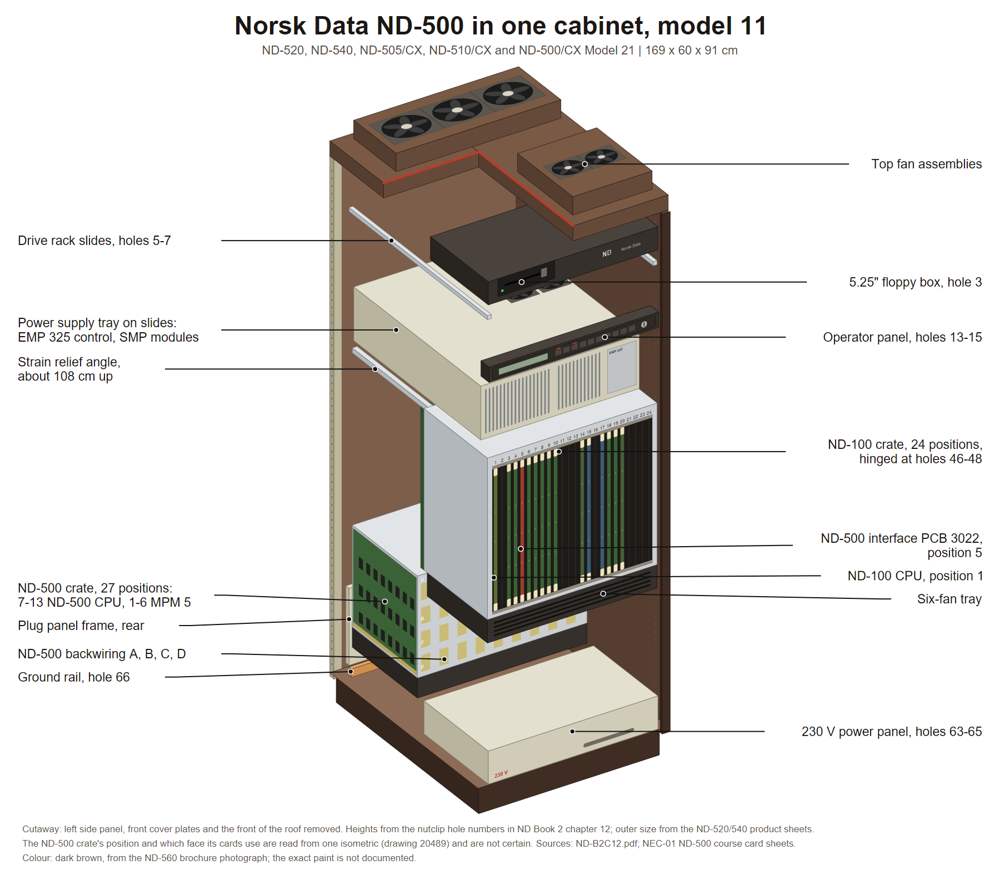

# ND-500 in one cabinet, model 11

The single-cabinet ND-500 system: the ND-500 CPU, the multiport memory and a complete
ND-100 machine in one 11-module cabinet. Sold as the ND-520 and ND-540 on the MPM 4
memory, and later as the ND-505/CX, ND-510/CX and the ND-500/CX Model 21 range on MPM 5.

Shell, frame and hole grid: [LARGE-11-MODULE-SHELL.md](LARGE-11-MODULE-SHELL.md).

**Source:** **Book 2 chapter 12**, "ND-500 11-MOD.CAB.'85 (ONE CAB), Assembly Drawings",
scan `ND-B2C12.pdf`, 29 pages, read page by page. The scan is in the sintran.com mirror
under `library/libhw/`; see the source map in [README.md](README.md). ND's own name for
this build on every title block is **MODEL 11**.




Cutaway drawing: [PNG](diagrams/nd500-one-cabinet.png), [SVG](diagrams/nd500-one-cabinet.svg). How it was built and what in it is schematic: [diagrams/README.md](diagrams/README.md).

---

## 1. The stack, top to bottom

Hole numbers are the nutclip holes, 1 at the top and 66 at the bottom.

| Holes | What | Face | Notes |
|---|---|---|---|
| on the roof | Two top fan assemblies lying flat, side by side | top | chained by a 45 cm mains cable |
| 3 | Floppy box, 5.25 inch, part 323 183 | front | a flat wide box pushed in from the front |
| 5-7 | Slides for the drive rack | front | the drive itself is not drawn in this book |
| 13-15 | Operator panel, part 323 163 | front | a thin horizontal strip across the full width, keyswitch and lamps at its left end, two flat ribbon cables up from the card crate |
| 16-18 | Slides for the power supply unit | front | pushed in from the front, screwed to the rear posts |
| about 24 to 48 | ND-100 card crate, 24 positions, part 505 007 | front | hinged at holes 46-48 on the front-left post, swings out like a door, bracket lock 48.5 cm above the base |
| under the crate | Six-fan tray, 2 by 3 axial fans, part 322 591 | front | wing nuts and locating pins |
| middle to lower rear | ND-500 card crate, 27 positions, part 505 013 | rear | four backwiring boards A to D on its rear face |
| under that crate | Its own fan unit, part 322 550 | | |
| 63-65 | 230 V power panel, part 322 949 | front | a long flat box lying on the base |
| 60-62 and 66 | Ground rail, part 519 283 | rear | M10 hardware across the rear at the bottom |
| bottom rear | Plug panels with frame | rear | a framed upright plate standing at the rear |
| about 108 cm up | Perforated strain-relief angle, part 519 333 | | carries the heavy DC cables from the power supply to both crates |
| about 63 cm up | Terminal strip 1 on a front post | front | |

---

## 2. The cages

| Crate | Part | Positions | Backplane | Cards plug in from |
|---|---|---|---|---|
| ND-100 | 505 007 | 24 | one 20-position N-100 backwiring 322 650 plus PCB 1818 bus interconnect at the end positions | front |
| ND-500 | 505 013 | 27 | four boards stacked A top, B, C, D bottom | GUESS: rear, the drawing shows the open face towards the rear post |

The ND-500 crate carries **both** the ND-500 CPU cards and the MPM 5 memory cards. Block
diagram 20585 splits it: **positions 7 to 13 are the ND-500 CPU**, **positions 1 to 6 are
MPM 5**. Along its right edge run three power rails, +5V right, +5V standby right and
+5V ND-500/2, held by nutpieces.

The four ND-500 backwiring boards are what makes one model different from another. From
drawing 20501 page 2:

| Cabinet kit | Model | A board | B | C | D |
|---|---|---|---|---|---|
| 329 011 | ND-570/11 | 324 448 | 324 445 | 324 446 | 324 447 |
| 329 012 | ND-560/11 | 324 424 | 324 445 | 324 446 | 324 447 |
| 329 010 | ND-550/11 | 324 425 | 324 445 | 324 446 | 324 447 |
| 329 003 | ND-530/11 and ND-510 | 324 426 | 324 445 | 324 446 | 324 427 |

B and C are the same board in every machine. Only A, and sometimes D, change.

In the ND-520 and ND-540 the ND-100 crate is the special **MPM4 ND-100 backplane**:
15 standard ND-100 bus positions plus 6 positions prewired to hold the most significant
half of shared memory. The least significant half, up to 1 MB, sits in the ND-500 crate
on an MPM4 1-bank backplane that replaces its first five positions.

---

## 3. How the cages are linked

| Link | From | To | How |
|---|---|---|---|
| Control and DMA | PCB 3022 "ND-500 interface" in the ND-100 crate | PCB 5015 "Control II" in the ND-500 crate | one flat cable, 327703 on block diagram 20585, from ND-100 crate position 5 row C to ND-500 crate position 13 row C |
| Power | The power supply unit at the top | both crates | heavy 16 mm square DC cables down the perforated strain-relief angle; 5 V/220 A feeds the ND-500 crate, 5 V/150 A the ND-100 crate, and a standby supply gives +5 V and +12 V standby to both |
| Memory, external variant | MPM 5 positions in the ND-500 crate | the rear plug panel | drawing 20655 brings the memory bus out so a second cabinet can share the multiport memory |

Power supply contents, from block diagram 20502: a **Power Control EMP 325** plus up to
three switch-mode modules, SMP1 always 5 V/150 A, SMP2 and SMP3 either 5 V/150 A or the
standby supply, with battery switches SW1 and SW2. A fourth module SMP4 is listed as not
mounted on the power frame.

---

## 4. Not known, so do not draw it

- Any overall dimension. Page 1 of drawing 20490 is missing from the scan.
- Side panels, doors, the plinth, the disk drive itself.
- Card lengths. The words 405 mm and 367 mm appear nowhere in this book. Which crate
  takes the longer ND-500 cards is inferred from the crate part numbers.
- Which crate is physically higher is only inferred from one isometric.

---

## 5. Image briefs

Paste the house style block from [README.md](README.md) first.

### Panel A, front view, panels on

Use Panel B of [LARGE-11-MODULE-SHELL.md](LARGE-11-MODULE-SHELL.md), with the floppy bay
and operator panel both fitted.

### Panel B, front cover off

```
Subject: the same cabinet seen from the front left, three quarter view, with the front
mouldings and the crate cover plate removed so the inside is visible.
Draw, top to bottom inside the frame:
- two flat top fan assembly boxes lying side by side on the roof;
- just under the roof, a wide flat 5.25 inch floppy box pushed in on slides, its bezel
  facing the viewer with a horizontal slot;
- below it a pair of empty horizontal slide rails running front to back;
- a thin horizontal operator panel strip spanning the full width, with a small display
  window, a row of square buttons and a round keyswitch at its left end, and two flat
  ribbon cables running down behind it;
- behind and above, a wide flat power supply tray on slides, holding several finned
  heat-sink modules side by side and a small control box;
- in the middle of the cabinet the ND-100 card crate: a wide shallow box, open towards
  the viewer, with card guide combs along its top and bottom and about 24 vertical card
  positions. Show ten or so olive-green circuit boards standing vertically in it with
  cream plastic ejector tabs, and the rest of the positions empty. The crate is hinged on
  its left front edge;
- directly under that crate a flat fan tray holding six round axial fans in two rows of
  three, and under the fans a flat mesh air filter;
- lower and further back, a second and taller card crate, the ND-500 crate, 27 positions,
  seen edge on, with its own six-fan tray under it;
- at the very bottom a long flat 230 V power panel box lying on the base slab, with a
  mains lead leaving it.
Labels with leader lines: "Top fan assembly", "5.25 inch floppy box, hole 3",
"Drive rack slides, holes 5-7", "Operator panel, holes 13-15", "Power supply unit on
slides, holes 16-18", "ND-100 card crate, 24 positions", "Six-fan tray", "Air filter",
"ND-500 card crate, 27 positions", "230 V power panel, holes 63-65".
```

### Panel C, the two cages side by side

```
Subject: a labelled diagram of the two card crates of one ND-500 system, drawn as two
long rectangles seen from the card face, one above the other, with numbered slot columns.
Upper rectangle, titled "ND-100 crate, 24 positions": a row of 24 narrow vertical slots
numbered 1 to 24 from the right. Mark the boards ND-100 CPU at slot 1, memory management
at slot 3, Megalink at slot 4, ND-500 interface PCB 3022 at slot 5 (highlight this one),
magnetic tape controller at slot 6, large disc controller at slots 7 and 8, floppy
controller at slot 9, 8-terminal interface at slot 10, dynamic RAM at slots 14 and 20,
bus master at slot 15, bus control at slot 17, MPM4 ports at slots 18 and 19.
Lower rectangle, titled "ND-500 crate, 27 positions": a row of 27 narrow vertical slots.
Bracket slots 1 to 6 and label the bracket "MPM 5 multiport memory". Bracket slots 7 to
13 and label it "ND-500 CPU". Inside the CPU bracket mark, from slot 13 downward,
Control II PCB 5015 (highlight this one), prefetch PCB 5018, Control I PCB 5012, trap
PCB 5019, control store PCB 5401, sequencer PCB 5004, four CPU slice boards PCB 5001,
four arithmetic boards PCB 5008 5009 5011 5014, and cache and memory management boards
PCB 5006, 5017 and 5022 at the low slot numbers.
Behind the lower rectangle show four stacked backplane boards labelled A, B, C, D.
Draw one bold line from slot 5 of the upper crate to slot 13 of the lower crate and
label it "PCB 3022 to PCB 5015, the ND-100 to ND-500 link".
Labels: "Cards plug in from the front", "Backwiring A B C D on the rear",
"Power rails +5V, +5V standby".
```

### Panel D, rear connector legend

Use Panel C of [LARGE-11-MODULE-SHELL.md](LARGE-11-MODULE-SHELL.md). For this machine the
strips carry SMD disk, HDLC, TFIX, CONS and TPRI, and in the external-memory variant the
multiport memory bus as well.

---

## 6. Sources

- Book 2 chapter 12, sheets 20488 nutclips, 20470 drive slides, 20469 power supply slides,
  20471 strain relief, 20464 hinge bracket and ground rail, 20466 power panel and plug
  frame, 20472 floppy box, 20487 power supply unit, 20462 ND-100 card crate assembly,
  20467 card crate and cover mounting, 20501 mounting of back wiring pages 1 and 2,
  20490 card frame and fan unit, 20481 operator panel pages 1 and 2, 20489 cabling mains
  and ground, plus block diagrams 20502, 20503, 20585, 20588 and 20655.
- Board identities cross-checked against `../ND500-HW.md`.

---

*Index: [README.md](README.md)*
