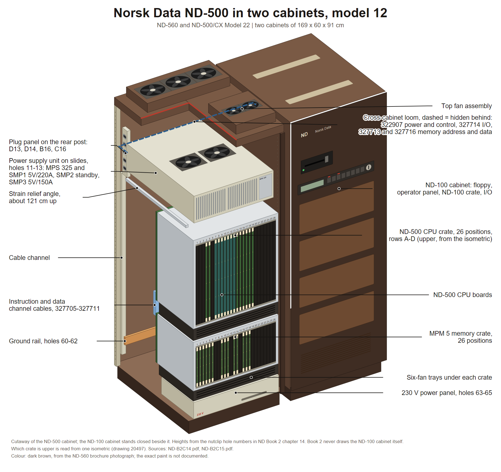

# ND-500 in two cabinets, model 12

The two-cabinet ND-500 system. One cabinet holds the ND-500 CPU crate and the MPM 5
multiport memory crate. The second cabinet holds the ND-100 machine and the I/O. Sold as
the ND-560 and as the ND-500/CX Model 22 range, ND 5372, 5572, 5672 and 5772.

Shell, frame and hole grid: [LARGE-11-MODULE-SHELL.md](LARGE-11-MODULE-SHELL.md).

**Source:** **Book 2 chapter 14**, "ND-500 11-Mod.Cab.'85 (TWO CAB), Assembly Drawings",
scan `ND-B2C14.pdf`, 17 pages, and **Book 2 chapter 15**, the cable info, block and
wiring diagrams, scan `ND-B2C15.pdf`, 20 pages. Both read page by page. The scans are in
the sintran.com mirror under `library/libhw/`; see the source map in
[README.md](README.md). ND's own name on every title block is **MODEL 12**.

> **Scope warning.** Both books draw **one cabinet only**, the ND-500 cabinet. The ND-100
> cabinet is never pictured. It appears only as an arrow, "To ND-100 Cab. (TS1)", and as
> a box, "ND-100 I/O 2 CARD CRATE", on the wiring diagrams. Its own drawings are in
> Book 2 chapter 11, which is a separate file. Draw the ND-100 cabinet from the shared
> shell file, not from this one.




Cutaway drawing: [PNG](diagrams/nd500-two-cabinet.png), [SVG](diagrams/nd500-two-cabinet.svg). How it was built and what in it is schematic: [diagrams/README.md](diagrams/README.md).

---

## 1. The stack in the ND-500 cabinet, top to bottom

| Holes | What | Notes |
|---|---|---|
| on the roof | Top fan assembly, two fan blocks side by side | chained by a 45 cm mains cable |
| 11-13 | Slides for the power supply unit | left and right slides are different parts, 519 392 and 519 365 |
| 11-13 | Power supply unit on those slides | a wide flat box with two round fan grilles and a slotted heat-sink area on top, pushed in from the front |
| about 121 cm up | Perforated strain-relief angle, part 519 333 | carries the heavy DC cables down from the power supply to both crates |
| upper middle | ND-500 CPU crate, 26 positions, part 505 011 | GUESS: upper, from one isometric |
| lower middle | MPM 5 memory crate, same 26-position frame 505 011 | GUESS: lower |
| 48-50 | Hinge brackets for both crates, front and rear | the crates swing out for service |
| 63-65 | 230 V power panel, part 322 949 | a low box at the bottom front |
| 60-62 | Ground rail, part 519 283 | across the rear, M10 studs |
| 66 | Lowest rear fixing | |
| up a rear post | Cable channel with a lid, part 519 451 | |
| top of a rear post | Plug panel strip, part 519 581 | where the cross-cabinet cables land |

There is **no floppy drive and no operator panel** in this cabinet. Both live in the
ND-100 cabinet. The operator panel and a CPU frame appear in the same box only on the
single-cabinet 5704 variants, drawings 20527 and 20529.

---

## 2. The cages

Both crates are the **same 26-position frame, part 505 011**, with **four connector rows
A, B, C, D** on the rear and a six-fan tray, 2 by 3 axial fans, part 322 592, under each.
Cards stand vertically and slide in from the **front**; a flat cover plate on DZUS
quarter-turn fasteners closes the front.

Slot numbering on the wiring diagrams runs **position 26 at the left to position 1 at the
right**.

An ND-100 crate, where it is drawn at all in these books, has **three connector rows
A, B, C** against the ND-500 crate's four. That is the quickest way to tell the two apart
in a diagram.

The MPM 5 crate carries two +5 V bus bars on each side, a normal +5 V rail and a +5 V
standby rail, left and right, parts 519 573 to 519 576.

The ND-500 backwiring boards again identify the model. From drawing 20505 page 2:

| Cabinet kit | Model | A board | B | C | D |
|---|---|---|---|---|---|
| 329 005 | ND-570/12 | 324 435 | 324 436 | 324 437 | 324 438 |
| 329 006 | ND-560/12 | 324 428 | 324 436 | 324 437 | 324 438 |
| 329 008 | ND-550/12 | 324 429 | 324 436 | 324 437 | 324 438 |
| 329 009 | ND-530/12 and ND-510 | 324 430 | 324 436 | 324 437 | 324 420 |

The MPM 5 boards depend on bank count instead, from drawing 20509:

| Build | A | B | C | D |
|---|---|---|---|---|
| MPM 5 one bank | 324 421 | 324 431 | 324 251 | 324 432 |
| MPM 5 two bank | 324 422 | 324 433 | 324 252 | 324 434 |

---

## 3. Inside the ND-500 cabinet: crate to crate

Ten flat signal cables run between the two crates, from rows C and D of the ND-500 crate
to rows B, C and D of the MPM 5 crate. Block diagram 20577 names them:

| Cable | What it carries |
|---|---|
| 327710 | instruction and data address |
| 327711 | instruction address |
| 327705, 327706, 327707 | data most significant, three paths |
| 327708, 327709 | data least significant |

The pattern is the one the MPM 4 manual describes: the ND-500 reaches memory over
**two separate channels, one for instructions and one for data**, each through its cache
modules, and each 32-bit cache module connects to two 16-bit memory banks through two
ports.

---

## 4. Cabinet to cabinet: every cable that crosses

This is the part that makes a two-cabinet diagram worth drawing.

| Cable | From | To | What it is |
|---|---|---|---|
| 322907 | Terminal strip 1 in the ND-500 cabinet | Terminal strip TS1 in the ND-100 cabinet | power and control. Carries the master-clear, power-fail and running signals over 327021, and the power control link 325131. On drawing 20536, T.S.1 pins 9 and 10 give "Ext.PF ND100" and ground |
| 327714 and 327715 | ND-500 crate position 4, row D | the ND-100 cabinet | "N100/500 I/O". GUESS: it lands on the ND-100's PCB 3022 bus interface card |
| 327713 | plug panel connector D13 | the ND-100 cabinet | "N100 MPM L Driv Addrs", the memory link address side. "L Driv" is line driver |
| 327716 | plug panel connector D14 | the ND-100 cabinet | "N100 MPM L Driv Data", the memory link data side |
| 2 x 327543 | plug panel connectors B16 and C16 | stays inside the cabinet | MPM 5 controller, two bank |

All the cross-cabinet cables land on the **plug panel** on a rear post at the top of the
ND-500 cabinet, then run down the cable channel. The plug panel strip carries its own
labels: black number labels 1, 2, 12, 13, 14 and 16, and a white letter label A B C D.

The operator panel that switches the ND-500 on lives in the ND-100 cabinet and plugs into
**backwiring position 11 of the ND-500 crate**, PCB 1981, over the cross-cabinet loom.

---

## 5. Power

From wiring diagram 20508. The power supply tray holds a **Nord Power Control MPS 325**
plus three switch-mode modules:

| Module | Output | Feeds |
|---|---|---|
| SMP1 | 5 V/220 A | the ND-500 crate |
| SMP2 | standby supply, +5 V and +12 V | both crates and the operator panel |
| SMP3 | 5 V/150 A | the MPM 5 crate |

The DC cables are 16 mm square, black for 0 V and white for +5 V, 135 to 225 cm long,
running from the tray at the top down to the bus bars along the full 26-position width of
each crate. Screen tubing on each run is bonded to the earth rail.

---

## 6. Not known, so do not draw it

- Any dimension in millimetres. The only printed length in these books is
  "ca. 121 cm from socket" for the strain-relief angle.
- The ND-100 cabinet's own insides.
- Card lengths.
- Which crate is physically above the other; only one isometric suggests it.

---

## 7. Image briefs

Paste the house style block from [README.md](README.md) first.

### Panel A, the pair of cabinets

```
Subject: two identical 1980s minicomputer cabinets standing side by side, three quarter
view from the front left, skin panels on. Each is about 169 cm high, 60 cm wide, 91 cm
deep, so together they read as one wide installation about 120 cm across.
The left cabinet is labelled "ND-100 cabinet" and has a 5.25 inch floppy drive bay near
the top of its front face and a slim operator panel strip with a keyswitch below it.
The right cabinet is labelled "ND-500 cabinet" and its front face is plain, every opening
closed with a blind panel, no floppy and no operator panel.
Both faces are tall narrow rectangles of two bolted mouldings with a chamfered right-hand
vertical edge and a recessed plinth at the bottom.
Between the two cabinets, low down at the back, draw a bundle of thick cables crossing
from one to the other and label it "Cross-cabinet loom: power and control 322907,
I/O 327714, memory address 327713, memory data 327716".
Colours: warm off-white painted steel, dark brown-black panel fronts, small
"ND Norsk Data" wordmark near the top of each face.
```

### Panel B, the ND-500 cabinet, cover off

```
Subject: the right-hand cabinet alone, front cover removed, three quarter view from the
front left.
Draw, top to bottom inside the frame:
- a flat top fan assembly of two fan blocks lying side by side on the roof;
- just under it, a wide flat power supply tray on horizontal slides, holding a power
  control module and three finned switch-mode supply modules in a row, with two round fan
  grilles on top;
- a perforated angle bar running front to back across the frame at about chest height,
  with a bundle of thick black and white cables tied along it;
- the upper card crate, a wide shallow box open towards the viewer with card guide combs
  top and bottom and 26 vertical card positions, about half filled with olive-green
  boards with cream ejector tabs. Label it "ND-500 CPU crate";
- a flat fan tray of six round axial fans in two rows of three directly under it;
- the lower card crate, identical in shape, labelled "MPM 5 memory crate", with its own
  six-fan tray under it;
- at the very bottom a long flat 230 V power panel box lying on the base slab.
On the rear edge of each crate show four stacked backplane boards edge on, lettered
A, B, C, D from top to bottom, and a bundle of about ten flat ribbon cables looping from
the upper crate's boards down to the lower crate's boards.
Labels: "Top fan assembly", "Power supply unit on slides, holes 11-13", "Power control
MPS 325", "5 V/220 A supply", "standby supply", "5 V/150 A supply", "Strain relief angle,
about 121 cm up", "ND-500 CPU crate, 26 positions", "Six-fan tray", "MPM 5 memory crate,
26 positions", "Backwiring rows A B C D", "Instruction and data channel cables",
"230 V power panel, holes 63-65", "Ground rail".
```

### Panel C, how the two cabinets are wired together

```
Subject: a flat schematic, not a picture of hardware. Two tall rectangles side by side on
a white background, the left labelled "ND-100 cabinet", the right labelled
"ND-500 cabinet".
Inside the left rectangle: one long horizontal crate bar labelled "ND-100 crate, 24
positions, connector rows A B C" with a highlighted slot labelled "PCB 3022 ND-500
interface"; a small box labelled "Terminal strip TS1"; a small box labelled
"Operator panel".
Inside the right rectangle: two long horizontal crate bars, the upper labelled
"ND-500 CPU crate, 26 positions, rows A B C D" with a highlighted slot labelled
"position 4 row D" and another labelled "PCB 5015 Control II"; the lower labelled
"MPM 5 memory crate, 26 positions, rows A B C D"; a small box labelled "Terminal strip
1"; a vertical strip on the right edge labelled "Plug panel" with four connector marks
labelled D13, D14, B16, C16.
Draw four bold lines crossing the gap between the rectangles, each with its own label:
"322907 power and control", "327714 N100/500 I/O", "327713 memory address",
"327716 memory data".
Draw ten thin lines inside the right rectangle between the two crate bars and bracket
them with the label "Instruction channel and data channel, 327705 to 327711".
```

---

## 8. Sources

- Book 2 chapter 14, sheets 20491 nutclips, 20492 power supply slides, 20493 strain
  relief, 20494 hinge bracket and ground rail, 20495 plug panel and power panel, 20496
  power supply unit, 20505 backwiring for the ND-500 pages 1 and 2, 20509 backwiring for
  MPM 5, 20497 card crate mounting pages 1 and 2, 20498 cabling mains and ground.
- Book 2 chapter 15, cable indexes and block diagrams 20507, 20508, 20577, 20212, 20587,
  20527, 20529, 20530, 20531, 20536.
- `../../Reference-Manuals/500/ND-10.003.01 TECHNICAL INTRODUCTION TO MULTIPORT 4.md`
  chapter 10 for the two-channel memory attachment.

---

*Index: [README.md](README.md)*
