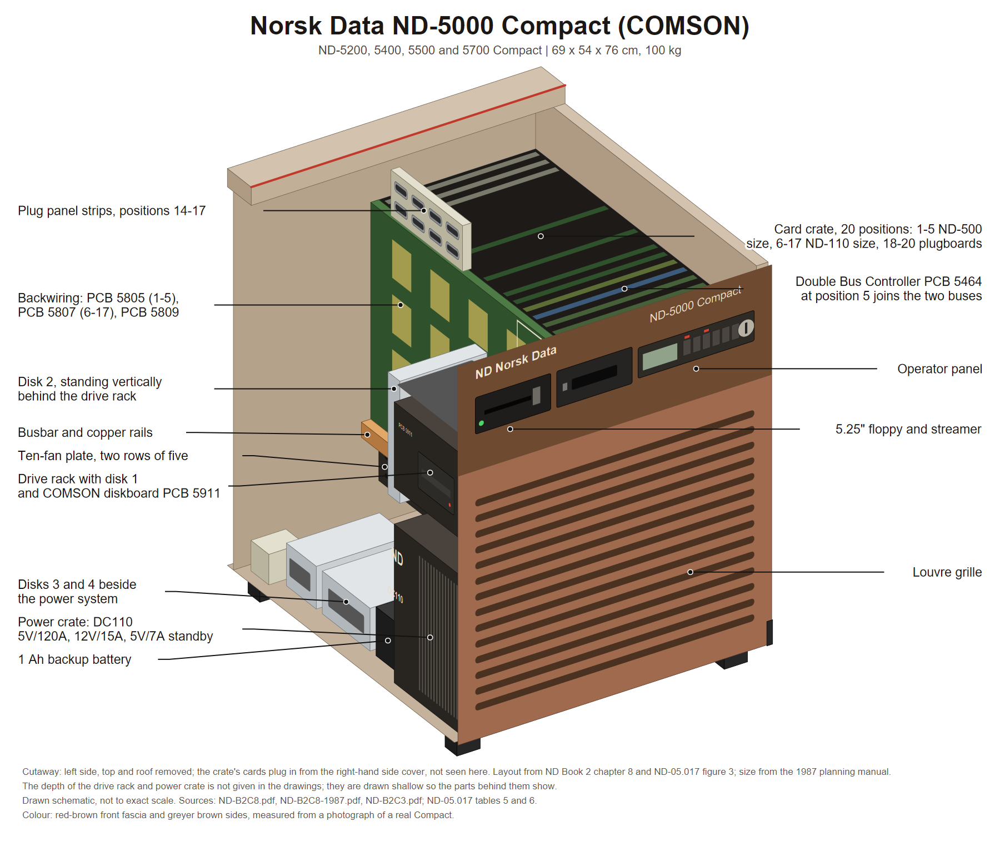

# ND-5000 Compact, the COMSON box

The small ND-5000: the same shell as the ND-100 Compact, with two backplanes inside
instead of one. Sold as the ND-5200, ND-5400, ND-5500 and ND-5700 Compact, models A0 to
A4, A10 to A14 and B.

ND's drawing set calls the build **COMSON**. That is a machine name, not a product code:
Norsk Data ran two ND-5000 Compacts in Oslo as disc test machines and called them
COMSON-A and COMSON-B. See `../../History/machines/cabinets/Compact-5000-COMSON.md`.

**Source:** **Book 2 chapter 8**, "ND-100/5000 COMPACT (COMSON), Assembly Drawings",
both editions: scan `ND-B2C8.pdf`, 38 pages, March 1988, and scan `ND-B2C8-1987.pdf`,
40 pages, December 1987. All 78 pages read and the two editions compared sheet by sheet.
The outer panels are **Book 2 chapter 3** sub-chapter 2, scan `ND-B2C3.pdf`. The scans
are in the sintran.com mirror under `library/libhw/`; see the source map in
[README.md](README.md).




Cutaway drawing: [PNG](diagrams/nd5000-compact.png), [SVG](diagrams/nd5000-compact.svg). How it was built and what in it is schematic: [diagrams/README.md](diagrams/README.md).

---

## 1. Outer size

| Source | H x W x D | Weight | Power |
|---|---|---|---|
| 1987 planning manual ND-13.028 | 69 x 54 x 76 cm | 100 kg | 1250 W, 16 A slow fuse |
| Same, for the ND-100 Compact | 69 x 54 x 76 cm | 78 kg | 800 W |

**The ND-5000 Compact and the ND-100 Compact are the same box.** They differ in weight
and power, not in shape. The ES Model C maintenance manual confirms it from the other
direction: the Model C "has the same cabinet as the previous version, except for the
front cover".

Not one of the 78 drawing sheets carries a dimension. The only millimetre number in the
whole set is "L = 320 MM" for a rubber strip on the crate cover.

---

## 2. The shape

A cube-like cage of square steel tube: a base rectangle on four small feet, four vertical
corner posts, a top rectangle, and one horizontal rail at mid height on two opposite
sides. Flat sheet covers bolt on: a top cover, a cover over the card face, a narrow rear
plate, and side covers.

Inside, the box is divided into **two halves standing side by side**: the **card side**
and the **drive and power side**.

The skin, from Book 2 chapter 3 drawing 20448: five panels, front 509 046, two sides
509 048, top 509 049 and rear 509 134, each hung on brackets and held by DZUS quarter-turn
fasteners with Vistop captive washers. An **air flow reducer** baffle plate 509 229 sits
inside the front. The front panel is a louvred grille over its lower half with a sloped
upper fascia carrying two rectangular windows. Drawing 20449, "Comson complete", shows
the finished machine: deeper than it is wide, a strongly chamfered top-front edge with
the sloped fascia and its two recessed windows, a wide louvre grille over the lower
front, plain flat sides and top, and a slim plinth at the bottom.

---

## 3. The card side: one cage, two card sizes

One card crate, part 509 110: a wide shallow sheet-metal box with card guide combs top
and bottom. Its open card face looks toward one side cover, so **cards plug in
horizontally, edge on, from that side**. That side is the service side.

The backwiring is one **20-position double-bus backplane** built from three boards:

| Board | Part | Covers |
|---|---|---|
| PCB 5805, BW-1, SAMSON | 324 805 | positions 1 to 5, the ND-500 size slots |
| PCB 5807, BB, BW-3, SAMSON-C | 324 807 | positions 6 to 17, the ND-110 size slots |
| PCB 5809, SAMSON-C-BW F.S. | 324 809 | a squarer board at one end |
| PCB 5236 console | 324 196 | a small board beside 5805, fitted in a 5000 build |

Position map, from the maintenance manual tables 5 and 6:

| Pos | Card size | New type, models A10-A14 and B |
|---|---|---|
| 1-2 | ND-500 | ND-5000 CPU card, type 1 |
| 1-3 | ND-500 | ND-5000 CPU card, type 2 |
| 3 | ND-500 | MFB dynamic RAM, if CPU type 1 |
| 4 | ND-500 | MFB dynamic RAM, 4, 8 or 16 MB |
| 5 | ND-500 | **Double Bus Controller, PCB 5464** |
| 6 | ND-110 | ND-110 CPU |
| 7 | ND-110 | Tracer, memory, Ethernet or token ring |
| 8-9 | ND-110 | HDLC, Megalink, memory, Ethernet or token ring |
| 10-12 | ND-110 | 8 terminal, PIOC or memory |
| 13 | ND-110 | Floppy and SCSI controller |
| 14-17 | ND-110 | free |
| 18-20 | | Plugboards 1, 2 and 3. **Not card slots** |

In the first version, models A0 to A4, position 6 is an ND-110/CX, position 13 an ST506
disk controller or Triangel, position 14 the floppy-SCSI card, and the plugboards carry
printed source notes: plugboard 1 takes the 8-terminal and PIOC lines from position 10,
the console from positions 5 and 6, and Telefix from position 6.

**The Double Bus Controller at position 5 is the whole point of the box.** It bridges the
MF-bus half, positions 1 to 5, to the ND-110 bus half, positions 6 to 17, on one shared
backwiring. There is no cable between the two buses and no MF-bus port card.

Along the bottom rear edge of the crate runs the **busbar**, part 509 117: a long bent
copper bar with four tabs pointing up, bolted to copper rails on the crate's left and
right side plates, parts 509 139 and 509 116, and to a third rail along the bottom rear,
part 509 119. The DC harness from the power supply ends here on push-on terminals. An
anti-static wrist strap is strapped to a crate corner.

---

## 4. The drive and power side, top to bottom

| What | Detail |
|---|---|
| **Drive rack** at mid height on two L brackets | A drawer with an angled front bezel: a floppy slot, a streamer slot and a small operator panel with two windows. Inside it sit disk 1 and the **COMSON diskboard PCB 5911**, which cables every drive and the operator panel |
| **Disk 2** | A single 125 MB 5.25 inch SCSI drive hanging **vertically** in a bracket, part 509 132, on the far side of the drive rack |
| **Power crate** | An open sheet-metal box holding the **DC110 5 V/120 A** supply, part 511 027, a box with a large finned heatsink along one long side, pushed in from the outside. A 1 Ah EBU-13 battery sits on the rear plate beside it |
| **Disks 3 and 4** | One on each side of the power system at the bottom, fed by a small SCSI power board PCB 1875 and a ribbon chain ending in a male terminator PCB 1880 with a plastic plug protection cover |

The DC110 supplies 5 V/120 A for the CPU and memory, 12 V/15 A for the drives, and
5 V/7 A standby for the memory during a power failure.

Drawing 20698 states the disk placement in one sentence: "There is option to mount more
disks according to configuration. One on opposite side of drive rack, and one on each
side of power system in bottom cabinet."

In the **external-disk variant**, module 329 105 with drawing 20697, the drive rack keeps
only the operator panel and a floppy. The disks live outside the box.

---

## 5. Cooling and mains

The fan unit is **one flat plate carrying ten axial fans in two rows of five**. It slides
in horizontally under the card crate from the drive side. The drawings do not state the
airflow direction.

At the base: the mains filter block with a transient absorber, part 503 318 and 503 322,
sits on a base tube under the power crate. The mains inlet passes through a rubber
grommet. The **circuit breaker**, a small square rocker, part 517 669, sits in a bracket
on the outside of a base rail at the bottom edge of the cabinet. The AC loom, brown, blue
and yellow-green, runs along the base tubes in clips.

---

## 6. The rear connector panel

Flat ribbon cables leave the A and B wiring rows of the I/O positions, run up the rear of
the crate and over its top, and end on **plug panel strips**: upright strips standing in a
row on top of the crate at the rear, each with two rows of D-sub cut-outs, one strip per
card position.

The strips read **"TOWARDS COMPUTER FRONT"** at the top and **"TOWARDS COMPUTER REAR"**
at the bottom, so they are seen from outside. In the 1988 edition there are four columns,
fed from positions 14, 15, 16 and 17; the 1987 edition has three, from 15, 16 and 17.

Two labelling examples are printed on drawing 20696 page 2:

| Example | Labels |
|---|---|
| Example 1 | PRTC A, SMC 2, SMC 3, SMT, SMR, SMC 0, SMC 1, PRTC B |
| Example 2 | 62, 63, 60, 61, STC 1, STC 2, ETHER NET as one wide label across two openings, 546, 547, 544, 545, STC 3, STC 4 |

A small configuration label carries "ND- ___ COMPACT MODEL / CPU NO." and three terminal
number diagrams: from position 10 the pairs 48 49, 50 51 and 36 37; from position 11 the
pairs 7 15 and 42 43; from position 12 the pairs 56 57 and 58 59, each headed
"B-TERM. A-TERM. Log.dev.no.".

---

## 7. Not known, so do not draw it

- Any dimension except the 320 mm rubber strip.
- Card lengths and slot pitch.
- Airflow direction through the ten-fan plate.
- Colour beyond the general ND scheme.

---

## 8. What changed between the 1987 and 1988 editions

The book was re-cut from four sub-chapters to five. New sheets in 1988: 20697 the drive
rack for the external-disk cabinet, 20711 SCSI signal cabling, 20712 SCSI power cabling,
20710 plugboard, clamp and power mounting. Revised: 20698 moved the disk power detail out
and added the sentence on disk placement; 20696 became two pages and moved the plug panel
columns from positions 15-17 to 14-17, adding Ethernet and PRTC labels; 20397 and 20398
were retitled "an example of". The mechanical sheets themselves did not change: the 1987
file already carries the October 1988 sub-chapter 2 insert.

---

## 9. Image briefs

Paste the house style block from [README.md](README.md) first.

### Panel A, front view

```
Subject: straight-on front view of a small 1980s Norsk Data desk-side minicomputer, about
69 cm high, 54 cm wide, 76 cm deep, so a squat box deeper than it is wide.
Draw a strongly chamfered top-front edge carrying a sloped fascia. On the fascia, at the
left, a small "ND Norsk Data" wordmark; in the middle, a recessed bay with two drive
openings side by side, the upper a 5.25 inch floppy with a horizontal slot and a small
lever, the lower a 5.25 inch tape streamer; to the right of them the legend "ND-5000
Compact"; below, a row of about eight small square buttons and a round keyswitch.
The whole lower two thirds of the front is a fine horizontal louvre grille.
A slim plinth runs round the bottom. At the bottom edge, at one corner, a small square
rocker circuit breaker.
Colours: warm beige painted steel, dark brown-black fascia and grille.
Labels: "Sloped fascia", "5.25 inch floppy", "Streamer", "Operator panel", "Louvre
grille", "Circuit breaker", "Plinth".
```

### Panel B, covers off, the two halves

```
Subject: the same small box with the top cover and one side cover removed, three quarter
view from the front left, so both halves inside are visible.
Draw a cage of square steel tube: a base rectangle on four small feet, four corner posts,
a top rectangle, one horizontal rail at mid height.
In the left half, the card crate: a wide shallow box with card guide combs top and bottom
and 20 positions in one row, its open card face towards the viewer so the boards are seen
edge on standing horizontally. Show the five leftmost positions filled by one thick
sandwiched multi-board assembly and one tall memory card, and the next twelve positions
by thinner olive-green boards with cream ejector tabs. The last three positions hold
narrow boards standing on edge at the end of the crate.
Along the bottom rear edge of the crate, a long bent copper bar with four tabs pointing
up, bolted to copper rails on the crate sides.
In the right half, from top to bottom: a drawer-like drive rack on two L brackets, with an
angled front bezel carrying a floppy slot, a streamer slot and a small operator panel with
two windows, and a hard disk and a circuit board inside it; a second hard disk standing
vertically in a bracket beside it; below, an open power crate holding a large power supply
box with a finned heatsink along one side, with a small battery beside it; and one hard
disk on each side of the power supply at the bottom.
At the very bottom, under the card crate, a flat plate carrying ten round axial fans in
two rows of five, part way slid out.
Labels: "Card crate, 20 positions", "Positions 1-5, ND-500 size cards",
"ND-5000 CPU", "MFB dynamic RAM", "Double Bus Controller PCB 5464",
"Positions 6-17, ND-110 size cards", "ND-110 CPU", "Positions 18-20, plugboards",
"Busbar and copper rails", "Drive rack: floppy, streamer, operator panel",
"Diskboard PCB 5911", "Disk 1", "Disk 2, vertical", "Power crate, DC110 5V/120A",
"Battery", "Disk 3", "Disk 4", "Ten-fan plate".
```

### Panel C, the service side, slot table

```
Subject: a flat straight-on diagram of the open card face of the crate, drawn as one long
horizontal rectangle divided into 20 numbered positions, on a white background.
Positions 1 to 5 are drawn taller and deeper than the rest and bracketed with the label
"ND-500 size cards, 405 x 277 mm". Positions 6 to 17 are shorter and bracketed
"ND-110 size cards, 367 x 277 mm". Positions 18 to 20 are drawn as narrow strips standing
on edge and bracketed "Plugboards, not card slots".
Inside the positions, label: 1 and 2 "ND-5000 CPU card, type 1"; 3 "MFB dynamic RAM";
4 "MFB dynamic RAM, 4, 8 or 16 MB"; 5 "Double Bus Controller"; 6 "ND-110 CPU";
7 "Tracer, memory or Ethernet"; 8 and 9 "HDLC, Megalink, memory or Ethernet";
10, 11 and 12 "8 terminal, PIOC or memory"; 13 "Floppy and SCSI controller";
14 to 17 "Free"; 18, 19 and 20 "Plugboard 1, 2, 3".
Behind the rectangle, draw three backplane boards edge on, one spanning positions 1 to 5
labelled "PCB 5805 BW-1 SAMSON", one spanning 6 to 17 labelled "PCB 5807 BW-3", and a
small square one at the end labelled "PCB 5809".
Draw a bold vertical line at position 5 and caption it: "One backwiring, two buses. The
Double Bus Controller bridges the MF-bus half to the ND-110 bus half. No cable and no
port card between them."
```

### Panel D, rear connector panel

```
Subject: a flat straight-on legend of the plug panel strips of an ND-5000 Compact, drawn
as four narrow vertical strips standing side by side on a white background.
Each strip is a metal plate with two vertical rows of rectangular cut-outs, each cut-out
holding a multiway D-shaped connector. At the top of each strip print "TOWARDS COMPUTER
FRONT" and at the bottom "TOWARDS COMPUTER REAR", both small.
Head the four strips "From pos. 17", "From pos. 16", "From pos. 15", "From pos. 14".
Small labels beside individual connectors, upper rows: PRTC A, SMC 2, SMC 3, STC 1,
STC 2, 62, 63, 60, 61. Lower rows: PRTC B, SMC 0, SMC 1, SMT, SMR, STC 3, STC 4, 546,
547, 544, 545, and one wide label "ETHER NET" spanning two openings.
Below the strips draw a small rectangular configuration label card reading
"ND- ___ COMPACT MODEL / CPU NO." with three small tables headed "B-TERM. A-TERM.
Log.dev.no." and the number pairs 48 49 / 50 51 / 36 37, 7 15 / 42 43, 56 57 / 58 59.
Labels: "Plug panel strip, one per card position", "Configuration label".
```

---

## 10. Sources

- Book 2 chapter 8, both editions. Key sheets: 20035 main assembly, 20443 base components,
  20444 card crate and backwiring pages 1 and 2, 20684 busbar and rails pages 1 and 2,
  20689 power crate, 20445 brackets and fan unit, 20692 covers, 20696 various and
  labelling, 20031 backwiring 5000 mounting, 20697 and 20698 drive rack, 20710 plugboard,
  20711 and 20712 SCSI cabling, plus block diagrams 20375, 20382, 20397 and 20398.
- Book 2 chapter 3 sub-chapter 2, drawings 20448 panels and 20449 complete.
- `../../Reference-Manuals/500/ND-05.017.01 EN ND-5000 HARDWARE MAINTENANCE.md`
  tables 5 and 6, and section 1.3 for the DC110.
- `../../Reference-Manuals/500/ND-05.020.01 EN ND-5000 Hardware Description.md` figure 3.
- `../../Hardware/ND-PHYSICAL-MODELS.md` for the outer size and the operator panel
  measurements.

---

*Index: [README.md](README.md)*
