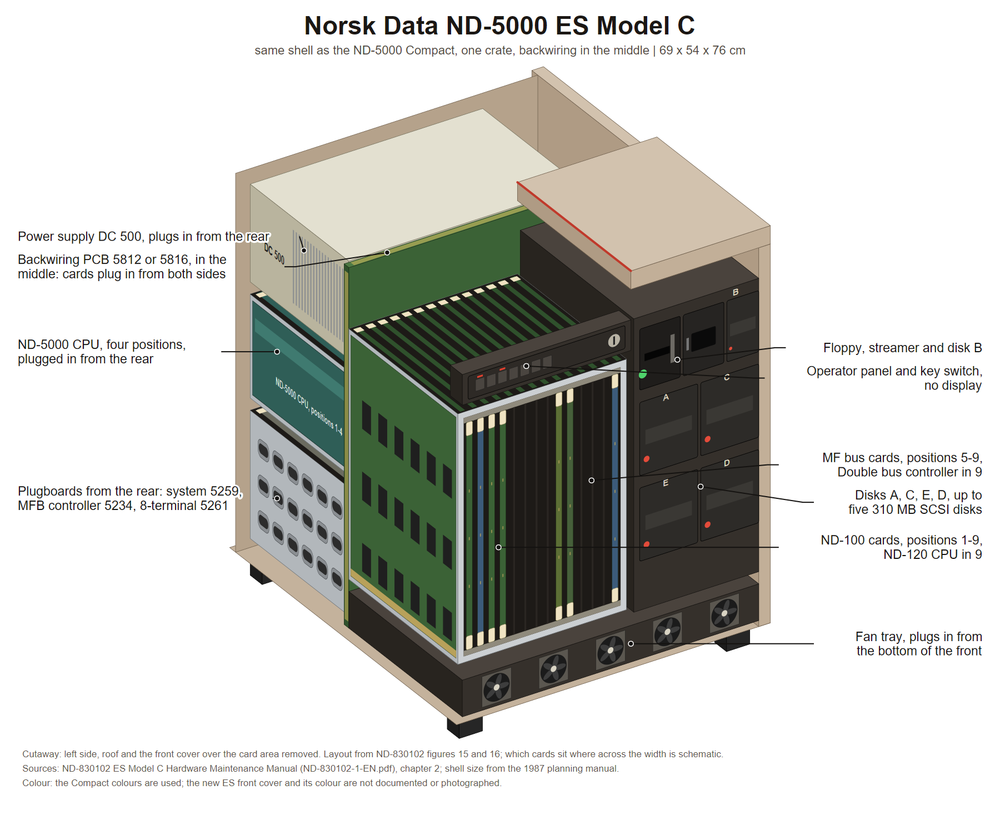

# ND-5000 ES Model C

The replacement for the ND-5000 Compact. **Same cabinet, new front cover, completely new
interior.** Available with every ND-5000 CPU type including the type 3 of the ND-5800, and
per the ES product lists with Rallar too, as ND-5830 and ND-5850 ES Model C11.

Its manual says it plainly: "It has the same cabinet as the previous version, except for
the front cover. The interior, however, is completely new."

Outer shell: see [ND-5000-COMPACT.md](ND-5000-COMPACT.md) section 1. Same 69 x 54 x 76 cm
box.

**Source:** **ND-830102**, "ND-5000 ES Model C Hardware Maintenance Manual", chapter 1
introduction and chapter 2 "Physical description", figures 1 to 25. Read from the scan
`ND-830102-1-EN.pdf` in the sintran.com mirror under `library/libhw/`, because the repo's
OCR of this manual,
`../../Reference-Manuals/500/ND-830102.1B EN ND-5000 ES Model C Hardware Maint. Manual-Sintran.md`,
**lost every figure**. This cabinet has no Book 2 chapter of its own.
A sibling manual **ND-830103** covers the **ES Model S** and is not in this repo.




Cutaway drawing: [PNG](diagrams/nd5000-es-model-c.png), [SVG](diagrams/nd5000-es-model-c.svg). How it was built and what in it is schematic: [diagrams/README.md](diagrams/README.md).

---

## 1. The one big idea

The ND-5000 Compact had a card crate on one side and a drive-and-power bay on the other,
joined by cables. The ES Model C replaces both with **one large card crate with the
backwiring in the middle**. Cards and devices plug into that backwiring **from both the
front and the rear**. Everything that normally needs service, including the power supply,
the fan tray, the disks, the floppy and the streamer, plugs straight in.

The manual's own summary: "the cabinet is practically free from internal cables."

---

## 2. The card crate, front and rear

Figure 15 of the manual is the key drawing. It shows the crate in section with the
backwiring as a vertical line down the middle, front to the right and rear to the left.

### In the front

| Group | Contents |
|---|---|
| MF bus cards, positions 1 to 4 | at the top |
| MF bus cards, positions 5 to 9 | position 5 memory or Domino SCSI; positions 6, 7 and 8 free for Domino; position 9 the **Double bus controller** |
| ND-100 cards, positions 1 to 9 | position 9 the **ND-120 CPU**; positions 3 to 8 free for ND-100 I/O; position 2 the floppy and SCSI interface; position 1 the 8-terminal interface or more ND-100 I/O |
| Device bays | a streamer unit, a floppy unit and up to five disk units |

Free ND-100 positions need no dummy plug. Empty mass-storage positions must be closed
with special plugs, part 322 774.

### At the rear

| Group | Contents |
|---|---|
| Plugboards | system plug board, MF bus plug boards, MFB controller plug board, a place for the ND-100 tracer, plug boards for the ND-100 cards, the 8-terminal plug board |
| ND-5000 CPU | **four positions**, numbered 1 to 4 |
| Power supply | its own bay |

So the ND-5000 CPU is plugged in **from the back** in this machine, and the ND-120 and the
I/O cards from the front.

---

## 3. The backwiring

Two versions exist: **PCB 5812** for early machines and **PCB 5816** for later ones. They
differ only in how far the SCSI bus can be split with straps and switches.

The board carries, all named on figures 5 and 6:

- a **temperature sensor** at the top, close to the air inlet, which sets the fan speed
- a connector for the **operator panel**
- an area where the voltages can be measured, marked Gnd, +5V, 5VStb and +12v
- **terminator and strap fields** for the SCSI bus, one, two or three of them depending on
  the board version
- **split switches** for the SCSI bus
- named device positions: **Floppy, Streamer, Disk A, Disk B, Disk C, Disk D, Disk E**
- the **fan tray** position along the bottom edge

---

## 4. The SCSI bus

The backwiring carries the internal SCSI bus to every internal device and ends it on the
plugboard at position 14, where it can be terminated or one external single-ended device
can be attached.

| SCSI ID | Device |
|---|---|
| 0 | Disk A, the system disk |
| 1 | Streamer or ND Gigatape. Reserved for system disk backup |
| 2 | optional external SCSI device |
| 3 to 6 | free, disks B to E |
| 7 | the ND-100 floppy and SCSI controller |

Straps and split switches let the bus be cut so that MF bus SCSI controllers take some
devices and the ND-100 controller the rest. The manual shows three worked examples, up to
three controllers on one physical bus: one ND-100 SCSI controller and two MF bus SCSI
controllers.

---

## 5. Cooling, power and the panels

- **Fan tray.** Plugs into the backwiring from the **bottom of the front**. DC fans, each
  with an extra wire reporting its speed. Power comes from the DC 500 supply and the
  voltage is set by software from the temperature sensor at the top of the backwiring.
  The power supply also checks that every fan is turning. The power must be off before the
  tray is pulled.
- **Power supply DC 500 or DC 501**, part 512 030. Plug-in, microprocessor controlled, and
  its voltages, currents and fan speed can be read and adjusted from a terminal or over
  Telefix. Capacities: +5 V at 150 A, +5 V standby at 8 A, 12 A on the DC501, and +12 V at
  18 A with a 25 A peak to spin the disks up. Its outer face carries the AC inlet and a
  lead to the on/off switch.
- **Operator panel** at the top of the front, with the key switch. Similar to earlier ND
  panels **but the display has been removed**. The same information needs an external
  maintenance display plugged into the system plugboard. A flat cable runs from the panel
  along the top of the cabinet to the backwiring.
- **Panels.** Front: one screw at the top, lift and pull away. Sides: two screws turned a
  half turn counterclockwise, then lift away. Top and rear: four screws each.

### Drive bay layout

Figure 16 places the devices on the front face: the floppy and the streamer in the upper
bay, side by side, with **disk B** to their right; below them a 2 by 2 block of disks
lettered **A** and **C** on the upper row, **E** and **D** on the lower. Up to five disks
of 310 MB, giving models C1 to C5. The optional ND Gigatape, an 8 mm cartridge system of
up to 2.2 GB, takes the disk B position on models C1 to C4 and lives in a separate box on
the C5.

---

## 6. The plugboards

Plugboards go into the backwiring from the **rear**, which is what makes the machine
cable-free. Some ship with every system, others depend on configuration.

| Board | PCB | What it connects |
|---|---|---|
| System plugboard | 5259, part 350 309 | maintenance display, external SCSI device or termination, ND-5000 CPU console, ND-100 console, Telefix modem. Also carries baud-rate switches for both consoles, a switch to enable or disable Telefix, normally down, and a yellow LED lit for differential SCSI. Always fitted, in the leftmost position seen from the rear |
| MFB controller plugboard | 5234, part 324 194 | OCTO 1, OCTO 2, a power-fail interrupt that is not used, and the MF console on both RS232 and current loop |
| ND-100 floppy and SCSI controller | 3201, part 350 001 | the old floppy controller plus the SCSI adapter. Up to four in one ND-100. Carries Z80 DMA, BUS and REQ lamps, an error code display for the floppy interface, and thumbwheels for the SCSI ID, the IOX and ident, and the floppy unit number |
| 8-terminal plugboard | 5261, part 350 311 | eight terminals. Goes in position 1 from the rear. It is so big that nothing else fits in position 2 |
| Plugboard for external panel | 5262, part 350 312 | links by two cables to an external plug panel PCB 1701 mounted in a wall frame in the machine room. Up to eight terminals per panel, up to eight panels per frame |
| Backwiring | 5812 or 5816, part 324 812 | |
| Tracer converter | 5257, part 350 307 | |

---

## 7. Not known, so do not draw it

- Any outer dimension is not restated in this manual; it is the Compact shell.
- What the new front cover looks like in detail. The manual's figures are line art with
  no styling.
- Colour.

---

## 8. Image briefs

Paste the house style block from [README.md](README.md) first.

### Panel A, front view

```
Subject: straight-on front view of a small 1980s Norsk Data server cabinet, about 69 cm
high, 54 cm wide, a squat box.
Draw, on the front face: along the top, a slim operator panel strip with a row of small
square buttons and a round keyswitch, and no display window. To the left of it, a tall
narrow block of fine horizontal louvre slots running most of the height.
In the upper middle, a bay with two 5.25 inch drives side by side, the left a floppy with
a horizontal slot, the right a tape streamer, and beside them a single drive bay labelled
B.
Below them, a 2 by 2 block of four square drive bays lettered A and C on the upper row,
E and D on the lower row.
Along the bottom, a narrow slot the full width, which is the fan tray front.
Colours: warm beige painted steel, dark brown-black bays.
Labels: "Operator panel and keyswitch, no display", "Air inlet louvres", "Floppy unit",
"Streamer, or ND Gigatape on models C1 to C4", "Disk B", "Disk A", "Disk C", "Disk E",
"Disk D", "Fan tray".
```

### Panel B, the crate in section

```
Subject: a flat cutaway section through the machine, seen from the side, on a white
background. No perspective. Rear at the left, front at the right, marked with two arrows
labelled "Rear" and "Front".
Draw one vertical line down the centre of the drawing, thick, labelled "Backwiring PCB
5812 or 5816". Everything plugs into it from one side or the other.
On the right of the line, from top to bottom: a block labelled "Disk unit"; a block
labelled "Floppy unit"; a block labelled "Streamer unit"; a group of four horizontal card
slots labelled "MF bus cards, positions 5 to 9" with individual notes "5 Memory or Domino
SCSI", "6, 7, 8 Free for Domino", "9 Double bus controller"; and a group of nine card
slots labelled "ND-100 cards, positions 1 to 9" with notes "9 ND-120 CPU", "3 to 8 Free
positions for ND-100 I/O", "2 Floppy and SCSI interface", "1 8-terminal interface or
ND-100 I/O".
On the left of the line, from top to bottom: a block labelled "Power supply DC 500";
a group of four card slots labelled "ND-5000 CPU, four positions, 1 to 4"; a group of
slots labelled "MF bus cards, positions 1 to 4"; a stack labelled "Plug boards for MF
bus"; single items labelled "System plug board", "MFB controller plug board", "Place for
ND-100 tracer"; a stack labelled "Plug boards for ND-100 cards"; and at the bottom
"8-terminal plug board".
Along the bottom of the whole drawing, a wide shallow tray labelled "Fan tray, plugs in
from the bottom of the front".
At the top of the backwiring line, a small dot labelled "Temperature sensor, sets fan
speed".
Caption: "One crate, one backwiring in the middle. Cards and devices plug in from both
sides. The cabinet is practically free from internal cables."
```

### Panel C, the backwiring board

```
Subject: a flat straight-on view of one large rectangular printed circuit board, olive
green, on a white background, seen from the rear face.
Draw across the top: a small round component labelled "Temp-sensor", a multiway header
labelled "Operator panel", and four small measuring posts labelled "Gnd", "+5V",
"5VStb", "+12v".
Fill the left two thirds of the board with three horizontal bands of long narrow vertical
connector slots, about eight to ten per band, which are the card positions.
Along the right third, draw a stepped cut-out in the board outline, and place inside it a
set of larger rectangular device connectors labelled "Floppy", "Streamer", "Disk B",
"Disk A", "Disk C", "Disk D", "Disk E", and three small groups of jumper pins labelled
"Strapfield 1", "Strapfield 2", "Strapfield 3", plus a small slide switch labelled
"Split-switch".
Along the bottom edge, a wide connector labelled "Fan tray".
Draw one bold line tracing from the bottom-left card area, across the board, touching
each device connector in turn, and ending at a connector on the right edge; label that
line "Internal SCSI bus" and the end connector "To plugboard position 14: terminate here,
or one external SCSI device".
Labels: "Backwiring PCB 5816", "Card positions", "Device positions", "Strap and
terminator fields", "Voltage measuring points".
```

### Panel D, the system plugboard

```
Subject: a flat straight-on view of one tall narrow printed circuit board standing on its
long edge, olive green, with a metal handle at each end, seen from its connector edge, on
a white background.
Down the connector edge, from top to bottom, draw and label: a D-shaped socket
"Connection for the maintenance panel"; a larger socket "Connection for external SCSI
device, or termination"; a wide grey ribbon cable leaving the board sideways, labelled
"Flat cable for connecting the SCSI bus"; a small two-position slide switch labelled
"Switch for enabling or disabling TELEFIX, normal setting DOWN"; a small round lamp
labelled "Yellow LED, lit if differential SCSI"; a socket "Connection for ND-5000 CPU";
a small rotary switch "Baud rate for ND-100 console"; a socket "Connection for ND-100
CPU"; a small rotary switch "Baud rate for TELEFIX"; a socket "Connection for TELEFIX".
Title above the board: "System plugboard PCB 5259".
```

---

## 9. Sources

- ND-830102, "ND-5000 ES Model C Hardware Maintenance Manual", chapter 1 introduction and
  chapter 2 physical description, figures 1 cabinet, 2 front panel, 3 panels, 4 fan tray
  and operator panel, 5 and 6 backwiring, 7 and 8 SCSI bus on the backwiring, 13 SCSI
  shared between three controllers, 14 strapping, 15 card crate, 16 mass storage devices,
  17 to 20 drive switch settings, 21 power supply, 22 system plugboard, 23 MFB controller
  plugboard, 24 floppy and SCSI controller, 25 external plug panel, and appendix A part
  numbers. In this repo as
  `../../Reference-Manuals/500/ND-830102.1B EN ND-5000 ES Model C Hardware Maint. Manual-Sintran.md`,
  with the figures lost in OCR; the scan in the sintran.com mirror has them.
- `../Product-Info/ND-198-1-EN.md` for the ES Model C place in the range.
- `../Installation-Description/ND-895560-2-EN.md` for the C11 model codes including Rallar.

---

*Index: [README.md](README.md)*
