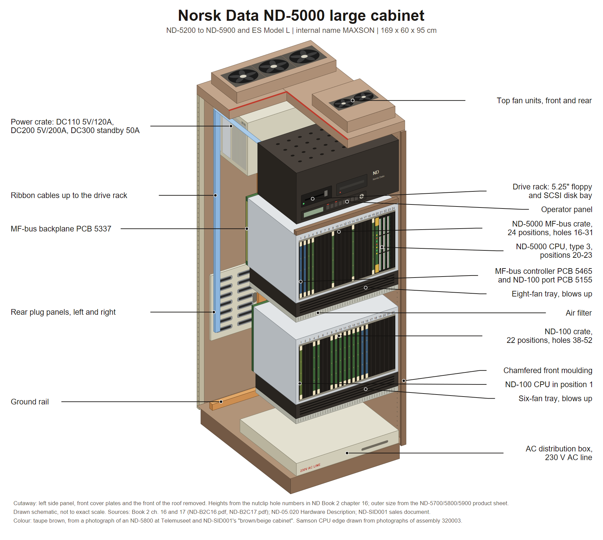

# ND-5000 large cabinet

The cabinet for every large ND-5000: ND-5200, 5400, 5500, 5700, 5800, the multi-CPU
ND-5900, and later the ES Model L range. Same shell as the ND-500 cabinet. ND's sales
document says so outright: "The ND-5000 system cabinet is identical to an ND-500 cabinet,
except for the card racks."

ND's internal name for the build is **MAXSON**, on every drawing title block, which is
not the same word as SAMSON, the CPU.

Shell, frame and hole grid: [LARGE-11-MODULE-SHELL.md](LARGE-11-MODULE-SHELL.md).

**Source:** **Book 2 chapter 16**, "ND-5000 (MAXSON) 11-Mod.Cab.'85, Main Assy", scan
`ND-B2C16.pdf`, 40 pages, and **Book 2 chapter 17**, the cable info, block and wiring
diagrams, scan `ND-B2C17.pdf`, 11 pages. Both read page by page. The scans are in the
sintran.com mirror under `library/libhw/`; see the source map in [README.md](README.md).
Sub-chapters 2 and 3 of chapter 16, the I/O expansion and the 2-bank crate, are missing
from the scan.




Cutaway drawing: [PNG](diagrams/nd5000-large.png), [SVG](diagrams/nd5000-large.svg). How it was built and what in it is schematic: [diagrams/README.md](diagrams/README.md).

---

## 1. Outer size

| Source | H x W x D | Weight | Power |
|---|---|---|---|
| ND-5700/5800/5900 product sheet | 1.60 x 0.60 x 0.95 m | max 250 kg | 2500 W standard, 3200 W max |
| 1987 planning manual | 169 x 60 x 95 cm | 180-250 kg | 2200 W, 25 A slow fuse |

ND's own sales structure list calls it a **"brown/beige cabinet"**, parts 110172 and
110712, which is the only documented colour statement for any ND cabinet in this repo.

---

## 2. The stack

This cabinet is unusual: the front and the rear carry different things at the same
height. The drive rack and the power crate sit back to back at the top.

### Front face, top to bottom

| Holes | What |
|---|---|
| 2-8 | Drive rack housing, part 509 189: a shallow tray with a 2 by 4 grid of square vent openings in its top plate. Behind it, on card guides, stands PCB 5910 the Maxson disk board adapter |
| 8-13 | Drive rack itself. A drawer with a front bezel carrying two bays side by side, the left a 5.25 inch floppy with a horizontal slot, the right a second bay that can take a 5.25 inch SCSI disk, and a slim horizontal operator panel strip below the bezels. Inside sits the diskboard PCB 5909 |
| 16 | Blind panel strip closing the gap above the upper crate |
| 16-31 | **Upper card crate: the ND-5000 MF-bus crate**, part 509 177. Front open, cards plug in from the front, closed by a plain cover plate with a neoprene seal on hand wing screws |
| under it | Fan tray of **eight** axial fans in a 3-2-3 staggered layout, part 323 189, blowing up into the crate, then a flat mesh air filter |
| 38-60 | **Lower card crate: the ND-100 crate**, part 509 172, same cover arrangement |
| under it | Fan tray of **six** axial fans in 2 by 3, part 323 187, then an air filter |
| 65-66 | AC distribution box, part 323 186. A flat wide tray slid in at floor level with a lid carrying a handle and the label **"230V AC LINE"** |

The AC box holds, in order: transient protection, a mains filter, a circuit breaker, a
time-delay relay for soft start, and a terminal strip.

### Rear face, top to bottom

| Holes | What |
|---|---|
| 1-12 | **Power crate**, part 509 183, back to back with the drive rack. Three plug-in supplies slide in from the rear, held by two lock rails: **DC110 5 V/120 A** (a big finned heat-sink block), **DC200 5 V/200 A** and **DC300 5 V standby 50 A**. A five-fan tray and a blind strip go on its rear face. Its rear plate carries the DC connectors, two hexagonal-cell mains plug strips and **bus bar L** |
| top to bottom, rear centre | **Bus bar I**, part 509 180: a vertical laminated bus bar running down the rear centre. Bus bar L joins it at the top with four stacked tabs. It bolts **directly to the power tabs on the rear of the ND-5000 backplane at five heights**, and ends beside the ND-100 crate whose rear power rail bolts to it. It carries +5 V, 0 V, +12 V and +5 V standby |
| mid height | Rear of the ND-5000 crate: tall narrow plug-in boards standing in the rear card guides at the right end, slots 1 and 2. **PCB 5238 MPM5 plug** and **PCB 5234 MFB console and octobus** with three 25-pin D connectors on its rear edge, next to a narrow **plugpanel 3x25** strip. **PCB 5235 console** is another tall narrow board at slot 20, the left end |
| 39-53 | Rear of the ND-100 crate: two large flat **plug panels**, left and right, each with a big rectangular window, two vertical connector strips and oval hand holes. A small blind panel closes the gap above them |
| 66 | Ground rail bolted across with M10 hardware |
| rear-left post | A vertical cable channel carrying the four screened mains cables up from the AC box, plus a vertical bundle of flat ribbon cables from the ND-100 crate up to the drive rack, held by adhesive clips |

### On the roof

Two **fan unit top** boxes, long and flat, lying side by side over the top vent slots,
front one and rear one, chained by a 45 cm mains cable.

---

## 3. The cages

| Crate | Part | Positions | Card size | Backplane |
|---|---|---|---|---|
| MF-bus, new type | 509 177 | 24, numbered 1 to 20 on the rear guides | ND-500 | PCB 5337 A2, part 324 256, one large square board with **five** horizontal rows of dense pin connectors, screwed on with long M4 x 35 bolts |
| MF-bus, first version | 509 177 | 26 | ND-500 | same |
| ND-100 | 509 172 | 22, numbered 1 to 22 | ND-100 | 20-position N-100 backwiring 322 650 in the lower position, PCB 1818 bus interconnect in the middle position |

### MF-bus rack, new type, drawing 20704 and table 2

| Position | Card |
|---|---|
| 1 | MF-bus controller, PCB 5465 or 5454 |
| 2 | MF-bus port, PCB 5155, the port for the ND-100. Same card as the MPM-5 port |
| 3-4 | ports or memory by choice |
| 5-8 | ND-5000 CPU 4, optional |
| 9 | ports or memory |
| 10-13 | ND-5000 CPU 3, optional |
| 14 | ports or memory |
| 15-18 | ND-5000 CPU 2, optional |
| 19 | ports or memory |
| 20-23 | ND-5000 CPU 1. Type 1 fills 20-21, type 2 fills 20-22, type 3 fills 20-23 |

Positions left free by absent CPUs take memory or ports. The MFB dynamic RAM cards are
the MPM-5 dynamic RAM cards.

### MF-bus rack, first version, table 3

26 positions. CPU 1 at 6-7, 6-8 or 6-9 by type. Positions 1 to 5 free, with the note
**"earlier used for ND-570 floating-point unit cards"**. MFB dynamic RAM at 8-11, where
masters cannot go because the bus controller has only 15 external request lines. The
MF-bus controller PCB 5465 sits at position 26.

### The optional VME crate

A small VME-bus card crate, part 323 216, three or four slots, bolts onto the **left end**
of the ND-5000 crate at slot positions 20 to 24, in the same crate height.

---

## 4. How the cages are linked

| Link | Path |
|---|---|
| ND-100 to shared memory | The Multifunction Bus Line Driver on the ND-120 side, an octobus controller gate array plus differential line transceivers, over a cable to **MF-bus port PCB 5155 at position 2** of the MF-bus rack |
| ND-5000 CPU to the bus | Direct. The CPU mother board carries the MFbus channel interface, so the CPU sits on the MF-bus itself and needs no port |
| Command and status | The **octobus**, a serial message bus, from the ACCP module on each ND-5000 CPU to the ND-120 through the line driver. Each CPU is an octobus station, numbered 708, 718, 728, 738 in octal. The octobus replaces the ND-500's PCB 3022 and 5015 pair entirely |
| Mailboxes | In shared MF-bus memory. The octobus only says "there is something in the mailbox" |
| ND-100 crate to the drive rack | Flat ribbon cables out of the rear of the ND-100 backplane, up the rear-left post in a clipped bundle, over the top, into the drive rack: floppy 327793, SCSI 327800, CPU 327801, TFIX console 327792 |
| ND-100 crate to the ND-5000 crate | MPM data 327802 and MPM address 327795 ribbon cables from the ND-100 crate rear up to the MPM5 plug board on the rear of the MF-bus crate, plus octobus cables 327607 termination and 327608 to the external panel |
| Power | AC box at the bottom feeds the two top fans, the power crate, and both crate fan trays. The power crate makes +5 V, 0 V, +12 V and +5 V standby, which go through bus bar L into bus bar I and from there to both crates and to the drive rack's disk board adapter |

Signal flow worth drawing, from block diagram 20716: the **ND-100 CPU card sits in
slot 1** and the disk and floppy controllers around **slot 10**. Positions 8 and 9 feed
the line driver and octobus connectors on the right plug panel. Positions 11 to 14 each
feed an 8-terminal plug.

The right plug panel is the busy one: MEG-L, two spare rows, SMD disk plugs, three
8 TERM plugs, LINE DRIVER A and D, OCTO 1 and 2. The left plug panel has one 8 TERM plug
and many empty rows.

---

## 5. Not known, so do not draw it

- Any overall dimension from the drawings. The only millimetre figure in either book is
  the crate power rail at about 428 mm, 15 plus 398 plus 15.
- The exact slot count of the ND-5000 backplane; that is on drawing 324 256 in Book 1.
- The I/O expansion and 2-bank crate builds; those sub-chapters are missing from the scan.
- Door design and side skins.

---

## 6. Image briefs

Paste the house style block from [README.md](README.md) first.

### Panel A, front view, panels on

```
Subject: straight-on front elevation of a 1980s Norsk Data ND-5000 minicomputer cabinet,
about 169 cm high, 60 cm wide.
Draw a tall narrow face of two bolted mouldings with one chamfered vertical edge running
the full height on the right, and a plinth recessed behind the face at the bottom.
Near the top, a recessed bay with two openings side by side: on the left a 5.25 inch
floppy drive bezel with a horizontal slot, on the right a second blanked bay. Directly
below them a slim horizontal operator panel strip with a small display window, a row of
about eight square buttons and a round keyswitch at the right end.
Below that, two tall plain cover plates one above the other, each a flat brown-black
sheet with a pair of small hand wing screws at its corners. Between and below them, thin
horizontal seams.
At the very bottom, a flat lid with a small carrying handle.
On the roof, two long flat fan boxes lying side by side, just visible above the top edge.
Small "ND Norsk Data" wordmark near the top of the face.
Colours: brown and beige painted steel, dark brown-black plastic bezels.
Labels: "Drive rack: floppy, second bay, operator panel", "Upper crate cover, ND-5000
MF-bus crate behind", "Lower crate cover, ND-100 crate behind", "AC distribution box
lid, 230V AC LINE", "Top fan units", "Plinth".
```

### Panel B, front covers off

```
Subject: the same cabinet from the front left, three quarter view, both crate cover
plates and the front mouldings removed.
Draw, top to bottom inside the frame:
- two long flat fan boxes lying side by side on the roof;
- a shallow drive rack housing whose top plate is perforated with a 2 by 4 grid of square
  vent holes; in its front, a 5.25 inch floppy drive on the left, a 5.25 inch SCSI disk
  bay on the right, and a slim operator panel strip below them; a small vertical circuit
  board standing behind them on card guides;
- the upper card crate, a wide box open towards the viewer, card guide combs top and
  bottom, about 24 vertical card positions. At its right-hand end show one thick
  multi-layer CPU assembly four slots wide, drawn as a stack of four sandwiched boards,
  and label it. The rest of the positions hold thinner olive-green memory and port boards
  with cream ejector tabs;
- directly under that crate a flat fan tray with eight round axial fans in a staggered
  three-two-three layout, and a flat mesh air filter under the fans;
- the lower card crate, a wide box open towards the viewer with 22 vertical positions,
  about two thirds filled with olive-green boards;
- under it a fan tray with six round axial fans in two rows of three and another filter;
- at the very bottom a flat wide sheet-metal tray with a lid, a carry handle and a label
  reading 230V AC LINE, with four screened cables leaving the back of it.
Labels with leader lines: "Top fan units", "Drive rack: 5.25 inch floppy, disk bay,
operator panel", "Disk board PCB 5909 and adapter PCB 5910", "ND-5000 MF-bus crate,
holes 16-31", "ND-5000 CPU, four card positions", "MF-bus controller PCB 5465",
"MF-bus port PCB 5155", "Eight-fan tray", "Air filter", "ND-100 crate, holes 38-60, 22
positions", "Six-fan tray", "AC distribution box, holes 65-66".
```

### Panel C, the rear, service side

```
Subject: the same cabinet from the rear left, three quarter view, rear open.
Draw, top to bottom:
- at the top, the power crate: an open box holding three plug-in power supply modules
  slid in from the viewer's side, the leftmost a large block covered in cooling fins, the
  other two flat modules. Two horizontal lock rails hold them in. A tray of five round
  axial fans and a narrow blind strip sit on its face. Behind the modules, a rear plate
  carrying rows of long pin connectors and two vertical hexagonal-cell mains plug strips;
- from the power crate, a flat L-shaped laminated copper bar bending downward, joining a
  long vertical laminated bus bar that runs down the centre of the rear;
- at mid height, the rear of the ND-5000 crate: three tall narrow circuit boards standing
  vertically in rear card guides, one at the right end with three 25-pin D connectors on
  its outer edge next to a narrow metal strip with three matching cut-outs, one plain
  board beside it, and one more at the far left end. The vertical bus bar bolts to five
  pairs of tabs on the crate's backplane here;
- lower down, the rear of the ND-100 crate: two large flat plug panels side by side, each
  with a big rectangular window, two vertical rows of multiway connectors and two oval
  hand holes. A small blind plate above them;
- at the very bottom, a horizontal copper ground rail bolted across with large hex nuts;
- up the left rear post, a vertical cable channel carrying four screened mains cables and
  a clipped bundle of flat ribbon cables that climbs to the top and turns over into the
  drive rack.
Labels: "Power crate: DC110 5V/120A", "DC200 5V/200A", "DC300 5V standby 50A",
"Five-fan tray", "Bus bar L", "Bus bar I, +5V 0V +12V +5V standby", "MPM5 plug board
PCB 5238", "MFB console and octobus PCB 5234", "Console PCB 5235", "Plug panel left",
"Plug panel right", "Ground rail", "Mains cables from the AC box", "Ribbon bundle to the
drive rack".
```

### Panel D, rear connector legend

```
Subject: a flat front-on legend of the two rear plug panels of an ND-5000, drawn as two
tall rectangles side by side on a white background, no perspective.
Right panel, the busy one, from top to bottom: a row labelled "MEG-L" with two connectors
marked 1 and 2; two rows labelled "SPARE"; a row labelled "SMD" with connectors marked 0
and 1; a second "SMD" row with connectors marked 2 and 3; a row labelled "SPARE"; three
rows each labelled "8 TERM"; a row labelled "LINE DRIVER" with connectors marked A and D;
a row labelled "OCTO" with connectors marked 1 and 2.
Left panel: one row labelled "8 TERM" and the rest empty rows.
Each connector is a long multiway D-shaped socket in a rectangular cut-out. Blank rows
are plain blind plates.
Above the two panels draw a separate small narrow vertical strip with three square
cut-outs, labelled "Plug panel 3x25, on the rear of the ND-5000 crate: ND-5000 CPU
console, ND-100 console, octobus".
Labels: "Plug panel left", "Plug panel right", "Hand hole", "Blind plate".
```

### Panel E, the octobus, a schematic

```
Subject: a flat block schematic on a white background showing how the two processors talk
in an ND-5000, no hardware drawing.
Draw one wide horizontal bar across the middle labelled "Multifunction bus (MF-bus)".
Hanging below it, a large block labelled "Shared memory, MFB dynamic RAM".
On the left, a tall block labelled "ND-120 I/O processor" connected down to a small block
labelled "MF-bus port PCB 5155" which touches the MF-bus bar. Between the ND-120 and the
port, a small block labelled "Multifunction Bus Line Driver, octobus controller".
On the right, a tall block labelled "ND-5000 CPU" touching the MF-bus bar directly
through a small block labelled "MFbus channel interface on the mother board". Inside the
ND-5000 CPU block, a smaller block labelled "ACCP access processor, MC68000 and octobus
controller".
Draw a separate thin line running from the ACCP block across the top of the whole diagram
to the line driver block, and label that line "Octobus, serial message bus. Station
numbers 708, 718, 728, 738".
Add a small box on the shared memory block labelled "Mailbox".
Caption under the diagram: "The octobus only says there is something in the mailbox. The
data itself is in shared memory. There is no PCB 3022 and no PCB 5015 in an ND-5000."
```

---

## 7. Sources

- Book 2 chapter 16: sheets 20701 main assembly, 20533 nutclips, 20101 angle iron, 20521
  AC distribution, 20524 lower card crate, 20525 fan unit and cover, 20540 plug panel,
  20550 power system, 20702 power system and fan mounting, 20594 bus bar L, 20704 main
  assembly with ND-5000, 20545 drive rack housing, 20547 floppy unit, 20703 power
  supplies, 20534 MFB backwiring, 20542 upper crate fan and cover, 20146 stiffening
  sheet, 20595 bus bar I pages 1 to 3, 20715 cabling mains, 20718 lower crate cabling,
  20713 plugboard mounting, 20719 upper crate cabling, 20293 VME crate, plus block
  diagrams 20716 signal and 20717 AC/DC.
- Book 2 chapter 17: cable indexes and block diagram 20237 AC.
- `../../Reference-Manuals/500/ND-05.020.01 EN ND-5000 Hardware Description.md` chapter 1.
- `../../Reference-Manuals/500/ND-05.017.01 EN ND-5000 HARDWARE MAINTENANCE.md` chapter 1.
- `../Sales-Info/ND-SID001-A1-EN.md` section 2.4 for the rack counts and the colour.

---

*Index: [README.md](README.md)*
