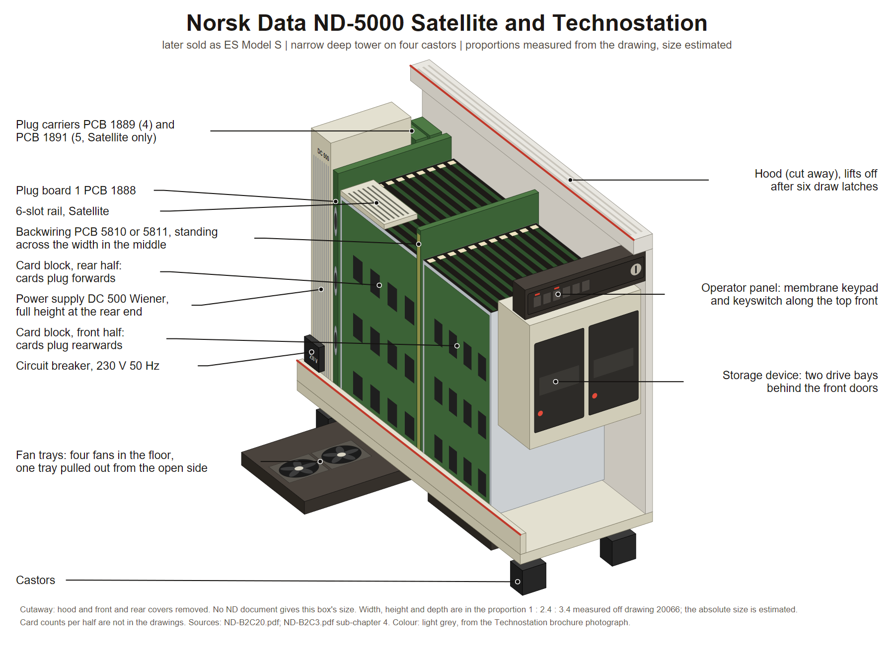

# ND-5000 Satellite and Technostation

The smallest ND-5000 box, and the odd one out: a **narrow, deep tower on four castors**
that stands on the floor beside a desk, with its narrow end facing the user. Two machines
share the shell, the
**ND-5000 Satellite**, later sold as the ES Model S, and the **Technostation**, the CAD
and CAM workstation built on ND-5000 gate-array technology.

Nothing else in this repository describes this box, so every part name here matters.

**Source:** **Book 2 chapter 20**, "ND-5000 Satellite/Technostation, Assembly Drawings",
scan `ND-B2C20.pdf`, 24 pages, 15 drawing sheets dated May to November 1988, read page by
page. The outer panels are **Book 2 chapter 3** sub-chapter 4, scan `ND-B2C3.pdf`. The
scans are in the sintran.com mirror under `library/libhw/`; see the source map in
[README.md](README.md).




Cutaway drawing: [PNG](diagrams/nd5000-satellite-technostation.png), [SVG](diagrams/nd5000-satellite-technostation.svg). How it was built and what in it is schematic: [diagrams/README.md](diagrams/README.md).

---

## 1. Size

**Not one sheet carries an overall dimension.** The only millimetre numbers in the whole
book are two guide-rail slot pitches, 21.7 mm and 20.3 mm, a rubber strip of 8 x 15 mm,
a 19 mm tape width, and screw sizes.

**Proportions, measured off the "complete" sheet 20066** (Book 2 chapter 3 sub-chapter 4)
once the rotated scan is turned upright with the castors at the bottom:
**width : height : depth about 1 : 2.4 : 3.4**. The narrow end carries the operator strip
at the top, so the box is a narrow, deep tower. A Technostation brochure photograph shows
the same shape standing on the floor beside the workstation desk, top just under desk
height.

**Absolute size: GUESS.** The cutaway uses 28 cm wide, 66 cm high, 92 cm deep, which fits
those proportions and the photograph. Treat those three numbers as an estimate.

> **Correction, 2026-09-14.** An earlier version of this file called the box "a long, low
> unit, not a tower", in proportion 2.3 : 1 : 1.3. The drawing sheets are scanned rotated
> 90 degrees, and the width and height were swapped when they were first read. The
> depth-wise layout described below, front end, backwiring in the middle, rear end, was
> read correctly and stands.

Nothing in the ES product sheets gives its size either. The ES Model S maintenance manual,
ND-830103, would, and it is not in this repository.

---

## 2. The shell

Two sheet-metal parts and six latches.

| Part | Number | What it is |
|---|---|---|
| Cabinet bottom part | 509 289 | a long shallow tray: a flat floor plate with a **tall wall along one long side** and a short lip along the other. Four large octagonal fan cut-outs in a row down the floor, plus one rectangular opening near one end |
| Cabinet top part | 509 288 | an **inverted-L hood**: a grooved top surface with about seven long ribs running the length, plus the other long side as a skirt. Its top corner at the front end is bevelled |
| Castor | 517 770 | four of them, one near each corner, each on a socket and a distance plate with three countersunk M4 screws. GUESS: 50 mm wheels, from the "050" in the type number |
| Latch draw | 517 771 | six toggle latches along the top edge of the tall wall and the front lip |
| Latch keeper | 517 772 | six, on the lower edge of the hood skirt |
| Grooved pin | 517 924 | locates the hood on the tray |

Lift the hood off and the whole card area is open from above.

Front and rear panels clip on with **push fasteners** alone, no screws. The
Satellite/Technostation is also **the one ND machine in Book 2 with a real door, and it
slides**: a slide angle, a slide bracket and a lubricated slide pin along the top of the
panel frame with a guide at the bottom. The sheet even says which grease: "Lubricate with
ISOFLEX TOPAS NB 152 or similar."

A plastic pocket inside the front panel holds a configuration card. Name labels are
fitted by configuration: ND-Technostation 21, 51, 52, 71 and 72, or ND-5200 ES and
ND-5400 ES.

---

## 3. Which end is which

| End | What is there |
|---|---|
| **Front end**, a narrow end | The hood's bevelled top corner carries the **operator panel**: a membrane keypad strip, part 508 210, with about nine small key windows and a round indicator, stuck on the outside of the bevel, with the operator panel PCB 323 167 behind it on the inside. A flat ribbon cable runs from it along the inside of the hood, held by 19 mm 3M tape, down into the card area. Below the bevel, a flat full-height **front cover** with a small vent grille at its bottom corner and a rubber strip. Behind the cover, the **storage device**, part 323 112: a metal cage with **two drive bays side by side, each with an arched front opening**, and a small PCB box with connectors on top of it |
| **Rear end**, the other narrow end | Outermost, the **power supply DC 500 Wiener**, part 512 030: a tall flat box the full height of the cabinet, with the mains inlet and two pairs of stud terminals near the bottom of its outer face. Inboard of it, **plug board 1 PCB 1888**, a large nearly square vertical PCB carrying three long connector blocks plus a smaller one. Then the plug carriers and the rear cover |
| **Rear bottom corner**, on the open long side | The **line switch**: a two-pole rocker circuit breaker in a bracket with a cover and a vinyl label reading **"230 V - 50 Hz"**. The mains cable enters through a strain-relief clamp under the floor at that corner |

---

## 4. The cage: one backplane, two card halves

This is the most distinctive thing about the machine, and the reason it deserves its own
diagram.

**The backwiring stands vertically across the width of the box, in the middle of its
length.** It is one tall PCB, as wide as the inside width and about the full inside
height, with its corners cut off at 45 degrees, carrying rows of card-edge connectors
**on both faces**.

| Machine | Backwiring |
|---|---|
| Technostation | PCB 5811, part 324 811 |
| Satellite | PCB 5810, part 324 810 |

Cards stand **vertical, parallel to the long sides**, in pressed slot rails on the floor
plate and matching rails on the underside of the hood. Cards in the **front half plug
rearwards**; cards in the **rear half plug forwards**. It is a two-sided crate with the
backplane down the middle. Cards go in from the open ends, or from above once the hood is
off.

Guide rails, floor and ceiling alike, are the same two plates, **guide rail front 509 290**
and **guide rail rear 509 291**, each with an angle bracket along its outer edge.

The two machines differ in what is bolted on beside those plates:

| Machine | Extra rails |
|---|---|
| Technostation | a **2-slot rail at 21.7 mm pitch** on the front plate and a **2-slot rail at 20.3 mm pitch** on the rear plate, each with an angle bracket stamped **"N100"**. GUESS: these are ND-100 size card positions, which need a different guide pitch, sitting at the edge of each half nearest the tall wall |
| Satellite | a **6-slot rail**, part 509 950, bolted beside the rear plate, extending the rear half's card positions |

The number of ND-5000 positions in each half cannot be counted from the drawings.
Position-marking labels, the slot-number strips, go on the edge of the guide rails:
509 505 front for the Technostation, 509 469 front for the Satellite, 509 470 rear for
both.

---

## 5. The rear connector panel

Vertical strips, one beside the other, in the rear opening.

| Machine | Strips | Rear cover |
|---|---|---|
| Technostation | **plug carrier 1, PCB 1889**, a narrow vertical strip with **four** stacked rectangular connector windows | rear cover with one or two tall vertical "Leonardo" windows, part 509 972 or 509 433, with blind plates 509 432 closing whichever are unused |
| Satellite | **plug board 2, PCB 1890** inside, then **plug carrier 1, PCB 1889** with four windows and **plug carrier 2, PCB 1891** with **five** windows, side by side: nine external connector positions in all | a plain full-height rear cover, part 509 435, with only a label area and no windows |

The book never explains what **"Leonardo"** is. GUESS: the name of an interface or
terminal unit whose connector shows through that window. Do not assert it.

Because the Satellite cover has no cut-outs, its cables must leave through the bottom slot
behind the rubber strip. That is a GUESS from the drawing, not a printed statement.

An **airflow reducer** plate slides in horizontally under the hood edge at the rear end,
above the cards. GUESS: it stops air short-circuiting past unused slots.

---

## 6. Cooling

**Four axial fans lie in the floor**, in one row along the length, in two slide-in trays
of two fans each, part 323 114, one under the front half and one under the rear half,
pushed in sideways from the open long side. Round wire finger guards sit over the four
octagonal floor holes. Air goes up through the slotted floor plates past the cards and out
at the ends past the airflow reducer. The direction is a GUESS from the fan positions; the
book does not state it.

---

## 7. Not known, so do not draw it

Overall length, width, height and weight. Fan size. The number of ND-5000 card slots.
The slot pitch of the main rails. What drives go in the storage device. What "Leonardo"
means. The power supply rating. Colour.

---

## 8. Image briefs

Paste the house style block from [README.md](README.md) first.

### Panel A, the machine complete

```
Subject: a narrow, deep 1980s Norsk Data floor tower standing on four small castors,
three quarter view from the front right. Proportions: width 1, height 2.4, depth 3.4, so a
slim tower much deeper than it is wide, its top just under desk height. The castors are
clearly visible under the four corners.
The narrow front face: along the top, a control strip with about seven small square keys
in two groups and a round keyswitch at one end; below it two small flush doors side by
side; below those a tall plain cover with a small slot near the bottom.
The long side is split by a horizontal seam at about mid height. The top edge along the
long side is chamfered and carries a band of fine louvre slots near the front.
Colours: light warm grey painted steel, darker grey control strip.
Labels: "Ribbed hood", "Chamfered front edge", "Operator panel: membrane keypad and
keyswitch", "Louvre band", "Front cover", "Castor".
```

### Panel B, cutaway along the length

```
Subject: a flat cutaway section through the machine seen from the side, along its length,
on a white background, no perspective. Front end at the right, rear end at the left.
Draw the outline as two parts: a shallow tray at the bottom with four castors under it,
and an inverted-L hood over the top with about seven ribs along its upper surface and a
bevelled corner at the front end.
Down the exact middle of the length, draw one tall vertical circuit board reaching almost
the full inside height, its corners cut off at 45 degrees, with rows of card-edge
connectors on both faces. Label it "Backwiring PCB 5810 or 5811".
On each side of it, draw a row of vertical circuit cards standing parallel, seen edge on,
their edges plugging horizontally into the backwiring: the cards on the right plug
leftwards, the cards on the left plug rightwards. Show slotted guide rails under the cards
on the floor plate and matching slotted rails above them on the underside of the hood.
Under the floor plate, four round axial fans in a row along the length, in two slide-in
trays of two, with round wire finger guards over four octagonal holes in the floor. Draw
small arrows showing air rising from the fans through the slotted floor plate and past the
cards.
At the front end, right: a metal cage with two drive bays side by side seen end on, each
with an arched opening, and a small circuit board box on top, then a flat full-height
front cover with a small vent grille at its bottom corner.
At the rear end, left: a tall flat power supply box the full height of the cabinet with a
mains inlet near the bottom of its outer face, and inboard of it a large vertical circuit
board with three long connector blocks on its edge, then a narrow vertical connector strip
and the rear cover. In the bottom rear corner, a small rocker circuit breaker with a label
reading "230 V - 50 Hz", and a mains cable entering through a clamp under the floor.
Along the top of the hood at the front, a flat ribbon cable running from the operator
panel on the bevel back into the card area.
Labels: "Cabinet top part, hood", "Cabinet bottom part, tray", "Draw latch", "Backwiring,
vertical, across the width, in the middle of the length", "Front card half, cards plug
rearwards", "Rear card half, cards plug forwards", "Floor guide rails", "Hood guide
rails", "Fan tray, two fans", "Finger guard", "Storage device, two drive bays",
"Front cover", "Power supply DC 500", "Plug board 1 PCB 1888", "Plug carrier",
"Rear cover", "Airflow reducer", "Circuit breaker, 230 V 50 Hz", "Mains strain relief",
"Operator panel ribbon cable", "Castor".
```

### Panel C, hood off, from above

```
Subject: a flat plan view of the machine from directly above with the hood lifted off, on
a white background.
Draw a long rectangular tray with a tall wall along the upper long side and a low lip
along the lower long side, four castors marked at the corners.
Across the middle of the length, one thick vertical bar spanning the full width, labelled
"Backwiring". On each side of it, a block of parallel card slots seen from above as a set
of closely spaced parallel lines running across the width, about three slot columns deep
by several rows along the length. Show a few olive-green cards in place and the rest of
the slots empty.
At the left edge of each card block, nearest the tall wall, draw two extra narrow slots
set at a visibly different spacing and label them "ND-100 size positions, 21.7 mm front,
20.3 mm rear, Technostation only". Draw a second alternative beside the rear block, six
extra slots, and label it "6-slot rail, Satellite only".
At the front end of the tray, a rectangular cage labelled "Storage device". At the rear
end, a tall narrow rectangle labelled "Power supply DC 500" and beside it one labelled
"Plug board 1".
Under the card blocks, dashed outlines of four round fans in a row along the length, in
two groups of two.
In the rear bottom corner, a small square marked "Circuit breaker".
Labels: "Tall long-side wall", "Low lip", "Draw latches", "Guide rail front 509 290",
"Guide rail rear 509 291", "Fan trays, slide in sideways".
```

### Panel D, the rear end, two variants

```
Subject: two flat straight-on views of the narrow rear end of the machine, side by side
on a white background, with the rear cover removed in both.
Left view, headed "Technostation": a tall narrow opening. On the left of the opening, a
tall flat power supply box with a mains inlet socket and two pairs of stud terminals near
the bottom of its face. To its right, a large nearly square circuit board with three long
connector blocks in a vertical row plus a smaller block at the bottom. To its right, one
narrow vertical strip with four rectangular connector windows stacked one above the other.
Above the opening, a horizontal plate sliding in under the hood edge.
Right view, headed "Satellite": the same power supply and square board, then a narrow
vertical board with two connector blocks, then two narrow vertical connector strips side
by side, the left with four stacked windows and the right with five.
Below both views, draw the two rear covers: the Technostation cover with one tall
vertical slot window and a rectangular window near the bottom and two blind plates beside
them; the Satellite cover plain with only a small label area.
Labels: "Power supply DC 500 Wiener", "Mains inlet", "Plug board 1 PCB 1888",
"Plug carrier 1 PCB 1889, four windows", "Plug board 2 PCB 1890", "Plug carrier 2
PCB 1891, five windows", "Airflow reducer", "Rear cover with Leonardo windows",
"Blind plate", "Plain rear cover", "Rubber strip".
```

---

## 9. Sources

- Book 2 chapter 20. Sub-chapter 1, shared: 20052 wheels and strain relief, 20055 guide
  sheets and line switch, 20054 latch and finger guards, 20057 guide rails, 20058
  backwiring, 20062 cabinet and fan units, 20064 storage device and front cover, 20067
  power supply and plug board 1. Sub-chapter 2, Technostation: 20063 top guide rails,
  20061 top part, 20068 plug carrier and rear cover. Sub-chapter 3, Satellite: 20382 top
  guide rails, 20383 top part, 20384 plug board 2 and plug carrier 1, 20385 rear cover and
  plug carrier 2.
- Book 2 chapter 3 sub-chapter 4: 20060 front panel and door assembly, 20065 front and
  rear panel mounting, 20066 complete.
- `../Product-Info/ND-198-1-EN.md` for the ES Model S in the range;
  `../Product-Info/ND-161-A1-EN.md` for the Technostation as a product.
- `../Installation-Description/ND-895560-2-EN.md` for the S11 model codes.

---

*Index: [README.md](README.md)*
